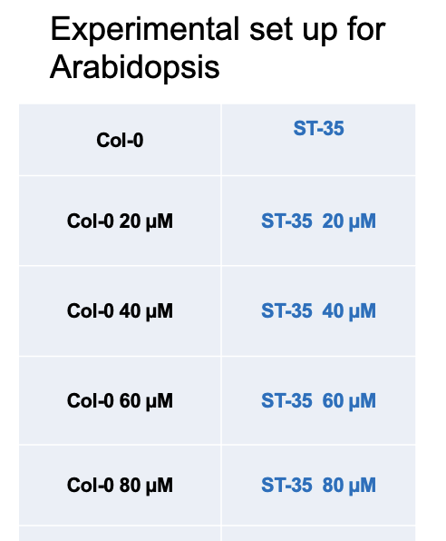

```{r setup, include = FALSE}
knitr::opts_chunk$set(echo = TRUE, cache = FALSE, warning = FALSE, message = FALSE)
```

The following are the necessary R-packages for running the code below: 
```{r, results = "hide"}
library(tidyverse)
library(readr)
# be sure to run install.packages("BiocManager") and use BiocManager::install("package") order to install and run the following libraries 
library(DESeq2)
library(apeglm)
library(ashr)
```

# 1) Peparing Count Data 
**1/20/25**
Below is a snippet of feature count data of Arabidopsis (both control and treated) regarding heavy metals.
```{r, echo = FALSE}
# reads in count data 
feature_counts <- read_tsv("../data/featureCounts_at_ST35.txt", show_col_types = FALSE)

# shows a snippet of the count data 
head(feature_counts, 10)

```

I created a data frame that matches the sample info provided by Sanju's PowerPoint slide as shown here:
```{r, echo = FALSE}


```

The following code creates the data frame itself, which will be used as colData in DESeq2.
```{r, results = "hide"}
# extract column names for the samples (exclude non-sample columns)
sample_names <- colnames(feature_counts)[-c(1, 2)]  # "GeneID" and "Length" are the first two columns (non-sample columns)

# map sample names treatment and genotype columns, respectively 
colData <- data.frame(
  sample_name = sample_names,
  treatment = case_when(
    grepl("^Col01_1", sample_names) ~ "0",
    grepl("^Col01_2", sample_names) ~ "20",
    grepl("^Col01_3", sample_names) ~ "40",
    grepl("^Col01_4", sample_names) ~ "60",
    grepl("^Col01_5", sample_names) ~ "80",
    grepl("^ST35_1", sample_names) ~ "0",
    grepl("^ST35_2", sample_names) ~ "20",
    grepl("^ST35_3", sample_names) ~ "40",
    grepl("^ST35_4", sample_names) ~ "60",
    grepl("^ST35_5", sample_names) ~ "80",
    TRUE ~ NA_character_ # default if no pattern matches
    ),
  genotype = case_when(
    grepl("Col", sample_names, ignore.case = TRUE) ~ "wild_type",
    grepl("ST35", sample_names, ignore.case = TRUE) ~ "knockout_line",
    TRUE ~ NA_character_ # default if no pattern matches
    ),
  row.names = sample_names # set sample_name column content as row names
  )

# combine 'genotype' and 'treatment' into a new 'group' column with shortened genotypes
colData$group <- paste(
  case_when(
    colData$genotype == "wild_type" ~ "wt", 
    colData$genotype == "knockout_line" ~ "ko",
    TRUE ~ NA_character_
  ),
  colData$treatment,
  sep = "_"
)

# convert appropriate columns into factors and remove sample_name column 
colData <- colData |>
  mutate(
    treatment = factor(treatment),
    genotype = factor(genotype),
    group = factor(group)
    ) |>
  select(-sample_name) # remove sample_name column 

# verify data structure 
str(colData)

```

``` {r, echo = FALSE}
# display colData
head(colData, 10)

```

Let's verify that the row names in colData matches the column names in feature_counts and are in the same order.
```{r}
# checking for matching names 
all(colnames(feature_counts) %in% rownames(colData))

```

The result is FALSE; this is due to the initial two columns found in the feature_counts for GeneID and Length. Let's remove the Length column and convert the GeneID column into the row names of this data frame (it shouldn't interfere with the DESeq2 output)! 
```{r}
# converting GeneID to rownames and removing Length column found in original feature count data set 
data_counts <- feature_counts |>
  column_to_rownames("GeneID") |>
  select(-Length)

# checking for matching names 
all(colnames(data_counts) %in% rownames(colData))

# checking that they are in the same order
all(colnames(data_counts) == rownames(colData))

# view new data counts format
head(data_counts, 10)

```
As we can see, it now returns TRUE for both conditions (matching names and same order).

# 2) Construct a DESeqDataSet Object
**1/21/25**
We will now be creating our DESeqDataSet object using the DESeq2 package and our recently updated and newly created data frames titled data_counts and colData, respectively. 

```{r}
# creating DESeq2 object 
dds <- DESeqDataSetFromMatrix(countData = data_counts,
                                   colData = colData,
                                   design = ~ treatment + genotype + treatment:genotype)

dds 

```
  
We have a total of 40745 rows.

Let's now pre-filter the dds to remove those entries that have less than 10 read counts (this is an arbitrary number I've simply chosen according to Dr. Liang's advice).
```{r}
# remove low gene counts (<10)
keep_counts <- rowSums(counts(dds)) >= 10
dds <- dds[keep_counts,]

dds

```
We have filtered down to 27710 rows.

# 3) Re-level Factors for Treatment Comparisons 
**1/21/25**
We now want to re-level and compare different treatment conditions to one another. Here are the following variations of the comparisons we will conduct: 

  - wild_type control vs. knockout_line control
    - 0 vs. 0
  
  - wild_type treatment vs. wild_type control 
    - WT_20 vs. WT_0, WT_40 vs. WT_0, etc.
  
  - knockout_line treatment vs. knockout_line control 
    - KO_20 vs. KO_0, KO_40 vs. KO_0, etc.
    
  - knockout_line treatment vs. wild_type treatment 
    - KO_20 vs. WT_20, KO_40 vs. WT_40, etc.
  
Note: we don't have to necessarily state which reference level we want to use. DESeq2 will simply choose alphabetically which level to use.
```{r}
# use wild_type control as reference baseline 
dds$treatment <- relevel(dds$treatment, ref = "0")
dds$genotype <- relevel(dds$genotype, ref = "wild_type")
# use the control as reference for every single dds object I will be making 

# you may want to set this to a different variable object so that we can keep reusing our set up data and not overwrite it every time (double-check with Dr. Liang if I can do that because this doesn't seem t make new variable anyway)
```

IMPORTANT NOTE: Make sure to collapse the technical replicates before analysis; however, do not collapse biological replicates! (I don't really know what this means though)

# 4) Run DESeq2 
**1/21/25**
We can now run DESeq2 and see if our data structure works! 
```{r}
# run the differential gene expression analysis
dds <- DESeq(dds)

# view what conditions were contrasted to make sure they match what we actually meant to compare 
resultsNames(dds)

# store the results in an object 
res_dds <- results(dds)

# view DESeq2 results 
res_dds

```

## Normalization 
**1/28/25**
The following code chunk is the normalization of the data's read counts for future use:
```{r}
# normalization of read counts for future use 
dds <- estimateSizeFactors(dds)
sizeFactors(dds)
normalized_counts <- counts(dds, normalized = TRUE)

# make a box plot using normalized counts 
boxplot(log10(normalized_counts))

# write data to a csv file 
write.csv(normalized_counts, file = "../data/st35_normalized_counts.csv")

```

# 5) Explore DESeq2 Results
**1/21/25**
Let's begin exploring the results of the differential gene expression analysis by summarizing the results.

  - we will use both the default setting for p-value and our own adjusted p-value of 0.05

```{r}
# summary results of dds (with a re-leveling of wild_type control vs. each treatment, and interaction between treatment and genotype) 
summary(res_dds)

# with adjusted p-value of 0.05
res_0.05_dds <- results(dds, alpha = 0.05)
summary(res_0.05_dds)

```

We can also use DESeq2's contrast function to compare specific factor levels after re-leveling. This allows us to make all the necessary comparisons we need without having to re-run the DESeq function with different parameters every time. 

Below are the comparison results between both the ____ and the ____:

The struggle here is that I need to be able to be more exact with my comparisons; how can I compare wild_type_0 to knockout_line_0 when the meta-data is contained in different columns (something the contrast function does not accommodate for).

  - The answer is that I would need to make a combined and more specific column in colData 
```{r, eval = FALSE}
#USEFUL FOR REFERENCE ON USING BASE CONTRAST() FUNCTION BUT THIS CODE CHUNK DOES NOT RUN

# contrast different factor levels (i.e. each treatment vs. ST-35, Col-0 vs. ST-35, etc.)
res_0_80 <- results(dds, contrast = c("treatment", "0", "80"), alpha = 0.05) # p-value of 0.05; this alpha = 0.05 does not work 
# do shrinkage after each individual contrast 

# convert DESeq2 results to a data frame
res_0_80_df <- as.data.frame(res_0_80)

# add the gene IDs as a column in the data frame
res_0_80_df$GeneID <- rownames(res_0_80_df)

# reorder columns to place GeneID as the first column
res_0_80_df <- res_0_80_df[, c("GeneID", colnames(res_0_80_df)[-ncol(res_0_80_df)])]

# write output to a csv file 
write.csv(res_0_80_df, "../data/DESeq2_results_0_vs_80.csv", row.names = FALSE) # filter and save only those values have are < 0.05 (get creative with padj in the res_0_80_df)
```

# 6) Visualizing the Results 
The following are different ways we can visualize the results of our differential gene expression analysis.

## PCA (Principal Component Analysis)
**1/21/25**

### Extract and Transform Normalized Data 
Make sure to use the the normalized data counts and not the DESeq result output! 
```{r}
# perform variance stabilizing transformation (VST)
vsd <- vst(dds, blind = FALSE)

# Alternatively, use rlog (log transformation)
# vsd <- rlog(dds, blind = FALSE)

```

### Perform PCA 
```{r}
# extract the transformed data
transformed_counts <- assay(vsd)

# perform PCA on the transformed counts
pca <- prcomp(t(transformed_counts))

```

### Extract PCA Results for Plotting 
```{r}
# create a data frame with PCA results and sample metadata
pca_dat <- as.data.frame(pca$x)  # PCA scores for each sample
pca_dat$sample <- rownames(pca_dat)  # sample names
pca_dat$treatment <- colData(dds)$treatment  # grouping variable (treatment condition)
pca_dat$genotype <- colData(dds)$genotype  # add genotype to the PCA data

```

### Create PCA Plot 
```{r}
# plot the first two principal components
ggplot(pca_dat, aes(x = PC1, y = PC2, color = treatment, shape = genotype, label = sample)) +
  geom_point(size = 3) +
  geom_text(vjust = -1, hjust = 0.5, size = 3) +
  labs(
    title = "PCA Plot of Arabidopsis Selenium Treatment:\nSulfur Transport Knockout-Line and Wild-Type Samples",
    x = paste0("PC1: ", round(summary(pca)$importance[2, 1] * 100, 1), "% Variance"),
    y = paste0("PC2: ", round(summary(pca)$importance[2, 2] * 100, 1), "% Variance"),
    color = "Treatment",
    shape = "Genotype"
  ) +
  theme_minimal()

```

## MA Plot 
**1/28/25**

### Genotype Shrinkage 
```{r}
# Step 1: Compute results for the contrast
res <- results(dds, contrast = c("genotype", "knockout_line", "wild_type"))

# Step 2: Apply shrinkage to the results
res_shrink <- lfcShrink(dds, coef = "genotype_knockout_line_vs_wild_type", type = "apeglm")

# check results
summary(res_shrink)
```

### Update the PCA Data Frame
```{r}
# create a data frame with the results from lfcShrink
pca_dat_shrink <- as.data.frame(res_shrink)
pca_dat_shrink$significance <- ifelse(pca_dat_shrink$padj < 0.05, "Significant", "Not Significant")

```

### Create MA Plot 
```{r}
# create MA plot using ggplot2
ggplot(pca_dat_shrink, aes(x = baseMean, y = log2FoldChange, color = significance)) +
  geom_point(size = 1) +
  scale_color_manual(values = c("Significant" = "blue", "Not Significant" = "black")) +
  scale_x_log10() +  # Apply log scale to x-axis (baseMean)
  labs(title = "MA Plot: Differential Expression with Shrinkage",
       x = "Mean of Normalized Counts (log scale)", 
       y = "Shrunken Log2 Fold Change") +
  theme_minimal()

```

# 7) Analyses for All Treatment Combinations
**2/3/25 - 2/4/25**

## Subsetting 'colData' and 'data_counts' into Individual Data Frames 
I will be subsetting our properly structured 'colData' data frame produced earlier in this script (found under "1. Preparing Count Data") as well as the 'data_counts' data frame to match column and rownames. This will allow us to properly utilize the contrast() function DESeq2 offers, giving us the ability to more dynamically compare our samples by treating the varying columns as independent factors. 

As a reminder, we will be making many comparisons, of which are as follows:

  - knockout_line treatment vs. wild_type treatment 
    - KO_20 vs. WT_20, KO_40 vs. WT_40, etc.

  - wild_type control vs. knockout_line control
    - WT_0 vs. KO_0
  
  - wild_type treatment vs. wild_type control 
    - WT_20 vs. WT_0, WT_40 vs. WT_0, etc.
  
  - knockout_line treatment vs. knockout_line control 
    - KO_20 vs. KO_0, KO_40 vs. KO_0, etc.
    
We will be using a total of 4 colData and data_counts variants (including the original colData and data_counts created earlier in this script) that will utilize either the 'treatment' or 'group' column as their contrast arguments depending on the type of specificity our colData allows. 

### Original colData and data_counts (for KO Treatment vs. WT Treatment)
colData:
```{r, echo = FALSE}
# display original colData produced under "1. Preparing Count Data"
head(colData)

```

data_counts:
```{r, echo = FALSE}
# display original data_counts produced under "1. Preparing Count Data"
head(data_counts)

```

Display does not obviously show that all rows/columns are included.

### Only Controls 
colData_controls:
```{r, echo = FALSE}
# subset colData to only include rows where treatment is 0 (control groups)
colData_controls <- colData[colData$treatment == 0, ]

head(colData_controls)

```

data_counts_controls:
```{r, echo = FALSE}
# subset data_counts to only include columns that start with 'Col01_1' or 'ST35_1'
control_columns <- grep("^(Col01_1.*|ST35_1.*)", colnames(data_counts))

# subset the data_counts to only include the above columns
data_counts_controls <- data_counts[, control_columns]

head(data_counts_controls)

```

### Only Wild-Type Samples 
colData_wt: 
```{r, echo = FALSE}
# subset colData to only include rows where genotype is wild_type 
colData_wt <- colData[colData$genotype == "wild_type", ]

head(colData_wt)

```

data_counts_wt:
```{r, echo = FALSE}
# subset data_counts to only include columns that start with 'Col'
wt_columns <- grep("^(Col.*)", colnames(data_counts))

# subset the data_counts to only include the above columns
data_counts_wt <- data_counts[, wt_columns]

head(data_counts_wt)

```

### Only Knockout-Line Samples 
colData_ko:
```{r, echo = FALSE}
# subset colData to only include rows where genotype is knockout_line 
colData_ko <- colData[colData$genotype == "knockout_line", ]

head(colData_ko)

```

data_counts_ko:
```{r, echo = FALSE}
# subset data_counts to only include columns that start with 'ST35'
ko_columns <- grep("^(ST35.*)", colnames(data_counts))

# subset the data_counts to only include the above columns
data_counts_ko <- data_counts[, ko_columns]

head(data_counts_ko)

```

## Function for Creating Varying 'dds' Objects 
I've written a function that allows for easy manipulation and production of 'dds' objects using the DESeqDataSetFromMatrix() function. It seems very similar to simply using the DESeq2 function itself, however, this allows for cleaner production of the dds objects and includes chosen filtering of gene counts. It also includes error messages to gracefully halt improper inputs. 

  - read_counts = the countData input (assumed it is properly structured)
  - column_data = the colData meta data that also contains the columns used for the design of the dds object
  - design_parameter = your chosen design formula that aligns with the colData column names 
  - filter_low_counts = a chosen limit to filter out gene counts; default is set to no filtering if not explicitly stated 
  
This function only works if the DESeq2 package is installed and running on the same script. 

```{r, results = 'hide'}
dds_generator <- function(read_counts, column_data, design_parameter, filter_low_counts = NULL) {
  if (!is.character(design_parameter)) {
    stop("'design_parameter' must be a character string representing the design formula.")
  }
  
  # validate design variables exist in column_data
  design_vars <- unlist(strsplit(design_parameter, " \\+ | \\* "))
  missing_vars <- setdiff(design_vars, colnames(column_data))
  if (length(missing_vars) > 0) {
    stop("The following design variables are missing in 'column_data': ", paste(missing_vars, collapse = ", "))
  }
  
  # convert design parameter input into formula
  design_formula <- as.formula(paste("~", design_parameter))
  
  # creating DESeq2 object
  dds <- DESeqDataSetFromMatrix(countData = read_counts,
                                colData = column_data,
                                design = design_formula)
  
  # remove low gene counts only if a filtering threshold is specified
  if (!is.null(filter_low_counts) && is.numeric(filter_low_counts) && filter_low_counts > 0) {
    keep_counts <- rowSums(counts(dds)) >= filter_low_counts
    dds <- dds[keep_counts,]
  }
  
  return(dds)
}

```

## Generating and Re-leveling 'dds' Objects 
Using all of the particular colData sub-sets, I will be producing varying 'dds' objects that will have different design formulas depending on how specific we need the comparisons between samples to be. These objects will then be implemented with the contrast function for more specific comparisons within each subset. 

  - Each 'dds' object will be produced and filtered using the dds_generator() function 

All 'dds' objects will be factor re-leveled to reference the baseline which is the wild-type control sample (treatment = 0 and genotype = wild_type or group = wild_type_0). This will be the same for every analyses. 

### KO Treatment vs. WT Treatment 
```{r}
dds_treatment <- dds_generator(data_counts, colData, "group", 10)

# set reference level: group to wt_0
dds_treatment$group <- relevel(dds_treatment$group, ref = "wt_0")

dds_treatment
```

### Only Controls 
```{r}
dds_controls <- dds_generator(data_counts_controls, colData_controls, "genotype", 10)

# set reference level: genotype to wild_type 
dds_controls$genotype <- relevel(dds_controls$genotype, ref = "wild_type")

dds_controls
```

### Only Wild-Type Samples 
```{r}
dds_wt <- dds_generator(data_counts_wt, colData_wt, "treatment", 10)

# set reference level: treatment to 0
dds_wt$treatment <- relevel(dds_wt$treatment, ref = "0")

dds_wt
```

### Only Knockout-Line Samples
```{r}
dds_ko <- dds_generator(data_counts_ko, colData_ko, "treatment", 10)

# set reference level: treatment to 0
dds_ko$treatment <- relevel(dds_ko$treatment, ref = "0")

dds_ko
```

## Functions for Writing Shrunken Comparison Data to CSV's
To allow for easier reproducibility and less redundancy in the code, I've written two functions that allow for producing dynamic contrasts that utilize either apeglm shrinkage with coefficients or ashr shrinkage with contrasts, and writes the output to a dynamically named CSV file.

### coef_shrinkage_contrast() Function 
As mentioned, the coef_shrinkage_contrast() function using apeglm shrinkage and coefficients from the 'dds' levels. This is especially useful to maintain indepdence amongst comparisons and the factor levels. 

  - dds_object = the specific 'dds' object used for the contrast 
  - column = the specific column used to reference the factor levels being contrasted 
  - level_1 = the first factor level being compared 
  - priority_level_2 = the second factor level being compared (generally the preferred baseline according to reference level)
  - output_dir = the relative path to which you want your dynamically named CSV file to go (the default is set for my personal computer;
  adjust it to your needs)
  
This function also dynamically incorporates the proper coefficient using the column, level_1, and priority_level_2 parameters. It also has a built-in check to make sure the coefficient exists in said dds object.
  
This function requires the apeglm package installed and running on the same script to work. 

```{r, results = 'hide'}
coef_shrinkage_contrast <- function(dds_object, column, level_1, priority_level_2, output_dir = "../data/arabidopsis_deseq2_results/") {
  # construct the expected coefficient name
  coef_name <- paste0(column, "_", level_1, "_vs_", priority_level_2)
  
  # ensure the coefficient exists
  dds_name <- deparse(substitute(dds_object))  # grab the object's name as a string 
  if (!(coef_name %in% resultsNames(dds_object))) {
    stop(paste("Coefficient", coef_name, "not found in object", dds_name, ". Check resultsNames(", dds_name, ")."))
    }

  # apply shrinkage using apeglm
  shrink_result <- lfcShrink(dds_object, coef = coef_name, type = "apeglm")

  # convert the shrinkage results to a data frame
  result_df <- as.data.frame(shrink_result)

  # add the gene IDs as a column in the data frame
  result_df$GeneID <- rownames(result_df)

  # re-order columns to place GeneID as the first column
  result_df <- result_df[, c("GeneID", colnames(result_df)[-ncol(result_df)])]

  # get the name of the dds_object (used for output_file name)
  dds_name <- deparse(substitute(dds_object))

  # generate dynamic output file name
  output_file <- paste0(output_dir, "deseq2_", dds_name, "_", level_1, "_vs_", priority_level_2, ".csv")

  # write output to a CSV file
  write.csv(result_df, output_file, row.names = FALSE)
}

```

### ashr_shrinkage_contrast() Function 
The following ashr_shrinkage_contrast() function utilizes the ashr shrinkage estimator along with the contrast function to allow mutability in contrasting factor levels that are were not originally set during factor re-leveling. In other words, we can compare different factor levels that are do not involve the reference level. 

All of the parameters used in the function above are used and represented the same in this one. The same checks are also in place.

This function requires the ashr package to be installed and running on the same script. 

```{r, results = 'hide'}
ashr_shrinkage_contrast <- function(dds_object, column, level_1, priority_level_2, output_dir = "../data/arabidopsis_deseq2_results/") {
  # ensure the contrast levels exist
  dds_name <- deparse(substitute(dds_object))  # grab the object's name as a string 
  factor_levels <- levels(colData(dds_object)[[column]])  # Get levels of the specified column
  
  # check whether the levels exist in the factor column
  if (!(level_1 %in% factor_levels) | !(priority_level_2 %in% factor_levels)) {
    stop(paste("Levels", level_1, "or", priority_level_2, "not found in column", column, "of object", dds_name, ". Check levels(colData(",
               dds_name, ")[[", column, "]])."))
    }
  
  # apply shrinkage using ashr and contrast
  shrink_result <- lfcShrink(dds_object, contrast = c(column, level_1, priority_level_2), type = "ashr")

  # convert the shrinkage results to a data frame
  result_df <- as.data.frame(shrink_result)

  # add the gene IDs as a column in the data frame
  result_df$GeneID <- rownames(result_df)

  # re-order columns to place GeneID as the first column
  result_df <- result_df[, c("GeneID", colnames(result_df)[-ncol(result_df)])]

  # generate dynamic output file name
  output_file <- paste0(output_dir, "deseq2_", dds_name, "_", level_1, "_vs_", priority_level_2, ".csv")

  # write output to a CSV file
  write.csv(result_df, output_file, row.names = FALSE)
}

```

## Run Varying DESeq2 Analyses and Contrasts
Below will contain the code running all of the various DESeq2 analyses we need along with specific contrasts. Each contrast will be written to a CSV file that will be used for further analyses. There will be many files saved to a subdirectory within my 'data' directory. 

### KO Treatment vs. WT Treatment 
```{r}
# run the differential gene expression analysis
dds_treatment <- DESeq(dds_treatment)

# view what conditions were contrasted to make sure they match what we actually meant to compare 
resultsNames(dds_treatment)

# store the results in an object 
res_dds_treatment <- results(dds_treatment)

# view DESeq2 results 
res_dds_treatment

# summary results of res_dds_treatment (with re-level of group = wt_0)
summary(res_dds_treatment, 0.05)
```

We will be using the ashr_shrinkage_contrast() function for the comparisons regarding dds_treatment as they have a reference level of wt_0 but require contrasts between treatments of both genotypes to each other, not to the controls. In other words, we will be comparing wt_20 vs. ko_20, wt_40 vs. ko_40, etc., in these 'dds' results. Therefore, we need the ability to be specific about our contrasts (using the contrast() function) and still be able to shrink the data which is not functional with apeglm, but is functional with ashr.

#### WT_20 vs. KO_20 
```{r, results = 'hide'}
ashr_shrinkage_contrast(dds_treatment, "group", "ko_20", "wt_20")
```

#### WT_40 vs. KO_40 
```{r, results = 'hide'}
ashr_shrinkage_contrast(dds_treatment, "group", "ko_40", "wt_40")
```

#### WT_60 vs. KO_60 
```{r, results = 'hide'}
ashr_shrinkage_contrast(dds_treatment, "group", "ko_60", "wt_60")
```

#### WT_80 vs. KO_80 
```{r, results = 'hide'}
ashr_shrinkage_contrast(dds_treatment, "group", "ko_80", "wt_80")
```

### Only Controls 
```{r}
# run the differential gene expression analysis
dds_controls <- DESeq(dds_controls)

# view what conditions were contrasted to make sure they match what we actually meant to compare 
resultsNames(dds_controls)

# store the results in an object 
res_dds_controls <- results(dds_controls)

# view DESeq2 results 
res_dds_controls

# summary results of res_dds_controls (with re-level of genotype = wild_type)
summary(res_dds_controls, 0.05)
```

For the all of the remaining comparisons, we will be using the coef_shrinkage_contrast() function as the data for the dds_controls, dds_wt, and dds_ko objects have all been subset and re-leveled to reference the wild_type control variant where possible (dds_controls and dds_wt) or the knockout_line control variant in dds_ko. In these cases, we are comparing all instances specifically to the reference level, therefore, the intercepts are viable coefficients to use with the apeglm shrinkage estimator. Although we cannot use the contrast() function with apeglm. 

The vignette's on DESeq2 describe apeglm as a higher performance estimator than ashr. For now, I am using a mix for the sake of ease in repeated production of the resulting dds data sets. Depending on our future needs, we can apply either function to all the data to maintain consistency. 

#### WT_0 vs. KO_0 
I honestly should not need to even contrast this as the only rows in the 'dds_controls' are the triplactes of the control groups for both the knockout_line and the wild_type variants. However, I have the run_shrinkage_contrast() function already and it seems to work pretty well, and incorporates shrinkage so we will just use it. 

**Will contrasting have any negative effect on the outcome of an already completed comparison?**
```{r, results = 'hide'}
coef_shrinkage_contrast(dds_controls, "genotype", "knockout_line", "wild_type")
```

### Only Wild-Type Samples 
```{r}
# run the differential gene expression analysis
dds_wt <- DESeq(dds_wt)

# view what conditions were contrasted to make sure they match what we actually meant to compare 
resultsNames(dds_wt)

# store the results in an object 
res_dds_wt <- results(dds_wt)

# view DESeq2 results 
res_dds_wt

# summary results of res_dds_wt (with re-level of treatment = 0 for wild_type)
summary(res_dds_wt, 0.05)
```

#### WT_0 vs. WT_20
```{r, results = 'hide'}
coef_shrinkage_contrast(dds_wt, "treatment", "20", "0")
```

#### WT_0 vs. WT_40 
```{r, results = 'hide'}
coef_shrinkage_contrast(dds_wt, "treatment", "40", "0")
```

#### WT_0 vs. WT_60
```{r, results = 'hide'}
coef_shrinkage_contrast(dds_wt, "treatment", "60", "0")
```

#### WT_0 vs. WT_80 
```{r, results = 'hide'}
coef_shrinkage_contrast(dds_wt, "treatment", "80", "0")
```

### Only Knockout-Line Samples
```{r}
# run the differential gene expression analysis
dds_ko <- DESeq(dds_ko)

# view what conditions were contrasted to make sure they match what we actually meant to compare 
resultsNames(dds_ko)

# store the results in an object 
res_dds_ko <- results(dds_ko)

# view DESeq2 results 
res_dds_ko

# summary results of res_dds_ko (with re-level of treatment = 0 for knockout_line)
summary(res_dds_ko, 0.05)

```

#### KO_0 vs. KO_20
```{r, results = 'hide'}
coef_shrinkage_contrast(dds_ko, "treatment", "20", "0")
```

#### KO_0 vs. KO_40
```{r, results = 'hide'}
coef_shrinkage_contrast(dds_ko, "treatment", "40", "0")
```

#### KO_0 vs. KO_60
```{r, results = 'hide'}
coef_shrinkage_contrast(dds_ko, "treatment", "60", "0")
```

#### KO_0 vs. KO_80
```{r, results = 'hide'}
coef_shrinkage_contrast(dds_ko, "treatment", "80", "0")
```

# CSV Naming Key
**2/5/25**

The following are defined terms and acronyms that can be used to distinguish the CSV files produced via the ashr_shrinkage_contrast() and coef_shrinkage_contrast() functions. 

  - All file titles will consistently include 'deseq2_1_2_vs_3.csv':
    - 'deseq2' is included as that is the package we are using to conduct these analyses and to produce the object used in the analyses.
    - 'vs' simply means versus as this denotes that particular comparison used to produce the data in said file. 
    - '.csv' will be consistent as we are writing to a csv file; can be changed within the function to whatever file format preferred.
    - Functions utilizes snake_case format by placing an underscore between all terms in the title. It will only be a mix of snake_case
    and other formatting if you do not use snake_case to name row values in your colData data frame. 
    - Each number represents a part of your contrast parameters used in either function (i.e the numbers will not actually be in your
    saved file name):
      - 1 = the name of your used 'dds' object 
      - 2 = the first factor level used in your contrast 
      - 3 = the second factor level used in your contrast 
  
Key Title Terms: 

  - deseq2 = package used to run analysis 
  
  - 'dds' Object Names: 
    - dds_controls = the 'dds' object used for analysis only consisted of the control data for both wild_type and knockout_line samples
    - dds_ko = the 'dds' object used for analysis only consisted of the knockout_line data
    - dds_wt = the 'dds' object used for analysis only consisted of the wild_type data
    - dds_treatment = the 'dds' object used for analysis consisted of all samples (including controls)
  
  - Contrast Parameters: 
    - knockout_line = genotype factor level for knockout-line samples 
    - wild_type = genotype factor level for wild-type samples 
    - 0 = treatment factor level for control samples (no treatment)
    - 20 = treatment factor level for samples treated with 20 uM 
    - 40 = treatment factor level for samples treated with 40 uM 
    - 60 = treatment factor level for samples treated with 60 uM 
    - 80 = treatment factor level for samples treated with 80 uM 
    
For example, one of the csv files produced from the above analyses had the title of: deseq2_dds_ko_20_vs_0.csv

  - The 'dds' object used consisted of only the knockout_line samples and is thus named 'dds_ko' (ko = knockout).
  - This file contains the contrast results of the knockout_line samples treated with 20 uM against the control sample with 0 uM. 
  
Therefore, this CSV file contains the resulting contrast between the knockout_line sample treated with 20 uM and the knockout_line control sample with 0 uM. 

# 8) Gene Ontology Enrichment Analysis
**2/18/25**

Be sure to install and run the following libraries for the analysis:
```{r, results = 'hide'}
# be sure to run install.packages("BiocManager") and use BiocManager::install("package") order to install and run the following libraries
library(clusterProfiler)
library(AnnotationDbi) # warning: will mask select() from dpylr 
library(org.At.tair.db) # database used for arabidopsis
```

## Read in Individual Treatment Comparison CSV Files 
In order to conduct GO enrichment analysis, we will need to read in our produced CSV files (from section #7) as data frames. The following chunk of code will loop through our data folder that contains the CSV files and save them as individual data frames in our global environment for further use. 

The code will keep the same name for the files but change the beginning portion of "deseq2_" to "df_" and will only read in those rows with a padj < 0.05. Be sure to also replace the file path when creating the data_folder variable to wherever your CSV files were saved (will be the same path as used in the coef and ashr functions if those were utilized). 
```{r, results = 'hide'}
# define the data folder path
data_folder <- "../data/arabidopsis_deseq2_results/"  # change to your actual data folder path 

# list all CSV files in the folder
csv_files <- list.files(data_folder, pattern = "\\.csv$", full.names = TRUE)

# avoid scientific notation
options(scipen = 999)

# loop through each file and create a filtered data frame (padj < 0.05)
for (file in csv_files) {
  # extract file name without extension
  df_name <- tools::file_path_sans_ext(basename(file))
  
  # replace "deseq2_" with "df_" in the variable name (should always work if using the ashr and coef functions)
  df_name <- sub("^deseq2_", "df_", df_name)
  
  # read the CSV into a data frame
  df <- read.csv(file, stringsAsFactors = FALSE)
  
  # filter rows where column padj < 0.05 and remove rows where padj = NA 
  df <- df[!is.na(df$padj) & df$padj < 0.05, ]
  
  # save the data frames to the global environment
  assign(df_name, df, envir = .GlobalEnv)
}
```

## GO_results() Function 
Function made to allow for modular Gene Ontology Enrichment analysis result output. The function's parameters are as follows:

  - dataframe = dataframe of Deseq2 results of a specific comparison
  - up_or_down = input "up" to subset up-regulated genes (+log2FoldChange) or "down" to subset down-regulated genes
  (-log2FoldChange)
  - database = chosen database used for the gene annotation (pulled from BiocManager; default is org.At.tair.db which a
  database for arabidopsis)
  - key = keyType used for the correct organism and database (default is "TAIR" which is for arabidopsis)
  - ont_category = the major category used to dictate the gene ontology analysis
    - BP = Biological Processes (our default for this function)
    - MF = Molecular Function
    - CC = Cellular Component 
```{r, results = 'hide'}
GO_results <- function(dataframe, up_or_down, database = "org.At.tair.db", key = "TAIR", ont_category = "BP") {
  # remove any suffix (like ".1") from the GeneIDs (won't work otherwise)
  dataframe$GeneID <- sub("\\..*", "", dataframe$GeneID)
  
  # filter up-regulation or down-regulation based on up_or_down
  if (up_or_down == "up") {
    genes_to_test <- dataframe$GeneID[dataframe$log2FoldChange > 0]
  } else if (up_or_down == "down") {
    genes_to_test <- dataframe$GeneID[dataframe$log2FoldChange < 0]
  } else {
    stop("Invalid value for 'up_or_down'. Use 'up' or 'down'.")
  }
  
  # perform GO enrichment analysis
  go_results <- enrichGO(gene = genes_to_test, OrgDb = database, keyType = key, ont = ont_category)
  
  return(go_results)
  
}
```

## save_GO_results() Function 
This function is used to convert the GO analysis results into a more reader-friendly data frame, write the contents to a CSV file, and then sort them into respective folders for either "up" or "down" regulation. 

  - go_result = chosen GO results object 
  - direction = direction of gene regulation ("up" or "down") used to determine the folder sorting location 
  - file_path = path to parent directory of where your "up" or "down" folders are produced (default is my parent directory)
```{r, results = 'hide'}
save_GO_results <- function(go_result, direction, file_path = "../data/arabidopsis_GO_results/") {
  # convert the GO results object to a data frame
  go_result_df <- as.data.frame(go_result)
  
  # get the go_result variable name as a string
  object_name <- deparse(substitute(go_result))
  
  # define the directory based the gene regulation direction ("up" or "down")
  output_folder <- paste0(file_path, direction, "_results/")
  
  # create the folder if it doesn't exist
  dir.create(output_folder, recursive = TRUE, showWarnings = FALSE)
  
  # define the output file name using the go_result variable name (so name it something useful)
  output_file <- paste0(output_folder, object_name, ".csv")
  
  # write the data frame to a CSV file
  write.csv(go_result_df, file = output_file, row.names = FALSE) 
}
```

## Annotating Genes 
The following code will utilize clusterProfiler, AnnotationDbi, the GO_results(), and save_GO_results() functions to annotate the genes found in each of the individual CSV files we have just read into data frames. We will select for both up-regulated (+log2FoldChange) and down-regulated (-log2FoldChange) for each CSV file. We will also be conducting this on each of the three gene ontology categories (biological processes, molecular functions, cellular components).

  - We will have double the amount of CSV files split into two different folders.

KO Treatment vs. WT Treatment:
```{r}
# WT_20 vs. KO_20 
up_BP_ko_20_vs_wt_20_GO <- GO_results(df_dds_treatment_ko_20_vs_wt_20, "up") # actual GO results (up-regulated)/default ont_category = "BP"
save_GO_results(up_BP_ko_20_vs_wt_20_GO, "up") # GO results converted to a dataframe and saved to a CSV file 
down_BP_ko_20_vs_wt_20_GO <- GO_results(df_dds_treatment_ko_20_vs_wt_20, "down") # (down-regulated)
save_GO_results(down_BP_ko_20_vs_wt_20_GO, "down")

up_MF_ko_20_vs_wt_20_GO <- GO_results(df_dds_treatment_ko_20_vs_wt_20, "up", ont_category = "MF")
save_GO_results(up_MF_ko_20_vs_wt_20_GO, "up")
down_MF_ko_20_vs_wt_20_GO <- GO_results(df_dds_treatment_ko_20_vs_wt_20, "down", ont_category = "MF")
save_GO_results(down_MF_ko_20_vs_wt_20_GO, "down")

up_CC_ko_20_vs_wt_20_GO <- GO_results(df_dds_treatment_ko_20_vs_wt_20, "up", ont_category = "CC")
save_GO_results(up_CC_ko_20_vs_wt_20_GO, "up")
down_CC_ko_20_vs_wt_20_GO <- GO_results(df_dds_treatment_ko_20_vs_wt_20, "down", ont_category = "CC")
save_GO_results(down_CC_ko_20_vs_wt_20_GO, "down")


# WT_40 vs. KO_40
up_BP_ko_40_vs_wt_40_GO <- GO_results(df_dds_treatment_ko_40_vs_wt_40, "up")
save_GO_results(up_BP_ko_40_vs_wt_40_GO, "up")
down_BP_ko_40_vs_wt_40_GO <- GO_results(df_dds_treatment_ko_40_vs_wt_40, "down")
save_GO_results(down_BP_ko_40_vs_wt_40_GO, "down")

up_MF_ko_40_vs_wt_40_GO <- GO_results(df_dds_treatment_ko_40_vs_wt_40, "up", ont_category = "MF")
save_GO_results(up_MF_ko_40_vs_wt_40_GO, "up")
down_MF_ko_40_vs_wt_40_GO <- GO_results(df_dds_treatment_ko_40_vs_wt_40, "down", ont_category = "MF")
save_GO_results(down_MF_ko_40_vs_wt_40_GO, "down")

up_CC_ko_40_vs_wt_40_GO <- GO_results(df_dds_treatment_ko_40_vs_wt_40, "up", ont_category = "CC")
save_GO_results(up_CC_ko_40_vs_wt_40_GO, "up")
down_CC_ko_40_vs_wt_40_GO <- GO_results(df_dds_treatment_ko_40_vs_wt_40, "down", ont_category = "CC")
save_GO_results(down_CC_ko_40_vs_wt_40_GO, "down")


# WT_60 vs. KO_60 
up_BP_ko_60_vs_wt_60_GO <- GO_results(df_dds_treatment_ko_60_vs_wt_60, "up")
save_GO_results(up_BP_ko_60_vs_wt_60_GO, "up")
down_BP_ko_60_vs_wt_60_GO <- GO_results(df_dds_treatment_ko_60_vs_wt_60, "down")
save_GO_results(down_BP_ko_60_vs_wt_60_GO, "down")

up_MF_ko_60_vs_wt_60_GO <- GO_results(df_dds_treatment_ko_60_vs_wt_60, "up", ont_category = "MF")
save_GO_results(up_MF_ko_60_vs_wt_60_GO, "up")
down_MF_ko_60_vs_wt_60_GO <- GO_results(df_dds_treatment_ko_60_vs_wt_60, "down", ont_category = "MF")
save_GO_results(down_MF_ko_60_vs_wt_60_GO, "down")

up_CC_ko_60_vs_wt_60_GO <- GO_results(df_dds_treatment_ko_60_vs_wt_60, "up", ont_category = "CC")
save_GO_results(up_CC_ko_60_vs_wt_60_GO, "up")
down_CC_ko_60_vs_wt_60_GO <- GO_results(df_dds_treatment_ko_60_vs_wt_60, "down", ont_category = "CC")
save_GO_results(down_CC_ko_60_vs_wt_60_GO, "down")


# WT_80 vs. KO_80 
up_BP_ko_80_vs_wt_80_GO <- GO_results(df_dds_treatment_ko_80_vs_wt_80, "up")
save_GO_results(up_BP_ko_80_vs_wt_80_GO, "up")
down_BP_ko_80_vs_wt_80_GO <- GO_results(df_dds_treatment_ko_80_vs_wt_80, "down")
save_GO_results(down_BP_ko_80_vs_wt_80_GO, "down")

up_MF_ko_80_vs_wt_80_GO <- GO_results(df_dds_treatment_ko_80_vs_wt_80, "up", ont_category = "MF")
save_GO_results(up_MF_ko_80_vs_wt_80_GO, "up")
down_MF_ko_80_vs_wt_80_GO <- GO_results(df_dds_treatment_ko_80_vs_wt_80, "down", ont_category = "MF")
save_GO_results(down_MF_ko_80_vs_wt_80_GO, "down")

up_CC_ko_80_vs_wt_80_GO <- GO_results(df_dds_treatment_ko_80_vs_wt_80, "up", ont_category = "CC")
save_GO_results(up_CC_ko_80_vs_wt_80_GO, "up")
down_CC_ko_80_vs_wt_80_GO <- GO_results(df_dds_treatment_ko_80_vs_wt_80, "down", ont_category = "CC")
save_GO_results(down_CC_ko_80_vs_wt_80_GO, "down")
```

Only Controls:
```{r}
# WT_0 vs. KO_0
up_BP_control_ko_0_vs_wt_0_GO <- GO_results(df_dds_controls_knockout_line_vs_wild_type, "up")
save_GO_results(up_BP_control_ko_0_vs_wt_0_GO, "up")
down_BP_control_ko_0_vs_wt_0_GO <- GO_results(df_dds_controls_knockout_line_vs_wild_type, "down")
save_GO_results(down_BP_control_ko_0_vs_wt_0_GO, "down")

up_MF_control_ko_0_vs_wt_0_GO <- GO_results(df_dds_controls_knockout_line_vs_wild_type, "up", ont_category = "MF")
save_GO_results(up_MF_control_ko_0_vs_wt_0_GO, "up")
down_MF_control_ko_0_vs_wt_0_GO <- GO_results(df_dds_controls_knockout_line_vs_wild_type, "down", ont_category = "MF")
save_GO_results(down_MF_control_ko_0_vs_wt_0_GO, "down")

up_CC_control_ko_0_vs_wt_0_GO <- GO_results(df_dds_controls_knockout_line_vs_wild_type, "up", ont_category = "CC")
save_GO_results(up_CC_control_ko_0_vs_wt_0_GO, "up")
down_CC_control_ko_0_vs_wt_0_GO <- GO_results(df_dds_controls_knockout_line_vs_wild_type, "down", ont_category = "CC")
save_GO_results(down_CC_control_ko_0_vs_wt_0_GO, "down")
```

Only Wild-Type Samples:
```{r}
# WT_0 vs. WT_20 
up_BP_wt_20_vs_0_GO <- GO_results(df_dds_wt_20_vs_0, "up")
save_GO_results(up_BP_wt_20_vs_0_GO, "up")
down_BP_wt_20_vs_0_GO <- GO_results(df_dds_wt_20_vs_0, "down")
save_GO_results(down_BP_wt_20_vs_0_GO, "down")

up_MF_wt_20_vs_0_GO <- GO_results(df_dds_wt_20_vs_0, "up", ont_category = "MF")
save_GO_results(up_MF_wt_20_vs_0_GO, "up")
down_MF_wt_20_vs_0_GO <- GO_results(df_dds_wt_20_vs_0, "down", ont_category = "MF")
save_GO_results(down_MF_wt_20_vs_0_GO, "down")

up_CC_wt_20_vs_0_GO <- GO_results(df_dds_wt_20_vs_0, "up", ont_category = "CC")
save_GO_results(up_CC_wt_20_vs_0_GO, "up")
down_CC_wt_20_vs_0_GO <- GO_results(df_dds_wt_20_vs_0, "down", ont_category = "CC")
save_GO_results(down_CC_wt_20_vs_0_GO, "down")


# WT_0 vs. WT_40 
up_BP_wt_40_vs_0_GO <- GO_results(df_dds_wt_40_vs_0, "up")
save_GO_results(up_BP_wt_40_vs_0_GO, "up")
down_BP_wt_40_vs_0_GO <- GO_results(df_dds_wt_40_vs_0, "down")
save_GO_results(down_BP_wt_40_vs_0_GO, "down")

up_MF_wt_40_vs_0_GO <- GO_results(df_dds_wt_40_vs_0, "up", ont_category = "MF")
save_GO_results(up_MF_wt_40_vs_0_GO, "up")
down_MF_wt_40_vs_0_GO <- GO_results(df_dds_wt_40_vs_0, "down", ont_category = "MF")
save_GO_results(down_MF_wt_40_vs_0_GO, "down")

up_CC_wt_40_vs_0_GO <- GO_results(df_dds_wt_40_vs_0, "up", ont_category = "CC")
save_GO_results(up_CC_wt_40_vs_0_GO, "up")
down_CC_wt_40_vs_0_GO <- GO_results(df_dds_wt_40_vs_0, "down", ont_category = "CC")
save_GO_results(down_CC_wt_40_vs_0_GO, "down")


# WT_0 vs. WT_60 
up_BP_wt_60_vs_0_GO <- GO_results(df_dds_wt_60_vs_0, "up")
save_GO_results(up_BP_wt_60_vs_0_GO, "up")
down_BP_wt_60_vs_0_GO <- GO_results(df_dds_wt_60_vs_0, "down")
save_GO_results(down_BP_wt_60_vs_0_GO, "down")

up_MF_wt_60_vs_0_GO <- GO_results(df_dds_wt_60_vs_0, "up", ont_category = "MF")
save_GO_results(up_MF_wt_60_vs_0_GO, "up")
down_MF_wt_60_vs_0_GO <- GO_results(df_dds_wt_60_vs_0, "down", ont_category = "MF")
save_GO_results(down_MF_wt_60_vs_0_GO, "down")

up_CC_wt_60_vs_0_GO <- GO_results(df_dds_wt_60_vs_0, "up", ont_category = "CC")
save_GO_results(up_CC_wt_60_vs_0_GO, "up")
down_CC_wt_60_vs_0_GO <- GO_results(df_dds_wt_60_vs_0, "down", ont_category = "CC")
save_GO_results(down_CC_wt_60_vs_0_GO, "down")


# WT_0 vs. WT_80 
up_BP_wt_80_vs_0_GO <- GO_results(df_dds_wt_80_vs_0, "up")
save_GO_results(up_BP_wt_80_vs_0_GO, "up")
down_BP_wt_80_vs_0_GO <- GO_results(df_dds_wt_80_vs_0, "down")
save_GO_results(down_BP_wt_80_vs_0_GO, "down")

up_MF_wt_80_vs_0_GO <- GO_results(df_dds_wt_80_vs_0, "up", ont_category = "MF")
save_GO_results(up_MF_wt_80_vs_0_GO, "up")
down_MF_wt_80_vs_0_GO <- GO_results(df_dds_wt_80_vs_0, "down", ont_category = "MF")
save_GO_results(down_MF_wt_80_vs_0_GO, "down")

up_CC_wt_80_vs_0_GO <- GO_results(df_dds_wt_80_vs_0, "up", ont_category = "CC")
save_GO_results(up_CC_wt_80_vs_0_GO, "up")
down_CC_wt_80_vs_0_GO <- GO_results(df_dds_wt_80_vs_0, "down", ont_category = "CC")
save_GO_results(down_CC_wt_80_vs_0_GO, "down")
```

Only Knockout-Line Samples:
```{r}
# KO_0 vs. KO_20 
up_BP_ko_20_vs_0_GO <- GO_results(df_dds_ko_20_vs_0, "up")
save_GO_results(up_BP_ko_20_vs_0_GO, "up")
down_BP_ko_20_vs_0_GO <- GO_results(df_dds_ko_20_vs_0, "down")
save_GO_results(down_BP_ko_20_vs_0_GO, "down")

up_MF_ko_20_vs_0_GO <- GO_results(df_dds_ko_20_vs_0, "up", ont_category = "MF")
save_GO_results(up_MF_ko_20_vs_0_GO, "up")
down_MF_ko_20_vs_0_GO <- GO_results(df_dds_ko_20_vs_0, "down", ont_category = "MF")
save_GO_results(down_MF_ko_20_vs_0_GO, "down")

up_CC_ko_20_vs_0_GO <- GO_results(df_dds_ko_20_vs_0, "up", ont_category = "CC")
save_GO_results(up_CC_ko_20_vs_0_GO, "up")
down_CC_ko_20_vs_0_GO <- GO_results(df_dds_ko_20_vs_0, "down", ont_category = "CC")
save_GO_results(down_CC_ko_20_vs_0_GO, "down")


# KO_0 vs. KO_40 
up_BP_ko_40_vs_0_GO <- GO_results(df_dds_ko_40_vs_0, "up")
save_GO_results(up_BP_ko_40_vs_0_GO, "up")
down_BP_ko_40_vs_0_GO <- GO_results(df_dds_ko_40_vs_0, "down")
save_GO_results(down_BP_ko_40_vs_0_GO, "down")

up_MF_ko_40_vs_0_GO <- GO_results(df_dds_ko_40_vs_0, "up", ont_category = "MF")
save_GO_results(up_MF_ko_40_vs_0_GO, "up")
down_MF_ko_40_vs_0_GO <- GO_results(df_dds_ko_40_vs_0, "down", ont_category = "MF")
save_GO_results(down_MF_ko_40_vs_0_GO, "down")

up_CC_ko_40_vs_0_GO <- GO_results(df_dds_ko_40_vs_0, "up", ont_category = "CC")
save_GO_results(up_CC_ko_40_vs_0_GO, "up")
down_CC_ko_40_vs_0_GO <- GO_results(df_dds_ko_40_vs_0, "down", ont_category = "CC")
save_GO_results(down_CC_ko_40_vs_0_GO, "down")


# KO_0 vs. KO_60 
up_BP_ko_60_vs_0_GO <- GO_results(df_dds_ko_60_vs_0, "up")
save_GO_results(up_BP_ko_60_vs_0_GO, "up")
down_BP_ko_60_vs_0_GO <- GO_results(df_dds_ko_60_vs_0, "down")
save_GO_results(down_BP_ko_60_vs_0_GO, "down")

up_MF_ko_60_vs_0_GO <- GO_results(df_dds_ko_60_vs_0, "up", ont_category = "MF")
save_GO_results(up_MF_ko_60_vs_0_GO, "up")
down_MF_ko_60_vs_0_GO <- GO_results(df_dds_ko_60_vs_0, "down", ont_category = "MF")
save_GO_results(down_MF_ko_60_vs_0_GO, "down")

up_CC_ko_60_vs_0_GO <- GO_results(df_dds_ko_60_vs_0, "up", ont_category = "CC")
save_GO_results(up_CC_ko_60_vs_0_GO, "up")
down_CC_ko_60_vs_0_GO <- GO_results(df_dds_ko_60_vs_0, "down", ont_category = "CC")
save_GO_results(down_CC_ko_60_vs_0_GO, "down")


# KO_0 vs. KO_80 
up_BP_ko_80_vs_0_GO <- GO_results(df_dds_ko_80_vs_0, "up")
save_GO_results(up_BP_ko_80_vs_0_GO, "up")
down_BP_ko_80_vs_0_GO <- GO_results(df_dds_ko_80_vs_0, "down")
save_GO_results(down_BP_ko_80_vs_0_GO, "down")

up_MF_ko_80_vs_0_GO <- GO_results(df_dds_ko_80_vs_0, "up", ont_category = "MF")
save_GO_results(up_MF_ko_80_vs_0_GO, "up")
down_MF_ko_80_vs_0_GO <- GO_results(df_dds_ko_80_vs_0, "down", ont_category = "MF")
save_GO_results(down_MF_ko_80_vs_0_GO, "down")

up_CC_ko_80_vs_0_GO <- GO_results(df_dds_ko_80_vs_0, "up", ont_category = "CC")
save_GO_results(up_CC_ko_80_vs_0_GO, "up")
down_CC_ko_80_vs_0_GO <- GO_results(df_dds_ko_80_vs_0, "down", ont_category = "CC")
save_GO_results(down_CC_ko_80_vs_0_GO, "down")
```

## count_GO_terms() Function 
**2/25/25**

The following function produces a CSV file/table that contains the count of gene ontology description terms from the BP, MF, and CC annotations. It does so by parsing through the associated "up" and "down" regulated gene annotation files and inserts the values into their appropriate rows/columns. It looks for patterns denoted by the title of the CSV files saved in the previous step of annotating genes. It searches a specific directory (my personal one is the default) and searches for more specific directories that separated the "up" and "down" results (the default are set to my naming convention). The tables will be saved to their own new folder (named GO_term_counts) within your chosen data_file_path directory. 

  - Regardless if you have this entire repository, and don't need to specify any different file paths, you must include the
  CSV title pattern unique to each file produced during the annotating genes step. Those names are not dynamic, therefore,
  it will depend completely on how you named them yourself (assuming you changed them from what I originally had them as);
  BE CAREFUL! I suggest you just use the code as is as things are getting complicated to a point I'm struggling to make
  everything dynamic. 
  
The function's arguments are:

  - data_file_path = the path to the parent directory that contains your up-regulated and down-regulated gene annotation
  results (for BP, MF, and CC).
  - comparison_pattern = the particular pattern (i.e. part of the CSV file name) of the gene annotation results
    - Be sure to not include a beginning or ending underscore (the function accounts for that already).
  - up_regulated_data = the name of the child directory that contains your up-regulated data files 
  - down_regulated_data = the name of the child directory that contains your down-regulated data files 
  
Note: there is a lot of debugging code in this function to see how it works as I struggled writing it for quite some time.
```{r}
count_GO_terms <- function(data_file_path = "../data/arabidopsis_GO_results", 
                           comparison_pattern, 
                           up_regulated_data = "up_results", 
                           down_regulated_data = "down_results") {
  # define the GO categories
  go_categories <- c("BP", "MF", "CC")
  
  # initialize the results matrix 
  results_matrix <- matrix(0, nrow = length(go_categories), ncol = 2, 
                           dimnames = list(go_categories, c("up", "down")))
  
  # helper function used to process files in a given folder and direction ("up" or "down")
  process_files <- function(folder, direction, results_matrix) {
    for (category in go_categories) {
      # build the exact file name pattern
      file_pattern <- paste0(direction, "_", category, "_", comparison_pattern, "_GO.csv") # very exact to the naming convention used for the annotating genes step 
      
      # list out files matching the name pattern (should be only one per category (BP, MF, CC))
      files <- list.files(folder, pattern = file_pattern, full.names = TRUE)
      
      if (length(files) > 0) {
        file <- files[1]  # take the initial match (should only be one anyways)
        
        # read the matching CSV file
        data <- read.csv(file, stringsAsFactors = FALSE)
        
        # count rows where p.adjust < 0.05 (will match the number of significant GO Description terms); ignores NA values 
        count <- sum(data$p.adjust < 0.05, na.rm = TRUE)
        
        # DEBUG: check the count and where it is being assigned
        print(paste("Updating matrix for category:", category, "and direction:", direction))
        print(paste("Count to assign:", count))
        
        # store result in matrix
        if (direction == "up") {
          results_matrix[category, "up"] <- count
        } else if (direction == "down") {
          results_matrix[category, "down"] <- count
        }
        
        # DEBUG: display the matrix after each count assignment
        print(results_matrix)  
      } else {
        # if no files are found (i.e. incorrect pattern input), print a warning error 
        warning(paste("No matching file found for", direction, category, "in", folder))
      }
    }
    return(results_matrix)  # return updated matrix
  }
  
  # define the output path
  output_dir <- file.path(data_file_path, "GO_term_counts")
  
  # create the directory (if it doesn't already exist)
  dir.create(output_dir, showWarnings = FALSE)
  
  # process both the "up" and "down" CSV file results 
  results_matrix <- process_files(file.path(data_file_path, up_regulated_data), "up", results_matrix)
  results_matrix <- process_files(file.path(data_file_path, down_regulated_data), "down", results_matrix)
  
  # DEBUG: display the final results matrix
  print("Final results_matrix:")
  print(results_matrix)
  
  # define the output path and save the results once the entire matrix is complete 
  output_file <- file.path(output_dir, paste0(comparison_pattern, "_GO_counts.csv"))
  write.csv(as.data.frame(results_matrix), output_file, row.names = TRUE)
}
```

The following code chunks are the running of the count_GO_terms() function to produce a table for each comparison.

 - The initial code chunk will display what the assignment to the matrix looks like in the terminal. The rest of the
 instances will hide the output. 

KO Treatment vs. WT Treatment:
```{r}
# WT_20 vs. KO_20 
count_GO_terms(comparison_pattern = "ko_20_vs_wt_20")
```

```{r, results = 'hide'}
# WT_40 vs. KO_40 
count_GO_terms(comparison_pattern = "ko_40_vs_wt_40")

# WT_60 vs. KO_60
count_GO_terms(comparison_pattern = "ko_60_vs_wt_60")

# WT_80 vs. KO_80
count_GO_terms(comparison_pattern = "ko_80_vs_wt_80")
```

Only Controls:
```{r, results = 'hide'}
# WT_0 vs. KO_0
count_GO_terms(comparison_pattern = "control_ko_0_vs_wt_0")
```

Only Wild-Type Samples:
```{r, results = 'hide'}
# WT_0 vs. WT_20 
count_GO_terms(comparison_pattern = "wt_20_vs_0")

# WT_0 vs. WT_40 
count_GO_terms(comparison_pattern = "wt_40_vs_0")

# WT_0 vs. WT_60 
count_GO_terms(comparison_pattern = "wt_60_vs_0")

# WT_0 vs. WT_80 
count_GO_terms(comparison_pattern = "wt_80_vs_0")
```

Only Knockout-Line Samples:
```{r, results = 'hide'}
# KO_0 vs. KO_20 
count_GO_terms(comparison_pattern = "ko_20_vs_0")

# KO_0 vs. KO_40 
count_GO_terms(comparison_pattern = "ko_40_vs_0")

# KO_0 vs. KO_60 
count_GO_terms(comparison_pattern = "ko_60_vs_0")

# KO_0 vs. KO_80 
count_GO_terms(comparison_pattern = "ko_80_vs_0")
```

## plot_top_GO_terms() Function 
**Double check that this works correctly by looking at the values directly; I think it struggles when there are matching values**

The following function uses a similar logic as the count_GO_terms() function. The difference is that instead of making a table with significant GO term counts, it makes a horizontal bar plot that displays the most significant GO terms for each category (BP, MF, CC) across both the up and down regulated gene annotations for a particular comparison. In other words, it parses through all associated data sets for the chosen comparison_pattern and finds the smallest p.adjust values across the up and down regulated genes combined. It then separates them by category. 

The function's arguments are the same as the count_GO_terms() function, however, there is now an option to select how many significant terms we want in the plot. 

  - top_n = how many significant terms we want to include in the plot (top 3, top 5, top 7, top 10, etc.)
    - Default is 5 
```{r}
plot_top_GO_terms <- function(data_file_path = "../data/arabidopsis_GO_results", 
                              comparison_pattern, 
                              top_n = 5,
                              up_regulated_data = "up_results", 
                              down_regulated_data = "down_results") {
  
  # define the GO categories 
  go_categories <- c("BP", "MF", "CC")
  all_data <- data.frame()  # initialize a data frame to store all GO term info
  
  # helper function used to process files in a given folder and direction ("up" or "down")
  process_files <- function(folder, direction) {
    category_data <- data.frame()  # initialize a data frame for the category info
    
    for (category in go_categories) {
      # build the exact file name pattern 
      file_pattern <- paste0(direction, "_", category, "_", comparison_pattern, "_GO.csv")
      # list out files matching the name pattern (should be only one per category (BP, MF, CC))
      files <- list.files(folder, pattern = file_pattern, full.names = TRUE)
      
      # take the initial match (should only be one anyways)
      if (length(files) > 0) {
        data <- read.csv(files[1], stringsAsFactors = FALSE)
        
        # filter the data only keep non-NA p.adjust values and create Category and Regulation columns
        data <- data |>
          dplyr::filter(!is.na(p.adjust)) |>
          dplyr::mutate(Category = category, Regulation = direction)
        
        # bind the data for a category to the category_data data frame
        category_data <- dplyr::bind_rows(category_data, data)
      } else {
        # if no files are found (i.e. incorrect pattern input), print a warning error 
        warning(paste("No matching file found for", direction, category, "in", folder))
      }
    }
    return(category_data)  # return the collected data for the given direction
  }
  
  # process both the "up" and "down" CSV file results 
  up_data <- process_files(file.path(data_file_path, up_regulated_data), "up")
  down_data <- process_files(file.path(data_file_path, down_regulated_data), "down")
  
  # combine the up-regulated and down-regulated data into a single data frame (in the form of all_data)
  all_data <- dplyr::bind_rows(up_data, down_data)
  
  # if no significant (< 0.05) GO terms are found, display error 
  if (nrow(all_data) == 0) {
    stop("No significant GO terms found for given comparison pattern.")
  }
  
  # select the top 5 GO terms 
  top_go_data <- all_data |>
    group_by(Category) |>
    arrange(p.adjust) |>  # sort by smallest p.adjust to get the most significant terms (ascending order)
    slice_head(n = top_n) |>   # select the top GO terms per category (choose how many when calling the function)
    ungroup() |>
    mutate(Label = paste0(ID, ": ", Description))  # create a label for each GO term (ID: Description)
  
  # plot the top GO terms 
  ggplot(top_go_data, aes(x = reorder(Label, p.adjust), y = -log10(p.adjust), fill = Regulation)) +
    geom_col(position = position_dodge(width = 0.7)) +  # use position_dodge to place up/down bars side by side
    coord_flip() +  # flip coordinates so the bars are horizontal
    facet_grid(Category ~ ., scales = "free_y", space = "free") +  # categories grouped together with free y-scales
    scale_fill_manual(values = c("up" = "lightblue", "down" = "pink")) +  # set colors for up and down regulation 
    labs(title = paste(top_n, "Most Significant GO Terms Across ONT Categories for", comparison_pattern),
         x = "GO Term (ID: Description)", 
         y = "-log10(p.adjust)", 
         fill = "Regulation") +
    theme_minimal() +
    theme(strip.text.y = element_text(angle = 0))  # keep facet labels horizontal (for categories)
}
```

Example run using the control group comparison:
```{r}
plot_top_GO_terms(comparison_pattern = "control_ko_0_vs_wt_0", top_n = 5)
```