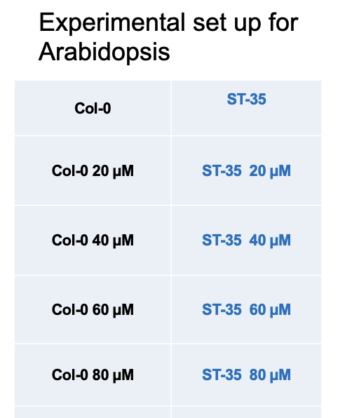

```{r setup, include = FALSE}
knitr::opts_chunk$set(echo = TRUE, cache = FALSE, warning = FALSE, message = FALSE)
```

The following are the necessary R-packages for running the code below: 
```{r, results = "hide"}
library(tidyverse)
library(readr)
library(RColorBrewer)
# be sure to run install.packages("BiocManager") and use BiocManager::install("package") order to install and run the following libraries 
library(DESeq2)
library(apeglm)
library(ashr)
library(pheatmap)
```

# 1) Peparing Count Data 
**1/20/25**
Below is a snippet of feature count data of Arabidopsis (both control and treated) regarding heavy metals.
```{r, echo = FALSE}
# reads in count data 
feature_counts <- read_tsv("../data/featureCounts_at_ST35.txt", show_col_types = FALSE)

# shows a snippet of the count data 
head(feature_counts, 10)

```

I created a data frame that matches the sample info provided by Sanju's PowerPoint slide as shown here:
```{r, echo = FALSE}


```

The following code creates the data frame itself, which will be used as colData in DESeq2.
```{r, results = "hide"}
# extract column names for the samples (exclude non-sample columns)
sample_names <- colnames(feature_counts)[-c(1, 2)]  # "GeneID" and "Length" are the first two columns (non-sample columns)

# map sample names treatment and genotype columns, respectively 
colData <- data.frame(
  sample_name = sample_names,
  treatment = case_when(
    grepl("^Col01_1", sample_names) ~ "0",
    grepl("^Col01_2", sample_names) ~ "20",
    grepl("^Col01_3", sample_names) ~ "40",
    grepl("^Col01_4", sample_names) ~ "60",
    grepl("^Col01_5", sample_names) ~ "80",
    grepl("^ST35_1", sample_names) ~ "0",
    grepl("^ST35_2", sample_names) ~ "20",
    grepl("^ST35_3", sample_names) ~ "40",
    grepl("^ST35_4", sample_names) ~ "60",
    grepl("^ST35_5", sample_names) ~ "80",
    TRUE ~ NA_character_ # default if no pattern matches
    ),
  genotype = case_when(
    grepl("Col", sample_names, ignore.case = TRUE) ~ "wild_type",
    grepl("ST35", sample_names, ignore.case = TRUE) ~ "knockout_line",
    TRUE ~ NA_character_ # default if no pattern matches
    ),
  row.names = sample_names # set sample_name column content as row names
  )

# combine 'genotype' and 'treatment' into a new 'group' column with shortened genotypes
colData$group <- paste(
  case_when(
    colData$genotype == "wild_type" ~ "wt", 
    colData$genotype == "knockout_line" ~ "ko",
    TRUE ~ NA_character_
  ),
  colData$treatment,
  sep = "_"
)

# convert appropriate columns into factors and remove sample_name column 
colData <- colData |>
  mutate(
    treatment = factor(treatment),
    genotype = factor(genotype),
    group = factor(group)
    ) |>
  select(-sample_name) # remove sample_name column 

# verify data structure 
str(colData)

```

``` {r, echo = FALSE}
# display colData
head(colData, 10)

```

Let's verify that the row names in colData matches the column names in feature_counts and are in the same order.
```{r}
# checking for matching names 
all(colnames(feature_counts) %in% rownames(colData))

```

The result is FALSE; this is due to the initial two columns found in the feature_counts for GeneID and Length. Let's remove the Length column and convert the GeneID column into the row names of this data frame (it shouldn't interfere with the DESeq2 output)! 
```{r}
# converting GeneID to rownames and removing Length column found in original feature count data set 
data_counts <- feature_counts |>
  column_to_rownames("GeneID") |>
  select(-Length)

# checking for matching names 
all(colnames(data_counts) %in% rownames(colData))

# checking that they are in the same order
all(colnames(data_counts) == rownames(colData))

# view new data counts format
head(data_counts, 10)

```
As we can see, it now returns TRUE for both conditions (matching names and same order).

# 2) Construct a DESeqDataSet Object
**1/21/25**

We will now be creating our DESeqDataSet object using the DESeq2 package and our recently updated and newly created data frames titled data_counts and colData, respectively. 

```{r}
# creating DESeq2 object 
dds <- DESeqDataSetFromMatrix(countData = data_counts,
                                   colData = colData,
                                   design = ~ treatment + genotype + treatment:genotype)

dds 

```
  
We have a total of 40745 rows.

Let's now pre-filter the dds to remove those entries that have less than 10 read counts (this is an arbitrary number I've simply chosen according to Dr. Liang's advice).
```{r}
# remove low gene counts (<10)
keep_counts <- rowSums(counts(dds)) >= 10
dds <- dds[keep_counts,]

dds

```
We have filtered down to 27710 rows.

# 3) Re-level Factors for Treatment Comparisons 
**1/21/25**

We now want to re-level and compare different treatment conditions to one another. Here are the following variations of the comparisons we will conduct: 

  - wild_type control vs. knockout_line control
    - 0 vs. 0
  
  - wild_type treatment vs. wild_type control 
    - WT_20 vs. WT_0, WT_40 vs. WT_0, etc.
  
  - knockout_line treatment vs. knockout_line control 
    - KO_20 vs. KO_0, KO_40 vs. KO_0, etc.
    
  - knockout_line treatment vs. wild_type treatment 
    - KO_20 vs. WT_20, KO_40 vs. WT_40, etc.
  
Note: we don't have to necessarily state which reference level we want to use. DESeq2 will simply choose alphabetically which level to use.
```{r}
# use wild_type control as reference baseline 
dds$treatment <- relevel(dds$treatment, ref = "0")
dds$genotype <- relevel(dds$genotype, ref = "wild_type")
# use the control as reference for every single dds object I will be making 

# you may want to set this to a different variable object so that we can keep reusing our set up data and not overwrite it every time (double-check with Dr. Liang if I can do that because this doesn't seem t make new variable anyway)
```

IMPORTANT NOTE: Make sure to collapse the technical replicates before analysis; however, do not collapse biological replicates! (I don't really know what this means though)

# 4) Run DESeq2 
**1/21/25**

We can now run DESeq2 and see if our data structure works! 
```{r}
# run the differential gene expression analysis
dds <- DESeq(dds)

# view what conditions were contrasted to make sure they match what we actually meant to compare 
resultsNames(dds)

# store the results in an object 
res_dds <- results(dds)

# view DESeq2 results 
res_dds
```

## Normalization 
**1/28/25**

The following code chunk is the normalization of the data's read counts for future use:
```{r}
# normalization of read counts for future use 
dds <- estimateSizeFactors(dds)
sizeFactors(dds)
normalized_counts <- counts(dds, normalized = TRUE)

# make a box plot using normalized counts 
boxplot(log10(normalized_counts))

# write data to a csv file 
write.csv(normalized_counts, file = "../data/st35_normalized_counts.csv")
```

# 5) Explore DESeq2 Results
**1/21/25**

Let's begin exploring the results of the differential gene expression analysis by summarizing the results.

  - we will use both the default setting for p-value and our own adjusted p-value of 0.05

```{r}
# summary results of dds (with a re-leveling of wild_type control vs. each treatment, and interaction between treatment and genotype) 
summary(res_dds)

# with adjusted p-value of 0.05
res_0.05_dds <- results(dds, alpha = 0.05)
summary(res_0.05_dds)

```

We can also use DESeq2's contrast function to compare specific factor levels after re-leveling. This allows us to make all the necessary comparisons we need without having to re-run the DESeq function with different parameters every time. 

Below are the comparison results between both the ____ and the ____:

The struggle here is that I need to be able to be more exact with my comparisons; how can I compare wild_type_0 to knockout_line_0 when the meta-data is contained in different columns (something the contrast function does not accommodate for).

  - The answer is that I would need to make a combined and more specific column in colData 
```{r, eval = FALSE}
#USEFUL FOR REFERENCE ON USING BASE CONTRAST() FUNCTION BUT THIS CODE CHUNK DOES NOT RUN

# contrast different factor levels (i.e. each treatment vs. ST-35, Col-0 vs. ST-35, etc.)
res_0_80 <- results(dds, contrast = c("treatment", "0", "80"), alpha = 0.05) # p-value of 0.05; this alpha = 0.05 does not work 
# do shrinkage after each individual contrast 

# convert DESeq2 results to a data frame
res_0_80_df <- as.data.frame(res_0_80)

# add the gene IDs as a column in the data frame
res_0_80_df$GeneID <- rownames(res_0_80_df)

# reorder columns to place GeneID as the first column
res_0_80_df <- res_0_80_df[, c("GeneID", colnames(res_0_80_df)[-ncol(res_0_80_df)])]

# write output to a csv file 
write.csv(res_0_80_df, "../data/DESeq2_results_0_vs_80.csv", row.names = FALSE) # filter and save only those values have are < 0.05 (get creative with padj in the res_0_80_df)
```

# 6) Visualizing the Results 
The following are different ways we can visualize the results of our differential gene expression analysis.

## PCA (Principal Component Analysis)
**1/21/25**

### Extract and Transform Normalized Data 
Make sure to use the the normalized data counts and not the DESeq result output! 
```{r}
# perform variance stabilizing transformation (VST)
vsd <- vst(dds, blind = FALSE)

# Alternatively, use rlog (log transformation)
# vsd <- rlog(dds, blind = FALSE)
```

### Perform PCA 
```{r}
# extract the transformed data
transformed_counts <- assay(vsd)

# perform PCA on the transformed counts
pca <- prcomp(t(transformed_counts))
```

### Extract PCA Results for Plotting 
```{r}
# create a data frame with PCA results and sample metadata
pca_dat <- as.data.frame(pca$x)  # PCA scores for each sample
pca_dat$sample <- rownames(pca_dat)  # sample names
pca_dat$treatment <- colData(dds)$treatment  # grouping variable (treatment condition)
pca_dat$genotype <- colData(dds)$genotype  # add genotype to the PCA data
```

### Create PCA Plot 
```{r}
# plot the first two principal components
ggplot(pca_dat, aes(x = PC1, y = PC2, color = treatment, shape = genotype, label = sample)) +
  geom_point(size = 3) +
  geom_text(vjust = -1, hjust = 0.5, size = 3) +
  labs(
    title = "PCA Plot of Arabidopsis Selenium Treatment:\nSulfur Transport Knockout-Line and Wild-Type Samples",
    x = paste0("PC1: ", round(summary(pca)$importance[2, 1] * 100, 1), "% Variance"),
    y = paste0("PC2: ", round(summary(pca)$importance[2, 2] * 100, 1), "% Variance"),
    color = "Treatment",
    shape = "Genotype"
  ) +
  theme_minimal()
```

## MA Plot 
**1/28/25**

### Genotype Shrinkage 
```{r}
# Step 1: Compute results for the contrast
res <- results(dds, contrast = c("genotype", "knockout_line", "wild_type"))

# Step 2: Apply shrinkage to the results
res_shrink <- lfcShrink(dds, coef = "genotype_knockout_line_vs_wild_type", type = "apeglm")

# check results
summary(res_shrink)
```

### Update the PCA Data Frame
```{r}
# create a data frame with the results from lfcShrink
pca_dat_shrink <- as.data.frame(res_shrink)
pca_dat_shrink$significance <- ifelse(pca_dat_shrink$padj < 0.05, "Significant", "Not Significant")

```

### Create MA Plot 
```{r}
# create MA plot using ggplot2
ggplot(pca_dat_shrink, aes(x = baseMean, y = log2FoldChange, color = significance)) +
  geom_point(size = 1) +
  scale_color_manual(values = c("Significant" = "blue", "Not Significant" = "black")) +
  scale_x_log10() +  # Apply log scale to x-axis (baseMean)
  labs(title = "MA Plot: Differential Expression with Shrinkage",
       x = "Mean of Normalized Counts (log scale)", 
       y = "Shrunken Log2 Fold Change") +
  theme_minimal()

```

# 7) Analyses for All Treatment Combinations
**2/3/25 - 2/4/25**

## Subsetting 'colData' and 'data_counts' into Individual Data Frames 
I will be subsetting our properly structured 'colData' data frame produced earlier in this script (found under "1. Preparing Count Data") as well as the 'data_counts' data frame to match column and rownames. This will allow us to properly utilize the contrast() function DESeq2 offers, giving us the ability to more dynamically compare our samples by treating the varying columns as independent factors. 

As a reminder, we will be making many comparisons, of which are as follows:

  - knockout_line treatment vs. wild_type treatment 
    - KO_20 vs. WT_20, KO_40 vs. WT_40, etc.

  - wild_type control vs. knockout_line control
    - WT_0 vs. KO_0
  
  - wild_type treatment vs. wild_type control 
    - WT_20 vs. WT_0, WT_40 vs. WT_0, etc.
  
  - knockout_line treatment vs. knockout_line control 
    - KO_20 vs. KO_0, KO_40 vs. KO_0, etc.
    
We will be using a total of 4 colData and data_counts variants (including the original colData and data_counts created earlier in this script) that will utilize either the 'treatment' or 'group' column as their contrast arguments depending on the type of specificity our colData allows. 

### Original colData and data_counts (for KO Treatment vs. WT Treatment)
colData:
```{r, echo = FALSE}
# display original colData produced under "1. Preparing Count Data"
head(colData)

```

data_counts:
```{r, echo = FALSE}
# display original data_counts produced under "1. Preparing Count Data"
head(data_counts)

```

Display does not obviously show that all rows/columns are included.

### Only Controls 
colData_controls:
```{r, echo = FALSE}
# subset colData to only include rows where treatment is 0 (control groups)
colData_controls <- colData[colData$treatment == 0, ]

head(colData_controls)

```

data_counts_controls:
```{r, echo = FALSE}
# subset data_counts to only include columns that start with 'Col01_1' or 'ST35_1'
control_columns <- grep("^(Col01_1.*|ST35_1.*)", colnames(data_counts))

# subset the data_counts to only include the above columns
data_counts_controls <- data_counts[, control_columns]

head(data_counts_controls)

```

### Only Wild-Type Samples 
colData_wt: 
```{r, echo = FALSE}
# subset colData to only include rows where genotype is wild_type 
colData_wt <- colData[colData$genotype == "wild_type", ]

head(colData_wt)

```

data_counts_wt:
```{r, echo = FALSE}
# subset data_counts to only include columns that start with 'Col'
wt_columns <- grep("^(Col.*)", colnames(data_counts))

# subset the data_counts to only include the above columns
data_counts_wt <- data_counts[, wt_columns]

head(data_counts_wt)

```

### Only Knockout-Line Samples 
colData_ko:
```{r, echo = FALSE}
# subset colData to only include rows where genotype is knockout_line 
colData_ko <- colData[colData$genotype == "knockout_line", ]

head(colData_ko)

```

data_counts_ko:
```{r, echo = FALSE}
# subset data_counts to only include columns that start with 'ST35'
ko_columns <- grep("^(ST35.*)", colnames(data_counts))

# subset the data_counts to only include the above columns
data_counts_ko <- data_counts[, ko_columns]

head(data_counts_ko)

```

## Function for Creating Varying 'dds' Objects 
I've written a function that allows for easy manipulation and production of 'dds' objects using the DESeqDataSetFromMatrix() function. It seems very similar to simply using the DESeq2 function itself, however, this allows for cleaner production of the dds objects and includes chosen filtering of gene counts. It also includes error messages to gracefully halt improper inputs. 

  - read_counts = the countData input (assumed it is properly structured)
  - column_data = the colData meta data that also contains the columns used for the design of the dds object
  - design_parameter = your chosen design formula that aligns with the colData column names 
  - filter_low_counts = a chosen limit to filter out gene counts; default is set to no filtering if not explicitly stated 
  
This function only works if the DESeq2 package is installed and running on the same script. 
```{r, results = 'hide'}
dds_generator <- function(read_counts, column_data, design_parameter, filter_low_counts = NULL) {
  if (!is.character(design_parameter)) {
    stop("'design_parameter' must be a character string representing the design formula.")
  }
  
  # validate design variables exist in column_data
  design_vars <- unlist(strsplit(design_parameter, " \\+ | \\* "))
  missing_vars <- setdiff(design_vars, colnames(column_data))
  if (length(missing_vars) > 0) {
    stop("The following design variables are missing in 'column_data': ", paste(missing_vars, collapse = ", "))
  }
  
  # convert design parameter input into formula
  design_formula <- as.formula(paste("~", design_parameter))
  
  # creating DESeq2 object
  dds <- DESeqDataSetFromMatrix(countData = read_counts,
                                colData = column_data,
                                design = design_formula)
  
  # remove low gene counts only if a filtering threshold is specified
  if (!is.null(filter_low_counts) && is.numeric(filter_low_counts) && filter_low_counts > 0) {
    keep_counts <- rowSums(counts(dds)) >= filter_low_counts
    dds <- dds[keep_counts,]
  }
  
  return(dds)
}

```

## Generating and Re-leveling 'dds' Objects 
Using all of the particular colData sub-sets, I will be producing varying 'dds' objects that will have different design formulas depending on how specific we need the comparisons between samples to be. These objects will then be implemented with the contrast function for more specific comparisons within each subset. 

  - Each 'dds' object will be produced and filtered using the dds_generator() function 

All 'dds' objects will be factor re-leveled to reference the baseline which is the wild-type control sample (treatment = 0 and genotype = wild_type or group = wild_type_0). This will be the same for every analyses. 

### KO Treatment vs. WT Treatment 
```{r}
dds_treatment <- dds_generator(data_counts, colData, "group", 10)

# set reference level: group to wt_0
dds_treatment$group <- relevel(dds_treatment$group, ref = "wt_0")

dds_treatment
```

### Only Controls 
```{r}
dds_controls <- dds_generator(data_counts_controls, colData_controls, "genotype", 10)

# set reference level: genotype to wild_type 
dds_controls$genotype <- relevel(dds_controls$genotype, ref = "wild_type")

dds_controls
```

### Only Wild-Type Samples 
```{r}
dds_wt <- dds_generator(data_counts_wt, colData_wt, "treatment", 10)

# set reference level: treatment to 0
dds_wt$treatment <- relevel(dds_wt$treatment, ref = "0")

dds_wt
```

### Only Knockout-Line Samples
```{r}
dds_ko <- dds_generator(data_counts_ko, colData_ko, "treatment", 10)

# set reference level: treatment to 0
dds_ko$treatment <- relevel(dds_ko$treatment, ref = "0")

dds_ko
```

## Functions for Writing Shrunken Comparison Data to CSV's
To allow for easier reproducibility and less redundancy in the code, I've written two functions that allow for producing dynamic contrasts that utilize either apeglm shrinkage with coefficients or ashr shrinkage with contrasts, and writes the output to a dynamically named CSV file.

### coef_shrinkage_contrast() Function 
As mentioned, the coef_shrinkage_contrast() function using apeglm shrinkage and coefficients from the 'dds' levels. This is especially useful to maintain independence amongst comparisons and the factor levels. 

  - dds_object = the specific 'dds' object used for the contrast 
  - column = the specific column used to reference the factor levels being contrasted 
  - level_1 = the first factor level being compared 
  - priority_level_2 = the second factor level being compared (generally the preferred baseline according to reference level)
  - output_dir = the relative path to which you want your dynamically named CSV file to go (the default is set for my personal computer;
  adjust it to your needs)
  
This function also dynamically incorporates the proper coefficient using the column, level_1, and priority_level_2 parameters. It also has a built-in check to make sure the coefficient exists in said dds object.
  
This function requires the apeglm package installed and running on the same script to work. 
```{r, results = 'hide'}
coef_shrinkage_contrast <- function(dds_object, column, level_1, priority_level_2, output_dir = "../data/arabidopsis_deseq2_results/") {
  # construct the expected coefficient name
  coef_name <- paste0(column, "_", level_1, "_vs_", priority_level_2)
  
  # ensure the coefficient exists
  dds_name <- deparse(substitute(dds_object))  # grab the object's name as a string 
  if (!(coef_name %in% resultsNames(dds_object))) {
    stop(paste("Coefficient", coef_name, "not found in object", dds_name, ". Check resultsNames(", dds_name, ")."))
    }

  # apply shrinkage using apeglm
  shrink_result <- lfcShrink(dds_object, coef = coef_name, type = "apeglm")

  # convert the shrinkage results to a data frame
  result_df <- as.data.frame(shrink_result)

  # add the gene IDs as a column in the data frame
  result_df$GeneID <- rownames(result_df)

  # re-order columns to place GeneID as the first column
  result_df <- result_df[, c("GeneID", colnames(result_df)[-ncol(result_df)])]

  # get the name of the dds_object (used for output_file name)
  dds_name <- deparse(substitute(dds_object))

  # generate dynamic output file name
  output_file <- paste0(output_dir, "deseq2_", dds_name, "_", level_1, "_vs_", priority_level_2, ".csv")

  # write output to a CSV file
  write.csv(result_df, output_file, row.names = FALSE)
}

```

### ashr_shrinkage_contrast() Function 
The following ashr_shrinkage_contrast() function utilizes the ashr shrinkage estimator along with the contrast function to allow mutability in contrasting factor levels that are were not originally set during factor re-leveling. In other words, we can compare different factor levels that are do not involve the reference level. 

All of the parameters used in the function above are used and represented the same in this one. The same checks are also in place.

This function requires the ashr package to be installed and running on the same script. 
```{r, results = 'hide'}
ashr_shrinkage_contrast <- function(dds_object, column, level_1, priority_level_2, output_dir = "../data/arabidopsis_deseq2_results/") {
  # ensure the contrast levels exist
  dds_name <- deparse(substitute(dds_object))  # grab the object's name as a string 
  factor_levels <- levels(colData(dds_object)[[column]])  # Get levels of the specified column
  
  # check whether the levels exist in the factor column
  if (!(level_1 %in% factor_levels) | !(priority_level_2 %in% factor_levels)) {
    stop(paste("Levels", level_1, "or", priority_level_2, "not found in column", column, "of object", dds_name, ". Check levels(colData(",
               dds_name, ")[[", column, "]])."))
    }
  
  # apply shrinkage using ashr and contrast
  shrink_result <- lfcShrink(dds_object, contrast = c(column, level_1, priority_level_2), type = "ashr")

  # convert the shrinkage results to a data frame
  result_df <- as.data.frame(shrink_result)

  # add the gene IDs as a column in the data frame
  result_df$GeneID <- rownames(result_df)

  # re-order columns to place GeneID as the first column
  result_df <- result_df[, c("GeneID", colnames(result_df)[-ncol(result_df)])]

  # generate dynamic output file name
  output_file <- paste0(output_dir, "deseq2_", dds_name, "_", level_1, "_vs_", priority_level_2, ".csv")

  # write output to a CSV file
  write.csv(result_df, output_file, row.names = FALSE)
}

```

## Run Varying DESeq2 Analyses and Contrasts
Below will contain the code running all of the various DESeq2 analyses we need along with specific contrasts. Each contrast will be written to a CSV file that will be used for further analyses. There will be many files saved to a sub directory within my 'data' directory. 

### KO Treatment vs. WT Treatment 
```{r}
# run the differential gene expression analysis
dds_treatment <- DESeq(dds_treatment)

# view what conditions were contrasted to make sure they match what we actually meant to compare 
resultsNames(dds_treatment)

# store the results in an object 
res_dds_treatment <- results(dds_treatment)

# view DESeq2 results 
res_dds_treatment

# summary results of res_dds_treatment (with re-level of group = wt_0); general summary 
summary(res_dds_treatment, 0.05)
```

We will be using the ashr_shrinkage_contrast() function for the comparisons regarding dds_treatment as they have a reference level of wt_0 but require contrasts between treatments of both genotypes to each other, not to the controls. In other words, we will be comparing wt_20 vs. ko_20, wt_40 vs. ko_40, etc., in these 'dds' results. Therefore, we need the ability to be specific about our contrasts (using the contrast() function) and still be able to shrink the data which is not functional with apeglm, but is functional with ashr.

#### WT_20 vs. KO_20 
```{r, results = 'hide'}
ashr_shrinkage_contrast(dds_treatment, "group", "ko_20", "wt_20")
```

**3/27/25**
The following is a code chunk that shows the summary results of a dds object that has undergone DESeq2 analysis (in this case, dds_treatment) with a specific contrast. The information regarding up and down regulated gene counts/percentages are recorded in two separate Excel files in the 'data' directory. 

The two files contain 7 of the 8 columns below: 

  - comparison = the particular dds object used for the DESeq2 analysis 
    - the general comparison without any particular contrasts (e.g. wt vs. ko as a whole; not contrasted any more specifically than that
    using the results from the dds object called dds_treatment)
  - contrast = the particular dds object used for the DESeq2 analysis using more specific contrast parameters 
    - the more specific contrast comparison (e.g. using the column "group", we contrasted "ko_20" against "wt_20" using the results from
    the dds object called dds_treatment)
  - up_counts = the number of genes with a positive Log2FoldChange (up-regulated)
  - up_percent = the percentage of genes with a positive Log2FoldChange (up-regulated)
  - down_counts = the number of genes with a negative Log2FoldChange (down-regulated)
  - up_percent = the percentage of genes with a positive Log2FoldChange (up-regulated)
  - total_count = the total number of reads 
  - padj_threshold = the adjusted p-value threshold used to filter the summary results (e.g. a cell value of 0.05 means that the
  counts/percentages only applied to genes with an adjusted p-value < 0.05)
  
Note: No shrinkage has been applied to these summary results. Shrinkage was only applied to the output CSV files associated with the ashr_shrinkage_contrast() and coef_shrinkage_contrast() functions. 

The file titled "general_at_deseq_results_summary.xlsx" is the generalized summary without contrasts and uses the column labeled comparison.
The file titled "contrast_at_deseq_results_summary.xlsx" is the more specific summary using contrasts and uses the column labeled contrast. Both files contain the rest of the columns. 

  - 'at' stands for Arabidopsis thaliana
  
The code chunks for the remaining result summaries will be hidden in this R Markdown file but the results will still be displayed. Also, due to how few contrasts there actually are and columns associated, I simply added these values into their files by hand. 
```{r}
# summarized results of dds_treatment with contrast of ko_20 vs. wt_20 and adjusted p-value < 0.05 
summary(results(dds_treatment, contrast = c("group", "ko_20", "wt_20")), 0.05)
```

#### WT_40 vs. KO_40 
```{r, results = 'hide'}
ashr_shrinkage_contrast(dds_treatment, "group", "ko_40", "wt_40")
```

```{r, echo = FALSE}
# summarized results of dds_treatment with contrast of ko_40 vs. wt_40 and adjusted p-value < 0.05 
summary(results(dds_treatment, contrast = c("group", "ko_40", "wt_40")), 0.05)
```

#### WT_60 vs. KO_60 
```{r, results = 'hide'}
ashr_shrinkage_contrast(dds_treatment, "group", "ko_60", "wt_60")
```

```{r, echo = FALSE}
# summarized results of dds_treatment with contrast of ko_60 vs. wt_60 and adjusted p-value < 0.05 
summary(results(dds_treatment, contrast = c("group", "ko_60", "wt_60")), 0.05)
```

#### WT_80 vs. KO_80 
```{r, results = 'hide'}
ashr_shrinkage_contrast(dds_treatment, "group", "ko_80", "wt_80")
```

```{r, echo = FALSE}
# summarized results of dds_treatment with contrast of ko_80 vs. wt_80 and adjusted p-value < 0.05 
summary(results(dds_treatment, contrast = c("group", "ko_80", "wt_80")), 0.05)
```

### Only Controls 
```{r}
# run the differential gene expression analysis
dds_controls <- DESeq(dds_controls)

# view what conditions were contrasted to make sure they match what we actually meant to compare 
resultsNames(dds_controls)

# store the results in an object 
res_dds_controls <- results(dds_controls)

# view DESeq2 results 
res_dds_controls

# summary results of res_dds_controls (with re-level of genotype = wild_type)
summary(res_dds_controls, 0.05)
```

For the all of the remaining comparisons, we will be using the coef_shrinkage_contrast() function as the data for the dds_controls, dds_wt, and dds_ko objects have all been subset and re-leveled to reference the wild_type control variant where possible (dds_controls and dds_wt) or the knockout_line control variant in dds_ko. In these cases, we are comparing all instances specifically to the reference level, therefore, the intercepts are viable coefficients to use with the apeglm shrinkage estimator. Although we cannot use the contrast() function with apeglm. 

The vignette's on DESeq2 describe apeglm as a higher performance estimator than ashr. For now, I am using a mix for the sake of ease in repeated production of the resulting dds data sets. Depending on our future needs, we can apply either function to all the data to maintain consistency. 

#### WT_0 vs. KO_0 
I honestly should not need to even contrast this as the only rows in the 'dds_controls' are the triplactes of the control groups for both the knockout_line and the wild_type variants. However, I have the run_shrinkage_contrast() function already and it seems to work pretty well, and incorporates shrinkage so we will just use it. 
```{r, results = 'hide'}
coef_shrinkage_contrast(dds_controls, "genotype", "knockout_line", "wild_type")
```

```{r, echo = FALSE}
# summarized results of dds_controls with contrast of knockout_line vs. wild_type and adjusted p-value < 0.05 
# note: same as without the contrast (the general summary) as they are the only two samples within the DESeq2 analysis anyway but we will leave this here regardless 
summary(results(dds_controls, contrast = c("genotype", "knockout_line", "wild_type")), 0.05)
```

### Only Wild-Type Samples 
```{r}
# run the differential gene expression analysis
dds_wt <- DESeq(dds_wt)

# view what conditions were contrasted to make sure they match what we actually meant to compare 
resultsNames(dds_wt)

# store the results in an object 
res_dds_wt <- results(dds_wt)

# view DESeq2 results 
res_dds_wt

# summary results of res_dds_wt (with re-level of treatment = 0 for wild_type)
summary(res_dds_wt, 0.05)
```

#### WT_0 vs. WT_20
```{r, results = 'hide'}
coef_shrinkage_contrast(dds_wt, "treatment", "20", "0")
```

```{r, echo = FALSE}
# summarized results of dds_wt with contrast of wt_0 vs. wt_20 and adjusted p-value < 0.05 
summary(results(dds_wt, contrast = c("treatment", "20", "0")), 0.05)
```

#### WT_0 vs. WT_40 
```{r, results = 'hide'}
coef_shrinkage_contrast(dds_wt, "treatment", "40", "0")
```

```{r, echo = FALSE}
# summarized results of dds_wt with contrast of wt_0 vs. wt_40 and adjusted p-value < 0.05 
summary(results(dds_wt, contrast = c("treatment", "40", "0")), 0.05)
```

#### WT_0 vs. WT_60
```{r, results = 'hide'}
coef_shrinkage_contrast(dds_wt, "treatment", "60", "0")
```

```{r, echo = FALSE}
# summarized results of dds_wt with contrast of wt_0 vs. wt_60 and adjusted p-value < 0.05 
summary(results(dds_wt, contrast = c("treatment", "60", "0")), 0.05)
```

#### WT_0 vs. WT_80 
```{r, results = 'hide'}
coef_shrinkage_contrast(dds_wt, "treatment", "80", "0")
```

```{r, echo = FALSE}
# summarized results of dds_wt with contrast of wt_0 vs. wt_80 and adjusted p-value < 0.05 
summary(results(dds_wt, contrast = c("treatment", "80", "0")), 0.05)
```

### Only Knockout-Line Samples
```{r}
# run the differential gene expression analysis
dds_ko <- DESeq(dds_ko)

# view what conditions were contrasted to make sure they match what we actually meant to compare 
resultsNames(dds_ko)

# store the results in an object 
res_dds_ko <- results(dds_ko)

# view DESeq2 results 
res_dds_ko

# summary results of res_dds_ko (with re-level of treatment = 0 for knockout_line)
summary(res_dds_ko, 0.05)
```

#### KO_0 vs. KO_20
```{r, results = 'hide'}
coef_shrinkage_contrast(dds_ko, "treatment", "20", "0")
```

```{r, echo = FALSE}
# summarized results of dds_ko with contrast of ko_0 vs. ko_20 and adjusted p-value < 0.05 
summary(results(dds_ko, contrast = c("treatment", "20", "0")), 0.05)
```

#### KO_0 vs. KO_40
```{r, results = 'hide'}
coef_shrinkage_contrast(dds_ko, "treatment", "40", "0")
```

```{r, echo = FALSE}
# summarized results of dds_ko with contrast of ko_0 vs. ko_40 and adjusted p-value < 0.05 
summary(results(dds_ko, contrast = c("treatment", "40", "0")), 0.05)
```

#### KO_0 vs. KO_60
```{r, results = 'hide'}
coef_shrinkage_contrast(dds_ko, "treatment", "60", "0")
```

```{r, echo = FALSE}
# summarized results of dds_ko with contrast of ko_0 vs. ko_60 and adjusted p-value < 0.05 
summary(results(dds_ko, contrast = c("treatment", "60", "0")), 0.05)
```

#### KO_0 vs. KO_80
```{r, results = 'hide'}
coef_shrinkage_contrast(dds_ko, "treatment", "80", "0")
```

```{r, echo = FALSE}
# summarized results of dds_ko with contrast of ko_0 vs. ko_80 and adjusted p-value < 0.05 
summary(results(dds_ko, contrast = c("treatment", "80", "0")), 0.05)
```

# CSV Naming Key
**2/5/25**

The following are defined terms and acronyms that can be used to distinguish the CSV files produced via the ashr_shrinkage_contrast() and coef_shrinkage_contrast() functions. 

  - All file titles will consistently include 'deseq2_1_2_vs_3.csv':
    - 'deseq2' is included as that is the package we are using to conduct these analyses and to produce the object used in the analyses.
    - 'vs' simply means versus as this denotes that particular comparison used to produce the data in said file. 
    - '.csv' will be consistent as we are writing to a csv file; can be changed within the function to whatever file format preferred.
    - Functions utilizes snake_case format by placing an underscore between all terms in the title. It will only be a mix of snake_case
    and other formatting if you do not use snake_case to name row values in your colData data frame. 
    - Each number represents a part of your contrast parameters used in either function (i.e the numbers will not actually be in your
    saved file name):
      - 1 = the name of your used 'dds' object 
      - 2 = the first factor level used in your contrast 
      - 3 = the second factor level used in your contrast 
  
Key Title Terms: 

  - deseq2 = package used to run analysis 
  
  - 'dds' Object Names: 
    - dds_controls = the 'dds' object used for analysis only consisted of the control data for both wild_type and knockout_line samples
    - dds_ko = the 'dds' object used for analysis only consisted of the knockout_line data
    - dds_wt = the 'dds' object used for analysis only consisted of the wild_type data
    - dds_treatment = the 'dds' object used for analysis consisted of all samples (including controls)
  
  - Contrast Parameters: 
    - knockout_line = genotype factor level for knockout-line samples 
    - wild_type = genotype factor level for wild-type samples 
    - 0 = treatment factor level for control samples (no treatment)
    - 20 = treatment factor level for samples treated with 20 uM 
    - 40 = treatment factor level for samples treated with 40 uM 
    - 60 = treatment factor level for samples treated with 60 uM 
    - 80 = treatment factor level for samples treated with 80 uM 
    
For example, one of the csv files produced from the above analyses had the title of: deseq2_dds_ko_20_vs_0.csv

  - The 'dds' object used consisted of only the knockout_line samples and is thus named 'dds_ko' (ko = knockout).
  - This file contains the contrast results of the knockout_line samples treated with 20 uM against the control sample with 0 uM. 
  
Therefore, this CSV file contains the resulting contrast between the knockout_line sample treated with 20 uM and the knockout_line control sample with 0 uM. 

# 8) Gene Ontology Enrichment Analysis
**2/18/25**

Be sure to install and run the following libraries for the analysis:
```{r, results = 'hide'}
# be sure to run install.packages("BiocManager") and use BiocManager::install("package") order to install and run the following libraries
library(clusterProfiler)
library(AnnotationDbi) # warning: will mask select() from dpylr 
library(org.At.tair.db) # database used for arabidopsis
```

## Read in Individual Treatment Comparison CSV Files 
In order to conduct GO enrichment analysis, we will need to read in our produced CSV files (from section #7) as data frames. The following chunk of code will loop through our data folder that contains the CSV files and save them as individual data frames in our global environment for further use. 

The code will keep the same name for the files but change the beginning portion of "deseq2_" to "df_" and will only read in those rows with a padj < 0.05. Be sure to also replace the file path when creating the data_folder variable to wherever your CSV files were saved (will be the same path as used in the coef and ashr functions if those were utilized). If you are using the full GitHub repository, then ignore that last sentence as these relative paths will work perfectly with the repository.  
```{r, results = 'hide'}
# define the data folder path
data_folder <- "../data/arabidopsis_deseq2_results/"  # change to your actual data folder path unless using full GitHub repository

# list all CSV files in the folder
csv_files <- list.files(data_folder, pattern = "\\.csv$", full.names = TRUE)

# avoid scientific notation
options(scipen = 999)

# loop through each file and create a filtered data frame (padj < 0.05)
for (file in csv_files) {
  # extract file name without extension
  df_name <- tools::file_path_sans_ext(basename(file))
  
  # replace "deseq2_" with "df_" in the variable name (should always work if using the ashr and coef functions)
  df_name <- sub("^deseq2_", "df_", df_name)
  
  # read the CSV into a data frame
  df <- read.csv(file, stringsAsFactors = FALSE)
  
  # filter rows where column padj < 0.05 and remove rows where padj = NA 
  df <- df[!is.na(df$padj) & df$padj < 0.05, ]
  
  # save the data frames to the global environment
  assign(df_name, df, envir = .GlobalEnv)
}
```

## GO_results() Function 
Function made to allow for modular Gene Ontology Enrichment analysis result output. The function's parameters are as follows:

  - dataframe = dataframe of Deseq2 results of a specific comparison
  - up_or_down = input "up" to subset up-regulated genes (+log2FoldChange) or "down" to subset down-regulated genes
  (-log2FoldChange)
  - database = chosen database used for the gene annotation (pulled from BiocManager; default is org.At.tair.db which a
  database for arabidopsis)
  - key = keyType used for the correct organism and database (default is "TAIR" which is for arabidopsis)
  - ont_category = the major category used to dictate the gene ontology analysis
    - BP = Biological Processes (our default for this function)
    - MF = Molecular Function
    - CC = Cellular Component 
```{r, results = 'hide'}
GO_results <- function(dataframe, up_or_down, database = "org.At.tair.db", key = "TAIR", ont_category = "BP") {
  # remove any suffix (like ".1") from the GeneIDs (won't work otherwise)
  dataframe$GeneID <- sub("\\..*", "", dataframe$GeneID)
  
  # filter up-regulation or down-regulation based on up_or_down
  if (up_or_down == "up") {
    genes_to_test <- dataframe$GeneID[dataframe$log2FoldChange > 0]
  } else if (up_or_down == "down") {
    genes_to_test <- dataframe$GeneID[dataframe$log2FoldChange < 0]
  } else {
    stop("Invalid value for 'up_or_down'. Use 'up' or 'down'.")
  }
  
  # perform GO enrichment analysis
  go_results <- enrichGO(gene = genes_to_test, OrgDb = database, keyType = key, ont = ont_category)
  
  return(go_results)
  
}
```

## save_GO_results() Function 
This function is used to convert the GO analysis results into a more reader-friendly data frame, write the contents to a CSV file, and then sort them into respective folders for either "up" or "down" regulation. 

  - go_result = chosen GO results object 
  - direction = direction of gene regulation ("up" or "down") used to determine the folder sorting location 
  - file_path = path to parent directory of where your "up" or "down" folders are produced (default is my parent directory)
```{r, results = 'hide'}
save_GO_results <- function(go_result, direction, file_path = "../data/arabidopsis_GO_results/") {
  # convert the GO results object to a data frame
  go_result_df <- as.data.frame(go_result)
  
  # get the go_result variable name as a string
  object_name <- deparse(substitute(go_result))
  
  # define the directory based the gene regulation direction ("up" or "down")
  output_folder <- paste0(file_path, direction, "_results/")
  
  # create the folder if it doesn't exist
  dir.create(output_folder, recursive = TRUE, showWarnings = FALSE)
  
  # define the output file name using the go_result variable name (so name it something useful)
  output_file <- paste0(output_folder, object_name, ".csv")
  
  # write the data frame to a CSV file
  write.csv(go_result_df, file = output_file, row.names = FALSE) 
}
```

## Annotating Genes 
The following code will utilize clusterProfiler, AnnotationDbi, the GO_results(), and save_GO_results() functions to annotate the genes found in each of the individual CSV files we have just read into data frames. We will select for both up-regulated (+log2FoldChange) and down-regulated (-log2FoldChange) for each CSV file. We will also be conducting this on each of the three gene ontology categories (biological processes, molecular functions, cellular components).

  - We will have double the amount of CSV files split into two different folders.

KO Treatment vs. WT Treatment:
```{r}
# WT_20 vs. KO_20 
up_BP_ko_20_vs_wt_20_GO <- GO_results(df_dds_treatment_ko_20_vs_wt_20, "up") # actual GO results (up-regulated)/default ont_category = "BP"
save_GO_results(up_BP_ko_20_vs_wt_20_GO, "up") # GO results converted to a dataframe and saved to a CSV file 
down_BP_ko_20_vs_wt_20_GO <- GO_results(df_dds_treatment_ko_20_vs_wt_20, "down") # (down-regulated)
save_GO_results(down_BP_ko_20_vs_wt_20_GO, "down")

up_MF_ko_20_vs_wt_20_GO <- GO_results(df_dds_treatment_ko_20_vs_wt_20, "up", ont_category = "MF")
save_GO_results(up_MF_ko_20_vs_wt_20_GO, "up")
down_MF_ko_20_vs_wt_20_GO <- GO_results(df_dds_treatment_ko_20_vs_wt_20, "down", ont_category = "MF")
save_GO_results(down_MF_ko_20_vs_wt_20_GO, "down")

up_CC_ko_20_vs_wt_20_GO <- GO_results(df_dds_treatment_ko_20_vs_wt_20, "up", ont_category = "CC")
save_GO_results(up_CC_ko_20_vs_wt_20_GO, "up")
down_CC_ko_20_vs_wt_20_GO <- GO_results(df_dds_treatment_ko_20_vs_wt_20, "down", ont_category = "CC")
save_GO_results(down_CC_ko_20_vs_wt_20_GO, "down")


# WT_40 vs. KO_40
up_BP_ko_40_vs_wt_40_GO <- GO_results(df_dds_treatment_ko_40_vs_wt_40, "up")
save_GO_results(up_BP_ko_40_vs_wt_40_GO, "up")
down_BP_ko_40_vs_wt_40_GO <- GO_results(df_dds_treatment_ko_40_vs_wt_40, "down")
save_GO_results(down_BP_ko_40_vs_wt_40_GO, "down")

up_MF_ko_40_vs_wt_40_GO <- GO_results(df_dds_treatment_ko_40_vs_wt_40, "up", ont_category = "MF")
save_GO_results(up_MF_ko_40_vs_wt_40_GO, "up")
down_MF_ko_40_vs_wt_40_GO <- GO_results(df_dds_treatment_ko_40_vs_wt_40, "down", ont_category = "MF")
save_GO_results(down_MF_ko_40_vs_wt_40_GO, "down")

up_CC_ko_40_vs_wt_40_GO <- GO_results(df_dds_treatment_ko_40_vs_wt_40, "up", ont_category = "CC")
save_GO_results(up_CC_ko_40_vs_wt_40_GO, "up")
down_CC_ko_40_vs_wt_40_GO <- GO_results(df_dds_treatment_ko_40_vs_wt_40, "down", ont_category = "CC")
save_GO_results(down_CC_ko_40_vs_wt_40_GO, "down")


# WT_60 vs. KO_60 
up_BP_ko_60_vs_wt_60_GO <- GO_results(df_dds_treatment_ko_60_vs_wt_60, "up")
save_GO_results(up_BP_ko_60_vs_wt_60_GO, "up")
down_BP_ko_60_vs_wt_60_GO <- GO_results(df_dds_treatment_ko_60_vs_wt_60, "down")
save_GO_results(down_BP_ko_60_vs_wt_60_GO, "down")

up_MF_ko_60_vs_wt_60_GO <- GO_results(df_dds_treatment_ko_60_vs_wt_60, "up", ont_category = "MF")
save_GO_results(up_MF_ko_60_vs_wt_60_GO, "up")
down_MF_ko_60_vs_wt_60_GO <- GO_results(df_dds_treatment_ko_60_vs_wt_60, "down", ont_category = "MF")
save_GO_results(down_MF_ko_60_vs_wt_60_GO, "down")

up_CC_ko_60_vs_wt_60_GO <- GO_results(df_dds_treatment_ko_60_vs_wt_60, "up", ont_category = "CC")
save_GO_results(up_CC_ko_60_vs_wt_60_GO, "up")
down_CC_ko_60_vs_wt_60_GO <- GO_results(df_dds_treatment_ko_60_vs_wt_60, "down", ont_category = "CC")
save_GO_results(down_CC_ko_60_vs_wt_60_GO, "down")


# WT_80 vs. KO_80 
up_BP_ko_80_vs_wt_80_GO <- GO_results(df_dds_treatment_ko_80_vs_wt_80, "up")
save_GO_results(up_BP_ko_80_vs_wt_80_GO, "up")
down_BP_ko_80_vs_wt_80_GO <- GO_results(df_dds_treatment_ko_80_vs_wt_80, "down")
save_GO_results(down_BP_ko_80_vs_wt_80_GO, "down")

up_MF_ko_80_vs_wt_80_GO <- GO_results(df_dds_treatment_ko_80_vs_wt_80, "up", ont_category = "MF")
save_GO_results(up_MF_ko_80_vs_wt_80_GO, "up")
down_MF_ko_80_vs_wt_80_GO <- GO_results(df_dds_treatment_ko_80_vs_wt_80, "down", ont_category = "MF")
save_GO_results(down_MF_ko_80_vs_wt_80_GO, "down")

up_CC_ko_80_vs_wt_80_GO <- GO_results(df_dds_treatment_ko_80_vs_wt_80, "up", ont_category = "CC")
save_GO_results(up_CC_ko_80_vs_wt_80_GO, "up")
down_CC_ko_80_vs_wt_80_GO <- GO_results(df_dds_treatment_ko_80_vs_wt_80, "down", ont_category = "CC")
save_GO_results(down_CC_ko_80_vs_wt_80_GO, "down")
```

Only Controls:
```{r}
# WT_0 vs. KO_0
up_BP_control_ko_0_vs_wt_0_GO <- GO_results(df_dds_controls_knockout_line_vs_wild_type, "up")
save_GO_results(up_BP_control_ko_0_vs_wt_0_GO, "up")
down_BP_control_ko_0_vs_wt_0_GO <- GO_results(df_dds_controls_knockout_line_vs_wild_type, "down")
save_GO_results(down_BP_control_ko_0_vs_wt_0_GO, "down")

up_MF_control_ko_0_vs_wt_0_GO <- GO_results(df_dds_controls_knockout_line_vs_wild_type, "up", ont_category = "MF")
save_GO_results(up_MF_control_ko_0_vs_wt_0_GO, "up")
down_MF_control_ko_0_vs_wt_0_GO <- GO_results(df_dds_controls_knockout_line_vs_wild_type, "down", ont_category = "MF")
save_GO_results(down_MF_control_ko_0_vs_wt_0_GO, "down")

up_CC_control_ko_0_vs_wt_0_GO <- GO_results(df_dds_controls_knockout_line_vs_wild_type, "up", ont_category = "CC")
save_GO_results(up_CC_control_ko_0_vs_wt_0_GO, "up")
down_CC_control_ko_0_vs_wt_0_GO <- GO_results(df_dds_controls_knockout_line_vs_wild_type, "down", ont_category = "CC")
save_GO_results(down_CC_control_ko_0_vs_wt_0_GO, "down")
```

Only Wild-Type Samples:
```{r}
# WT_0 vs. WT_20 
up_BP_wt_20_vs_0_GO <- GO_results(df_dds_wt_20_vs_0, "up")
save_GO_results(up_BP_wt_20_vs_0_GO, "up")
down_BP_wt_20_vs_0_GO <- GO_results(df_dds_wt_20_vs_0, "down")
save_GO_results(down_BP_wt_20_vs_0_GO, "down")

up_MF_wt_20_vs_0_GO <- GO_results(df_dds_wt_20_vs_0, "up", ont_category = "MF")
save_GO_results(up_MF_wt_20_vs_0_GO, "up")
down_MF_wt_20_vs_0_GO <- GO_results(df_dds_wt_20_vs_0, "down", ont_category = "MF")
save_GO_results(down_MF_wt_20_vs_0_GO, "down")

up_CC_wt_20_vs_0_GO <- GO_results(df_dds_wt_20_vs_0, "up", ont_category = "CC")
save_GO_results(up_CC_wt_20_vs_0_GO, "up")
down_CC_wt_20_vs_0_GO <- GO_results(df_dds_wt_20_vs_0, "down", ont_category = "CC")
save_GO_results(down_CC_wt_20_vs_0_GO, "down")


# WT_0 vs. WT_40 
up_BP_wt_40_vs_0_GO <- GO_results(df_dds_wt_40_vs_0, "up")
save_GO_results(up_BP_wt_40_vs_0_GO, "up")
down_BP_wt_40_vs_0_GO <- GO_results(df_dds_wt_40_vs_0, "down")
save_GO_results(down_BP_wt_40_vs_0_GO, "down")

up_MF_wt_40_vs_0_GO <- GO_results(df_dds_wt_40_vs_0, "up", ont_category = "MF")
save_GO_results(up_MF_wt_40_vs_0_GO, "up")
down_MF_wt_40_vs_0_GO <- GO_results(df_dds_wt_40_vs_0, "down", ont_category = "MF")
save_GO_results(down_MF_wt_40_vs_0_GO, "down")

up_CC_wt_40_vs_0_GO <- GO_results(df_dds_wt_40_vs_0, "up", ont_category = "CC")
save_GO_results(up_CC_wt_40_vs_0_GO, "up")
down_CC_wt_40_vs_0_GO <- GO_results(df_dds_wt_40_vs_0, "down", ont_category = "CC")
save_GO_results(down_CC_wt_40_vs_0_GO, "down")


# WT_0 vs. WT_60 
up_BP_wt_60_vs_0_GO <- GO_results(df_dds_wt_60_vs_0, "up")
save_GO_results(up_BP_wt_60_vs_0_GO, "up")
down_BP_wt_60_vs_0_GO <- GO_results(df_dds_wt_60_vs_0, "down")
save_GO_results(down_BP_wt_60_vs_0_GO, "down")

up_MF_wt_60_vs_0_GO <- GO_results(df_dds_wt_60_vs_0, "up", ont_category = "MF")
save_GO_results(up_MF_wt_60_vs_0_GO, "up")
down_MF_wt_60_vs_0_GO <- GO_results(df_dds_wt_60_vs_0, "down", ont_category = "MF")
save_GO_results(down_MF_wt_60_vs_0_GO, "down")

up_CC_wt_60_vs_0_GO <- GO_results(df_dds_wt_60_vs_0, "up", ont_category = "CC")
save_GO_results(up_CC_wt_60_vs_0_GO, "up")
down_CC_wt_60_vs_0_GO <- GO_results(df_dds_wt_60_vs_0, "down", ont_category = "CC")
save_GO_results(down_CC_wt_60_vs_0_GO, "down")


# WT_0 vs. WT_80 
up_BP_wt_80_vs_0_GO <- GO_results(df_dds_wt_80_vs_0, "up")
save_GO_results(up_BP_wt_80_vs_0_GO, "up")
down_BP_wt_80_vs_0_GO <- GO_results(df_dds_wt_80_vs_0, "down")
save_GO_results(down_BP_wt_80_vs_0_GO, "down")

up_MF_wt_80_vs_0_GO <- GO_results(df_dds_wt_80_vs_0, "up", ont_category = "MF")
save_GO_results(up_MF_wt_80_vs_0_GO, "up")
down_MF_wt_80_vs_0_GO <- GO_results(df_dds_wt_80_vs_0, "down", ont_category = "MF")
save_GO_results(down_MF_wt_80_vs_0_GO, "down")

up_CC_wt_80_vs_0_GO <- GO_results(df_dds_wt_80_vs_0, "up", ont_category = "CC")
save_GO_results(up_CC_wt_80_vs_0_GO, "up")
down_CC_wt_80_vs_0_GO <- GO_results(df_dds_wt_80_vs_0, "down", ont_category = "CC")
save_GO_results(down_CC_wt_80_vs_0_GO, "down")
```

Only Knockout-Line Samples:
```{r}
# KO_0 vs. KO_20 
up_BP_ko_20_vs_0_GO <- GO_results(df_dds_ko_20_vs_0, "up")
save_GO_results(up_BP_ko_20_vs_0_GO, "up")
down_BP_ko_20_vs_0_GO <- GO_results(df_dds_ko_20_vs_0, "down")
save_GO_results(down_BP_ko_20_vs_0_GO, "down")

up_MF_ko_20_vs_0_GO <- GO_results(df_dds_ko_20_vs_0, "up", ont_category = "MF")
save_GO_results(up_MF_ko_20_vs_0_GO, "up")
down_MF_ko_20_vs_0_GO <- GO_results(df_dds_ko_20_vs_0, "down", ont_category = "MF")
save_GO_results(down_MF_ko_20_vs_0_GO, "down")

up_CC_ko_20_vs_0_GO <- GO_results(df_dds_ko_20_vs_0, "up", ont_category = "CC")
save_GO_results(up_CC_ko_20_vs_0_GO, "up")
down_CC_ko_20_vs_0_GO <- GO_results(df_dds_ko_20_vs_0, "down", ont_category = "CC")
save_GO_results(down_CC_ko_20_vs_0_GO, "down")


# KO_0 vs. KO_40 
up_BP_ko_40_vs_0_GO <- GO_results(df_dds_ko_40_vs_0, "up")
save_GO_results(up_BP_ko_40_vs_0_GO, "up")
down_BP_ko_40_vs_0_GO <- GO_results(df_dds_ko_40_vs_0, "down")
save_GO_results(down_BP_ko_40_vs_0_GO, "down")

up_MF_ko_40_vs_0_GO <- GO_results(df_dds_ko_40_vs_0, "up", ont_category = "MF")
save_GO_results(up_MF_ko_40_vs_0_GO, "up")
down_MF_ko_40_vs_0_GO <- GO_results(df_dds_ko_40_vs_0, "down", ont_category = "MF")
save_GO_results(down_MF_ko_40_vs_0_GO, "down")

up_CC_ko_40_vs_0_GO <- GO_results(df_dds_ko_40_vs_0, "up", ont_category = "CC")
save_GO_results(up_CC_ko_40_vs_0_GO, "up")
down_CC_ko_40_vs_0_GO <- GO_results(df_dds_ko_40_vs_0, "down", ont_category = "CC")
save_GO_results(down_CC_ko_40_vs_0_GO, "down")


# KO_0 vs. KO_60 
up_BP_ko_60_vs_0_GO <- GO_results(df_dds_ko_60_vs_0, "up")
save_GO_results(up_BP_ko_60_vs_0_GO, "up")
down_BP_ko_60_vs_0_GO <- GO_results(df_dds_ko_60_vs_0, "down")
save_GO_results(down_BP_ko_60_vs_0_GO, "down")

up_MF_ko_60_vs_0_GO <- GO_results(df_dds_ko_60_vs_0, "up", ont_category = "MF")
save_GO_results(up_MF_ko_60_vs_0_GO, "up")
down_MF_ko_60_vs_0_GO <- GO_results(df_dds_ko_60_vs_0, "down", ont_category = "MF")
save_GO_results(down_MF_ko_60_vs_0_GO, "down")

up_CC_ko_60_vs_0_GO <- GO_results(df_dds_ko_60_vs_0, "up", ont_category = "CC")
save_GO_results(up_CC_ko_60_vs_0_GO, "up")
down_CC_ko_60_vs_0_GO <- GO_results(df_dds_ko_60_vs_0, "down", ont_category = "CC")
save_GO_results(down_CC_ko_60_vs_0_GO, "down")


# KO_0 vs. KO_80 
up_BP_ko_80_vs_0_GO <- GO_results(df_dds_ko_80_vs_0, "up")
save_GO_results(up_BP_ko_80_vs_0_GO, "up")
down_BP_ko_80_vs_0_GO <- GO_results(df_dds_ko_80_vs_0, "down")
save_GO_results(down_BP_ko_80_vs_0_GO, "down")

up_MF_ko_80_vs_0_GO <- GO_results(df_dds_ko_80_vs_0, "up", ont_category = "MF")
save_GO_results(up_MF_ko_80_vs_0_GO, "up")
down_MF_ko_80_vs_0_GO <- GO_results(df_dds_ko_80_vs_0, "down", ont_category = "MF")
save_GO_results(down_MF_ko_80_vs_0_GO, "down")

up_CC_ko_80_vs_0_GO <- GO_results(df_dds_ko_80_vs_0, "up", ont_category = "CC")
save_GO_results(up_CC_ko_80_vs_0_GO, "up")
down_CC_ko_80_vs_0_GO <- GO_results(df_dds_ko_80_vs_0, "down", ont_category = "CC")
save_GO_results(down_CC_ko_80_vs_0_GO, "down")
```

## count_GO_terms() Function 
**2/25/25**

The following function produces a CSV file/table that contains the count of gene ontology description terms from the BP, MF, and CC annotations. It does so by parsing through the associated "up" and "down" regulated gene annotation files and inserts the values into their appropriate rows/columns. It looks for patterns denoted by the title of the CSV files saved in the previous step of annotating genes. It searches a specific directory (my personal one is the default) and searches for more specific directories that separated the "up" and "down" results (the default are set to my naming convention). The tables will be saved to their own new folder (named GO_term_counts) within your chosen data_file_path directory. 

  - Regardless if you have this entire repository, and don't need to specify any different file paths, you must include the
  CSV title pattern unique to each file produced during the annotating genes step. Those names are not dynamic, therefore,
  it will depend completely on how you named them yourself (assuming you changed them from what I originally had them as);
  BE CAREFUL! I suggest you just use the code as is as things are getting complicated to a point I'm struggling to make
  everything dynamic. 
  
The function's arguments are:

  - data_file_path = the path to the parent directory that contains your up-regulated and down-regulated gene annotation
  results (for BP, MF, and CC).
  - comparison_pattern = the particular pattern (i.e. part of the CSV file name) of the gene annotation results
    - Be sure to not include a beginning or ending underscore (the function accounts for that already).
  - up_regulated_data = the name of the child directory that contains your up-regulated data files 
  - down_regulated_data = the name of the child directory that contains your down-regulated data files 
  
Note: there is a lot of debugging code in this function to see how it works as I struggled writing it for quite some time.
```{r}
count_GO_terms <- function(data_file_path = "../data/arabidopsis_GO_results", 
                           comparison_pattern, 
                           up_regulated_data = "up_results", 
                           down_regulated_data = "down_results") {
  # define the GO categories
  go_categories <- c("BP", "MF", "CC")
  
  # initialize the results matrix 
  results_matrix <- matrix(0, nrow = length(go_categories), ncol = 2, 
                           dimnames = list(go_categories, c("up", "down")))
  
  # helper function used to process files in a given folder and direction ("up" or "down")
  process_files <- function(folder, direction, results_matrix) {
    for (category in go_categories) {
      # build the exact file name pattern
      file_pattern <- paste0(direction, "_", category, "_", comparison_pattern, "_GO.csv") # very exact to the naming convention used for the annotating genes step 
      
      # list out files matching the name pattern (should be only one per category (BP, MF, CC))
      files <- list.files(folder, pattern = file_pattern, full.names = TRUE)
      
      if (length(files) > 0) {
        file <- files[1]  # take the initial match (should only be one anyways)
        
        # read the matching CSV file
        data <- read.csv(file, stringsAsFactors = FALSE)
        
        # count rows where p.adjust < 0.05 (will match the number of significant GO Description terms); ignores NA values 
        count <- sum(data$p.adjust < 0.05, na.rm = TRUE)
        
        # DEBUG: check the count and where it is being assigned
        print(paste("Updating matrix for category:", category, "and direction:", direction))
        print(paste("Count to assign:", count))
        
        # store result in matrix
        if (direction == "up") {
          results_matrix[category, "up"] <- count
        } else if (direction == "down") {
          results_matrix[category, "down"] <- count
        }
        
        # DEBUG: display the matrix after each count assignment
        print(results_matrix)  
      } else {
        # if no files are found (i.e. incorrect pattern input), print a warning error 
        warning(paste("No matching file found for", direction, category, "in", folder))
      }
    }
    return(results_matrix)  # return updated matrix
  }
  
  # define the output path
  output_dir <- file.path(data_file_path, "GO_term_counts")
  
  # create the directory (if it doesn't already exist)
  dir.create(output_dir, showWarnings = FALSE)
  
  # process both the "up" and "down" CSV file results 
  results_matrix <- process_files(file.path(data_file_path, up_regulated_data), "up", results_matrix)
  results_matrix <- process_files(file.path(data_file_path, down_regulated_data), "down", results_matrix)
  
  # DEBUG: display the final results matrix
  print("Final results_matrix:")
  print(results_matrix)
  
  # define the output path and save the results once the entire matrix is complete 
  output_file <- file.path(output_dir, paste0(comparison_pattern, "_GO_counts.csv"))
  write.csv(as.data.frame(results_matrix), output_file, row.names = TRUE)
}
```

The following code chunks are the running of the count_GO_terms() function to produce a table for each comparison.

 - The initial code chunk will display what the assignment to the matrix looks like in the terminal. The rest of the
 instances will hide the output. 

KO Treatment vs. WT Treatment:
```{r}
# WT_20 vs. KO_20 
count_GO_terms(comparison_pattern = "ko_20_vs_wt_20")
```

```{r, results = 'hide'}
# WT_40 vs. KO_40 
count_GO_terms(comparison_pattern = "ko_40_vs_wt_40")

# WT_60 vs. KO_60
count_GO_terms(comparison_pattern = "ko_60_vs_wt_60")

# WT_80 vs. KO_80
count_GO_terms(comparison_pattern = "ko_80_vs_wt_80")
```

Only Controls:
```{r, results = 'hide'}
# WT_0 vs. KO_0
count_GO_terms(comparison_pattern = "control_ko_0_vs_wt_0")
```

Only Wild-Type Samples:
```{r, results = 'hide'}
# WT_0 vs. WT_20 
count_GO_terms(comparison_pattern = "wt_20_vs_0")

# WT_0 vs. WT_40 
count_GO_terms(comparison_pattern = "wt_40_vs_0")

# WT_0 vs. WT_60 
count_GO_terms(comparison_pattern = "wt_60_vs_0")

# WT_0 vs. WT_80 
count_GO_terms(comparison_pattern = "wt_80_vs_0")
```

Only Knockout-Line Samples:
```{r, results = 'hide'}
# KO_0 vs. KO_20 
count_GO_terms(comparison_pattern = "ko_20_vs_0")

# KO_0 vs. KO_40 
count_GO_terms(comparison_pattern = "ko_40_vs_0")

# KO_0 vs. KO_60 
count_GO_terms(comparison_pattern = "ko_60_vs_0")

# KO_0 vs. KO_80 
count_GO_terms(comparison_pattern = "ko_80_vs_0")
```

## plot_top_GO_terms() Function 
**Double check that this works correctly by looking at the values directly; I think it struggles when there are matching values**

The following function uses a similar logic as the count_GO_terms() function. The difference is that instead of making a table with significant GO term counts, it makes a horizontal bar plot that displays the most significant GO terms for each category (BP, MF, CC) across either the up or down regulated gene annotations for a particular comparison. In other words, it parses through all associated data sets for the chosen comparison_pattern and finds the smallest p.adjust values across either the up or down regulated genes. It then separates them by GO category. 

The function's arguments are the same as the count_GO_terms() function, however, there is now the options to select how many significant terms we want in the plot and whether we want to plot the up or down regular genes. 

  - top_n = how many significant terms we want to include in the plot (top 3, top 5, top 7, top 10, etc.)
    - Default is 5 
  - regulation_type = which regulatory direction the plot will be visualizing (up-regulated genes vs. down-regulated genes)
```{r}
plot_top_GO_terms <- function(data_file_path = "../data/arabidopsis_GO_results", 
                              comparison_pattern, 
                              top_n = 5,
                              up_regulated_data = "up_results", 
                              down_regulated_data = "down_results",
                              regulation_type = c("up", "down")) {
  
  regulation_type <- match.arg(regulation_type)  # ensure valid input for regulation direction 
  
  # define the GO categories 
  go_categories <- c("BP", "MF", "CC")
  
  # helper function to process files for the selected regulation type
  process_files <- function(folder, direction) {
    category_data <- data.frame()
    
    for (category in go_categories) {
      file_pattern <- paste0(direction, "_", category, "_", comparison_pattern, "_GO.csv")
      files <- list.files(folder, pattern = file_pattern, full.names = TRUE)
      
      if (length(files) > 0) {
        data <- read.csv(files[1], stringsAsFactors = FALSE) |>
          dplyr::filter(!is.na(p.adjust)) |>
          dplyr::mutate(Category = category, Regulation = direction)
        
        category_data <- dplyr::bind_rows(category_data, data)
      } else {
        warning(paste("No matching file found for", direction, category, "in", folder))
      }
    }
    return(category_data)
  }
  
  # process the selected regulation type
  data_folder <- ifelse(regulation_type == "up", up_regulated_data, down_regulated_data)
  selected_data <- process_files(file.path(data_file_path, data_folder), regulation_type)
  
  # if no significant (< 0.05) GO terms are found, stop execution
  if (nrow(selected_data) == 0) {
    stop("No significant GO terms found for the given comparison pattern.")
  }
  
  # select the top GO terms
  top_go_data <- selected_data |>
    group_by(Category) |>
    arrange(p.adjust) |>
    slice_head(n = top_n) |>
    ungroup() |>
    mutate(Label = paste0(ID, ": ", Description))
  
  # plot the selected regulation type
  ggplot(top_go_data, aes(x = reorder(Label, p.adjust), y = -log10(p.adjust), fill = Regulation)) +
    geom_col() +
    coord_flip() +
    facet_grid(Category ~ ., scales = "free_y", space = "free") +
    scale_fill_manual(values = c("up" = "lightblue", "down" = "pink")) +
    labs(title = paste(top_n, "Most Significant GO Terms for", regulation_type, "Regulation in", comparison_pattern),
         x = "GO Term (ID: Description)", 
         y = "-log10(p.adjust)", 
         fill = "Regulation") +
    theme_minimal() +
    theme(strip.text.y = element_text(angle = 0))
}
```

Example run using the control group comparison:
```{r}
plot_top_GO_terms(comparison_pattern = "control_ko_0_vs_wt_0", top_n = 5, regulation_type = "up")

plot_top_GO_terms(comparison_pattern = "control_ko_0_vs_wt_0", top_n = 5, regulation_type = "down")
```

# 9) DEG Visualization 
The following code is going to explore the various results stemming from our differential gene expression analysis through a few visualization techniques. 

## Heat Map 
**3/18/25**

Using the a dds object comparison and its results object produced earlier in the script, we will be making a heat map that demonstrates the pattern regarding the highest 50 and lowest 50 differential expressed genes according to their log2FoldChange value. This is simply to visualize the pattern. 

For this initial example, we will be using dds_controls and res_dds_controls which are the dds objects comparing ko_0 vs. wt_0. I mainly started with this because it did not need any further contrasting but if we want to test more we would have to contrast accordingly to the samples. 

This heat map filters out for padj < 0.05 and omits the NA values found in the padj column:  
```{r, echo = FALSE}
# we are using the results of the dds object for the control samples (ko_0 vs. wt_0) mainly because we didn't have to contrast anything and I was tired of coding (dds object: dds_controls; result dds object: res_dds_controls)

# filter results to include only genes with padj < 0.05 and omit those with a padj == NA 
filtered_res_dds_controls <- res_dds_controls[!is.na(res_dds_controls$padj) & res_dds_controls$padj < 0.05, ]

# sort the results by log2FoldChange, highest to lowest, and lowest to highest
largest_fc <- head(filtered_res_dds_controls[order(filtered_res_dds_controls$log2FoldChange, decreasing = TRUE), ], 50) # top 50 up regulated
smallest_fc <- head(filtered_res_dds_controls[order(filtered_res_dds_controls$log2FoldChange), ], 50)  # top 50 down regulated 

# combine the two sets of fc results 
high_and_low_50_genes <- c(rownames(largest_fc), rownames(smallest_fc))

# extract normalized counts using DESeq2's vst() function
normalized_dds_controls_counts <- assay(vst(dds_controls))[high_and_low_50_genes, ]

# create a heat map using pheatmap()
pheatmap(normalized_dds_controls_counts, 
         cluster_rows = TRUE, 
         cluster_cols = TRUE, 
         scale = "row", 
         show_rownames = TRUE, 
         show_colnames = TRUE,
         fontsize = 10,            # adjust for column labels
         fontsize_row = 6,         # adjust for row labels
         height = 300,             # make the plot significantly longer 
         width = 12,               # adjust width as needed
         main = "Heatmap of 50 Largest and Smallest log2FoldChange Genes (padj < 0.05) \nOnly Control Samples: wt_0 vs.ko_0")
```

This heat map lacks filtering for padj < 0.05 (i.e. includes everything): 
```{r, echo = FALSE}
# sort the results by log2FoldChange, highest to lowest, and lowest to highest
largest_fc <- head(res_dds_controls[order(res_dds_controls$log2FoldChange, decreasing = TRUE), ], 50) # top 50 up regulated
smallest_fc <- head(res_dds_controls[order(res_dds_controls$log2FoldChange), ], 50)  # top 50 down regulated 

# combine the two sets of fc results 
high_and_low_50_genes <- c(rownames(largest_fc), rownames(smallest_fc))

# extract normalized counts using DESeq2's vst() function
normalized_dds_controls_counts <- assay(vst(dds_controls))[high_and_low_50_genes, ]

# create a heat map using pheatmap()
pheatmap(normalized_dds_controls_counts, 
         cluster_rows = TRUE, 
         cluster_cols = TRUE, 
         scale = "row", 
         show_rownames = TRUE, 
         show_colnames = TRUE,
         fontsize = 10,            # adjust for column labels
         fontsize_row = 6,         # adjust for row labels
         height = 300,             # make the plot significantly longer 
         width = 12,               # adjust width as needed
         main = "Heatmap of 50 Largest and Smallest log2FoldChange Genes (No padj filter) \nOnly Control Samples: wt_0 vs. ko_0")
```

**Should we filter the padj or leave it as is? Should we use normalized counts? I'm assuming yes!**

## KEGG Pathway Analysis 
**3/17/25**

The following code will utilize KEGG Pathway Analysis to both find and visualize certain biological pathways and how they are affected by the up and down regulation of certain genes. 

Use the following packages (as well as the others used in this script so far) to conduct this analysis. 
```{r}
library(DOSE)
library(pathview)

# search database to make sure our organism is actually available (newsflash: it is)
search_kegg_organism('Arabidopsis thaliana', by = 'scientific_name')
```

IGNORE THE SECTION TITLED 'CONVERT TAIR IDS TO ENTREZ IDS' BECAUSE ACCORDING TO THE FOLLOWING:
```{r, echo = FALSE}
data(korg)
ri=korg[,"kegg.code"]=="ath"
korg[ri,]
```
WE ACTUALLY DO NOT NEED THE ENTREZID IN ORDER TO CONDUCT KEGG PATHWAY ANALYSIS USING ENRICHKEGG() AND CLUSTERPROFILER FOR ARABIDOPSIS! 

### Convert TAIR IDs to ENTREZ IDs (IGNORE THIS)
THE FOLLOWING CODE IS SIMPLY FOR REFERENCE:
```{r, results = 'hide'}
# choose any of the Deseq2 resulting data sets (I'm testing knockout-line vs. wild-type controls)

# copy original data frame and remove tailing ".1" to match TAIR format 
df_dds_controls_ko_vs_wt_entrez <- df_dds_controls_knockout_line_vs_wild_type |>
  mutate(GeneID = sub("\\.\\d+$", "", GeneID))

# extract the GeneID column
tair_ids_controls <- df_dds_controls_ko_vs_wt_entrez$GeneID

# convert TAIR IDs to ENTREZ IDs
entrez_mapping_controls <- select(org.At.tair.db, keys = tair_ids_controls, keytype = "TAIR", columns = "ENTREZID")

# when matching TAIR IDs to ENTREZ IDs, a warning denotes that there are many:1 mapping instances of TAIR to ENTREZ (i.e. various instances of the same TAIR values being matched to the same ENTREZ values). This is due to transcript variety (.1 vs. .3, but I think that should be fine). Is it? 
entrez_mapping_controls |>
  dplyr::count(TAIR) |>
  dplyr::filter(n > 1)

# merge with newly made _entrez data frame to keep track of IDs
df_dds_controls_ko_vs_wt_entrez <- merge(df_dds_controls_ko_vs_wt_entrez, 
                                         entrez_mapping_controls, 
                                         by.x = "GeneID", by.y = "TAIR", all.x = TRUE)

# move the newly created ENTREZID next to the GeneID column and remove duplicates 
df_dds_controls_ko_vs_wt_entrez <- df_dds_controls_ko_vs_wt_entrez |>
  dplyr::select(GeneID, ENTREZID, everything()) |>
  distinct() # collapsed a few duplicate entries due to many:1 mapping 

# View(df_dds_controls_ko_vs_wt_entrez)
```

IGNORE THIS AS WELL! 
```{r}
# add a new column (regulation) that signifies UP or DOWN according to the log2FoldChange 
df_dds_controls_ko_vs_wt_entrez <- df_dds_controls_ko_vs_wt_entrez |>
  mutate(regulation = case_when(
    log2FoldChange > 0 ~ "UP",
    log2FoldChange < 0 ~ "DOWN"
  ))

# omits rows with NA values in the ENTREZID column 
df_dds_controls_ko_vs_wt_entrez <- df_dds_controls_ko_vs_wt_entrez[!is.na(df_dds_controls_ko_vs_wt_entrez$ENTREZID), ]
```

### Prepare Gene List 
```{r}
# select whichever Deseq2 results you like (I'm testing knockout-line vs. wild-type controls)

# remove tailing ".1" to match TAIR format (remember: padj is already < 0.05 so we don't have to filter)
dds_kegg_controls <- df_dds_controls_knockout_line_vs_wild_type |>
  mutate(GeneID = sub("\\.\\d+$", "", GeneID))

# prepare the gene list for KEGG analysis
geneList_controls <- dds_kegg_controls$log2FoldChange # makes vector with log2FoldChange values 
names(geneList_controls) <- dds_kegg_controls$GeneID # adds GeneID to the vector 
```

### KEGG Pathway Over-Representation Analysis 
```{r}
# run KEGG enrichment analysis on the entire (both up and down regulated genes) geneList_controls and produce a list of over-represented pathways we can then visualize in the next step 
kegg_ora_analysis_controls <- enrichKEGG(gene = names(geneList_controls),
                                     organism     = 'ath', 
                                     pvalueCutoff = 0.05)

# View(kegg_ora_analysis_controls)
```

We can then visualize one of the particular pathways: 
  
  - **I'M STUCK HERE! Why isn't it mapping to an ID when the ORA analysis clearly shows this specific pathway is in it and also can find it via browseKEGG()? WHY ISN'T THIS WORKING?"**

Remove 'eval = FALSE' when it starts working . . .
```{r, eval = FALSE}
# use pathview() to visualize the pathway 
pathview(gene.data     = geneList_controls, # input gene list (log2FoldChange)
         pathway.id    = "AT1G26560", # pathway ID we want to visualize
         species       = "ath",         # arabidopsis species 
         out.suffix    = "pathway")

# can use the following to verify if the actual pathway even exists
browseKEGG(kegg_ora_analysis_controls, 'AT1G26560')
```

### KEGG Pathway Gene Set Enrichment Analysis 
THE FOLLOWING IS NOT WORKING...or is it:
```{r, eval = FALSE}
# remove duplicates by keeping the first occurrence
geneList_controls_unique <- geneList_controls[!duplicated(names(geneList_controls))]

# sort the gene list in decreasing order of log2FoldChange
geneList_controls_sorted <- sort(geneList_controls_unique, decreasing = TRUE)

# NOT WORKING!!!
# run KEGG pathway gene set enrichment analysis 
kegg_gsea_controls <- gseKEGG(geneList     = geneList_controls_sorted,
                              organism     = 'ath',
                              pvalueCutoff = 0.05) 
```

## Confirming or Contradicting GO Analysis using plotCounts()
**3/18/25**

The following function, plot_gene_counts(), is a makeshift function that takes arguements and feeds them into the Deseq2 built-in function called plotCounts(). This allows us to visualize specific genes and their counts found in specific dds objects and contrasts. It takes a few arguements: 

  - dds = the dds object you will be using (not the results but a DESeqDataSet)
  - genes = one or more genes (just make sure to use a list for multiple) of your choosing found in the dds
  - intgroup = a specific column or condition that was found in colData that we want to differentiate by 
  - filter_groups = the specific groups found within intgroup that you wish to contrast 
  
These parameters allow us to use the few dds objects made earlier in this script and stil contrast specific samples accordingly. 

The function can take a single gene or a list of genes and will simply facet wrap it so that we can avoid making a ton of unnecessary plots for the same contrast conditions and varying genes. I would only suggest to do 2 or 3 genes at a time. 

  - Note: because of the way the x-axis and the points are handled, the plot of a single gene make look slightly different
  to its version within a facetted plot. This is simply the effect of moving the points in different positions on the
  x-axis, something that actually has no bearing on the y-axis positions and thus retains the integrity of the count and
  plotting structure. At a quick glance, it may seem a bit off but don't stress, it is the exact same; don't
  believe me? Compare and contrast! 

In this particular script, the choice of re-leveled dds objects we have are:

  - dds_controls (control samples)
  - dds_treatment (treatment vs. treatment samples of both wild-type and knockout-line)
  - dds_ko (only knockout-line treatment samples)
  - dds_wt (only wild-type treatment samples)

They are also found in the title of each plot distinguishing the plots from one another (especially for dds_ko and dds_wt which only use numbers for their x-axis). 
  
Use any of these and specify according to a particular gene, intgroup which is a colData column used in the original contrast (group vs. treatment vs. genotype), and specific samples for filter_groups (wt_0 vs. ko_0).

Compare the clustering of points to the log2FoldChange of your chosen gene(s). Remember that the log2FoldChange represents up or down regulation relative to the reference level which has been set as the wild-type control, wild-type variant, or knockout-line control where appropriate. Then, physically look at the log2FoldChange value and if, for example, it is negative, make sure its clustering is lower than the reference level clustering on the graph. Vice versa if positive. If both sets of clustering are close together, that is indicative of a fairly small padj value. We are just trying to make sure that the log2FoldChange is accurately demonstrating up or down regulation via the normalized counts. 

  - do 2 or 3 genes per dds object and contrast 
  
Lastly, I've included a red dot that is representative of the mean value between the triplicate for each sample. You could remove that if you'd like. 

**Should I use normalized counts like plotCounts() normally does or should I use the raw counts as accomplished by changing: plot_data <- plotCounts(dds, gene = "AT1G02280.1", intgroup = "group", returnData = TRUE, normalized = FALSE)**
```{r}
plot_gene_counts <- function(dds, genes, intgroup, filter_groups) {
  # pull name of the dds object
  dds_name <- deparse(substitute(dds))
  
  # extract plot data for multiple genes
  plot_data_list <- lapply(genes, function(gene) {
    plot_data <- plotCounts(dds, gene = gene, intgroup = intgroup, returnData = TRUE)
    plot_data$gene <- gene  # Add gene identifier
    plot_data
  })
  
  # combine into a single data frame
  plot_data_combined <- bind_rows(plot_data_list)
  
  # filter based on specified groups
  plot_data_filtered <- plot_data_combined |>
    filter(.data[[intgroup]] %in% filter_groups)

  # generate plot title dynamically
  plot_title <- paste("Gene Counts for", paste(filter_groups, collapse = " vs. "),
                      "\nData from:", dds_name)
  
  # create the plot with facet_wrap
  ggplot(plot_data_filtered, aes_string(x = intgroup, y = "count")) +
    geom_jitter(width = 0.2, size = 3, alpha = 0.6) +
    stat_summary(fun = "mean", geom = "point", size = 4, color = "red") +
    theme_minimal(base_size = 14) +
    labs(title = plot_title, y = "Normalized Counts", x = "Condition") +
    facet_wrap(~gene, scales = "free_y") +
    theme(
      strip.background = element_rect(fill = "lightgray", color = "black", size = 1.5),  # Highlight facet labels
      strip.text = element_text(face = "bold", size = 12),  # Make facet labels bold
      panel.border = element_rect(color = "black", fill = NA, size = 1)  # Add borders to panels
    )
}

# example when using a single gene from dds_treatment (ko_20 vs. wt_20)
plot_gene_counts(dds_treatment, genes = "AT1G19350.4", 
                 intgroup = "group", filter_groups = c("ko_20", "wt_20"))


# example when using multiple genes from dds_treatment (ko_20 vs. wt_20)
plot_gene_counts(dds_treatment, genes = c("AT1G02280.1", "AT1G19350.4"), 
                 intgroup = "group", filter_groups = c("ko_20", "wt_20"))
```

Since we've already done 2 genes for ko_20 vs. wt_20 above, let's continue and do at least 2 genes for each contrast we've done thus far. 

The remaning KO Treatment vs. WT Treatment contrasts: 
```{r, echo = FALSE}
# dds_treatment: ko_40 vs. wt_40 
plot_gene_counts(dds_treatment, genes = c("AT1G18870.1", "AT1G20480.1"), 
                 intgroup = "group", filter_groups = c("ko_40", "wt_40"))

# dds_treatment: ko_60 vs. wt_60
plot_gene_counts(dds_treatment, genes = c("AT1G28230.1", "AT1G15010.1"), 
                 intgroup = "group", filter_groups = c("ko_60", "wt_60"))

# dds_treatment: ko_80 vs. wt_80
plot_gene_counts(dds_treatment, genes = c("AT1G69572.1", "AT2G15020.1"), 
                 intgroup = "group", filter_groups = c("ko_80", "wt_80"))
```

Only Controls: 
```{r, echo = FALSE}
# dds_controls: knockout_line vs. wild_type (ko_0 vs. wt_0)
plot_gene_counts(dds_controls, genes = c("AT1G01390.1", "AT1G02640.1"), 
                 intgroup = "genotype", filter_groups = c("knockout_line", "wild_type"))
```

```{r}
# code for if you ever want to view the normalized counts used for plotting the graph of a specific gene and compare to plot; I've compared and it has looked great so far
counts(dds_controls, normalized = TRUE)["AT1G02640.1", ] # specific to a particular gene 
```

Only Wild-Type Samples: 
```{r, echo = FALSE}
# dds_wt: wt_0 vs. wt_20 
plot_gene_counts(dds_wt, genes = c("AT1G01560.1", "AT1G02520.1"), 
                 intgroup = "treatment", filter_groups = c("20", "0"))

# dds_wt: wt_0 vs. wt_40
plot_gene_counts(dds_wt, genes = c("AT1G01750.1", "AT1G02065.1"), 
                 intgroup = "treatment", filter_groups = c("40", "0"))

# dds_wt: wt_0 vs. wt_60
plot_gene_counts(dds_wt, genes = c("AT1G02640.1", "AT1G04770.1"), 
                 intgroup = "treatment", filter_groups = c("60", "0"))

# dds_wt: wt_0 vs. wt_80 
plot_gene_counts(dds_wt, genes = c("AT1G01520.1", "AT1G03090.2"), 
                 intgroup = "treatment", filter_groups = c("80", "0"))
```

Only Knockout-Line Samples: 
```{r, echo = FALSE}
# dds_ko: ko_0 vs. ko_20 
plot_gene_counts(dds_ko, genes = c("AT1G12560.1", "AT1G14440.1"), 
                 intgroup = "treatment", filter_groups = c("20", "0"))

# dds_ko: ko_0 vs. ko_40 
plot_gene_counts(dds_ko, genes = c("AT1G02660.1", "AT1G03700.1"), 
                 intgroup = "treatment", filter_groups = c("40", "0"))

# dds_ko: ko_0 vs. ko_60 
plot_gene_counts(dds_ko, genes = c("AT1G01750.1", "AT1G02620.1"), 
                 intgroup = "treatment", filter_groups = c("60", "0"))

# dds_ko: ko_0 vs. ko_80 
plot_gene_counts(dds_ko, genes = c("AT1G05835.1", "AT1G07500.1"), 
                 intgroup = "treatment", filter_groups = c("80", "0"))
```

# 10) Categorizing Relevant Genes
This section will be utilizing data provided by Dr. Sanju A. Sanjaya (the collaborator on this project) from West Virginia State University that includes A. thaliana genes that have been categorized according to one of the following areas: 

  - Abiotic stress related
  - Lipid biosynthesis related
  - Starch biosynthesis related
  - Metal transporters

These are the particular genes of interest for this entire study as they are what will effectively help plants uptake, retain, remove, and survive heavy metal pollutants from the soil. Ideally, we will be finding the top 100/200 differential expressed/down-regulated genes from these categories. 

## Abiotic Stress Related Genes
**4/3/25**
```{r, results = 'hide'}
# package for reading in Excel files 
library(readxl)

# read in the provided abiotic stress related data (asrgd and asrgu are just short-hand versions of the OG file names)
asrg_drought <- read_xls("../data/relevant_genes/abiotic_stress_related_genes_drought.xls")
asrg_uvb <- read_xls("../data/relevant_genes/abiotic_stress_related_genes_UVB_related.xls")
```

### Cleaning Data
Cleaning up the read in data for abiotic_stress_related_genes_drought.xls (fixing column names, removing NA rows, etc.):
```{r, results = 'hide'}
# packages for cleaning data
library(janitor)
library(stringr)

# convert column names to the row values found in row 3 (leave column 1 as is)
drought_abiotic_stress_related <- bind_cols(
  asrg_drought |> slice(-(1:3)) |> dplyr::select(1),  # remove the first 3 rows from column 1 using slice()
  asrg_drought |> dplyr::select(-1) |> row_to_names(row_number = 3) # rename the other columns according to row 3
)

# convert column names to snake_case 
drought_abiotic_stress_related <- clean_names(drought_abiotic_stress_related)

# rename the column titled at_number to GeneID to facilitate joining with the df_dds_* files later on in this pipeline
drought_abiotic_stress_related <- drought_abiotic_stress_related |>
  rename(GeneID = at_number)

# move all row values in the abiotic_stress_related_genes columns up by 1 
drought_abiotic_stress_related <- drought_abiotic_stress_related |>
  mutate(abiotic_stress_related_genes = lag(abiotic_stress_related_genes)) |>
  slice(-1) # remove the first row which is fully NA 

# fill the row values in column 1 with the top-most row value until it hits a row that contains NA for all columns 
drought_abiotic_stress_related <- drought_abiotic_stress_related |>
  fill(abiotic_stress_related_genes, .direction = "down")
  
# remove rows where only the first column has a value and the rest are NA
drought_abiotic_stress_related <- drought_abiotic_stress_related |>
  filter(rowSums(across(-1, ~ !is.na(.))) > 0)

# convert the 1st column's values to snake_case by replacing both spaces and / with underscores 
drought_abiotic_stress_related <- drought_abiotic_stress_related |>
  mutate(abiotic_stress_related_genes = str_to_lower(abiotic_stress_related_genes), # make all values lower case 
         abiotic_stress_related_genes = str_replace_all(abiotic_stress_related_genes, "([ /])", "_")) # replace either spaces or / with an underscore 

# convert the 2nd column's values delimiters (,) to ; and remove the word "and" 
drought_abiotic_stress_related <- drought_abiotic_stress_related |>
  mutate(gene_name = str_replace_all(str_replace_all(gene_name, ",", ";"), "\\band\\b", ""))

# transform any instances of / in the gene_name column to ;
drought_abiotic_stress_related <- drought_abiotic_stress_related |>
  mutate(gene_name = gsub("/", ";", gene_name))

# remove any spaces around the delimiter ; in the gene_name column 
drought_abiotic_stress_related <- drought_abiotic_stress_related |>
  mutate(gene_name = gsub("\\s*;\\s*", ";", gene_name))
```

Here is a sample of the abiotic_stress_related_genes_drought.xls all cleaned up as well as its data structure. 
```{r, echo = FALSE}
# sample of the cleaned data 
head(drought_abiotic_stress_related, 5)

# structure seems appropriate so we will leave it as is 
str(drought_abiotic_stress_related)
```

Cleaning up the read in data for abiotic_stress_related_genes_UVB_related.xls (in the same way as the previous file). The code will not be included in this R Markdown file as it would be redundant to copy and paste the above code.
```{r, echo = FALSE, results = 'hide'}
# convert column names to the row values found in row 3 (leave column 1 as is)
uvb_abiotic_stress_related <- bind_cols(
  asrg_uvb |> slice(-(1:3)) |> dplyr::select(1),  # remove the first 3 rows from column 1 using slice()
  asrg_uvb |> dplyr::select(-1) |> row_to_names(row_number = 3) # rename the other columns according to row 3
)

# convert column names to snake_case 
uvb_abiotic_stress_related <- clean_names(uvb_abiotic_stress_related)

# rename the column titled at_number to GeneID to facilitate joining with the df_dds_* files later on in this pipeline
uvb_abiotic_stress_related <- uvb_abiotic_stress_related |>
  rename(GeneID = at_number)

# move all row values in the abiotic_stress_related_genes columns up by 1 
uvb_abiotic_stress_related <- uvb_abiotic_stress_related |>
  mutate(abiotic_stress_related_genes = lag(abiotic_stress_related_genes)) |>
  slice(-1) # remove the first row which is fully NA 

# fill the row values in column 1 with the top-most row value until it hits a row that contains NA for all columns 
uvb_abiotic_stress_related <- uvb_abiotic_stress_related |>
  fill(abiotic_stress_related_genes, .direction = "down")
  
# remove rows where only the first column has a value and the rest are NA
uvb_abiotic_stress_related <- uvb_abiotic_stress_related |>
  filter(rowSums(across(-1, ~ !is.na(.))) > 0)

# convert the 1st column's values to snake_case by replacing both spaces and / with underscores 
uvb_abiotic_stress_related <- uvb_abiotic_stress_related |>
  mutate(abiotic_stress_related_genes = str_to_lower(abiotic_stress_related_genes), # make all values lower case 
         abiotic_stress_related_genes = str_replace_all(abiotic_stress_related_genes, "([ /])", "_")) # replace either spaces or / with an underscore 

# NOT NEEDED FOR THIS DATA FRAME
# convert the 2nd column's values delimiters (,) to ; and remove the word "and" 
uvb_abiotic_stress_related <- uvb_abiotic_stress_related |>
  mutate(gene_name = str_replace_all(str_replace_all(gene_name, ",", ";"), "\\band\\b", ""))

# remove rows with abiotic_stress_related_genes values of 'example' (exactly 3 rows); those 'example' rows are actually drought_stressors as seen in drought_abiotic_stress_related
uvb_abiotic_stress_related <- uvb_abiotic_stress_related |>
  filter(abiotic_stress_related_genes != "example")

# transform any instances of / in the gene_name column to ;
uvb_abiotic_stress_related <- uvb_abiotic_stress_related |>
  mutate(gene_name = gsub("/", ";", gene_name))

# remove any rows with a missing GeneID (originally, at_number) value
# CONSIDER DOING THIS BUT NOT NECESSARY AS THE MERGING LATER ON WILL NOT FIND A GeneID TO MERGE WITH ANYWAY 

# remove any spaces around the delimiter ; in the gene_name column 
uvb_abiotic_stress_related <- uvb_abiotic_stress_related |>
  mutate(gene_name = gsub("\\s*;\\s*", ";", gene_name))
```

Instead, all that will be shown is a sample of the cleaned abiotic_stress_related_genes_UVB_related.xls data and its data structure: 
```{r, echo = FALSE}
# sample of the cleaned data 
head(uvb_abiotic_stress_related, 5)

# structure seems appropriate so we will leave it as is 
str(uvb_abiotic_stress_related)
```

### Filtering DESeq2 Results with Abiotic Stress Related Genes 
In section #7 (Analyses for All Treatment Combinations) of this document, we used our own coef_shrinkage_contrast() and ashr_shrinkage_contrast() functions to run DESeq2 analyses on the various contrasts for our arabidopsis data and wrote to individual CSV files saved in the file path: arabidopsis_duckweed_research/data/arabidopsis_deseq2_results. In section #8 (Gene Ontology Enrichment Analysis), we read back in those CSV files to be used as data frames in GO enrichment analyses. However, when we read them in, we filtered them by padj < 0.05. The naming convention was described when reading them back into R, however, for clarity we will described them again here: 

  - Example: df_dds_controls_knockout_line_vs_wild_type in the R global environment is the data frame equivalent to the CSV file
  titled deseq2_dds_controls_knockout_line_vs_wild_type.csv. The only difference is that it was filtered to only keep those rows with
  padj < 0.05. The same principle applies to the rest of the data frames and their CSV counter-parts. 
  
We will be using these same data frames (i.e. df_dds_controls_knockout_line_vs_wild_type) to produce an even more filtered version of themselves. We will take the curated uvb_abiotic_stress_related and drought_abiotic_stress_related data frames and match their at_number column to the GeneID column in the DESeq2 results. Those that match will have all of their information from the DESeq2 results moved into a new data frame along with the corresponding columns from either uvb_abiotic_stress_related or drought_abiotic_stress_related (abiotic_stress_related_genes column, gene_name, remarks, references). Remember: they are already filtered for padj < 0.05. 

These will be produced as CSV files and can be investigated further to see which abiotic stress related genes were up or down regulated within each arabidopsis sample according to their log2FoldChange. 

Although, we first have to remove the transcript numbers (.1, .2, etc.) from the GeneID column from the df_dds_* data frames in order to properly match our abiotic stress related genes at_number column:  
```{r}
# list all objects in the environment
all_objects <- ls()

# loop over each object in the environment
for (obj in all_objects) {
  # check if the object is a data frame and its name starts with 'df_dds_'
  # exclude the specific object 'df_dds_controls_ko_vs_wt_entrez'
  if (inherits(get(obj), "data.frame") && 
      grepl("^df_dds_", obj) && 
      obj != "df_dds_controls_ko_vs_wt_entrez") {
    
    # get the data frame
    df <- get(obj)
    
    # apply the transformation to the first column (assuming it's a chr column)
    df[[1]] <- sub("\\..*", "", df[[1]])  # remove the decimal point and everything after it found in the GeneID values
    
    # create a new name by replacing the prefix 'df_dds_' with 'relevant_'
    new_obj_name <- sub("^df_dds_", "relevant_", obj)
    
    # assign the modified data frame to a new object with the new name
    assign(new_obj_name, df)
  }
}
```

These data frames are named vaguely with the 'relevant_' prefix because they can then be used again later to match against the other gene categories when we receive that data (lipid biosynthesis, starch biosynthesis, metal transporters). 

For now, we will match them to the abiotic stress related genes, filter the matches into new data frames with information from both, and produce new CSV files accordingly. 

Below is a function called match_relevant_genes() which will merge the relevant_* data frames with the relevant gene categories (in this case, uvb_abiotic_stress_related and drought_abiotic_stress_related). However, **this requires that both data frames contain a matching column titled GeneID.** The data frames will be joined on the GeneID column. GeneID was organically added during the DESeq2 analysis when making the df_dds_* data frames (now prefixed relevant_) but the other data frames had it written in during the cleaning process (just above) in which the at_number column was renamed to GeneID to match the relevant_* data frames.

The function takes 4 parameters: 

  - deseq_results_df = the DESeq2 results data frame that has had its GeneID values cleaned of decimal points and
  has been filtered to only padj < 0.05. 
  - relevant_genes_df = the cleaned data files containing the meta data and TAIR IDs pertaining to important gene
  categories we are interested in. 
    - The TAIR IDs must be kept within a column also titled GeneID. 
  - merged_df_name = your chosen name for the joined data frame containing only matching rows. 
    - Choose a name that is obvious about the gene category and the DESeq2 contrast! 
  - output_directory = the name of the output directory in which the CSV files will be written to.
    - The default file path within the function itself matches to the existing directories associated with this entire
    GitHub repository. It can be changed directly within the function. 
    
The function will produce both a CSV file and a data frame so we can use the information both in R Studio or not without the hassle of having to read the data back in. If there are no matches, it will simply spit out a message stating so and will not make any uncessary files or data frames. 
```{r}
match_relevant_genes <- function(deseq_results_df, relevant_genes_df, merged_df_name, output_directory) {
  # default base directory/file path (can be changed as needed)
  base_directory <- "../data/"
  
  # combine the base directory with the provided output_directory name 
  full_directory <- file.path(base_directory, output_directory)
  
  # merge the two data frames by 'GeneID' to keep only the matching rows
  merged_df <- merge(deseq_results_df, relevant_genes_df, by = "GeneID")
  
  # if there are no matches, print the following message and exit the function 
  if (nrow(merged_df) == 0) {
    message("No matching GeneID values found! No CSV file or data frame was created.")
    return(NULL)
  }
  
  # create the specified output directory (if it doesn't already exist; if it does exist, it will use that one)
  dir.create(full_directory, showWarnings = FALSE, recursive = TRUE)
  
  # save the merged data frame to a CSV file 
  write.csv(merged_df, file.path(full_directory, paste0(merged_df_name, ".csv")), row.names = FALSE)
  
  # assign the merged data frame to an object with the same name as merged_df_name (for use within R Studio)
  assign(merged_df_name, merged_df, envir = .GlobalEnv)
  
  # return the merged data frame (for immediate viewing of data)
  return(merged_df)
}
```

Drought abiotic stress-related genes: 
```{r, echo = FALSE, results = 'hide'}
# Controls: KO_0 vs. WT_0 
match_relevant_genes(relevant_controls_knockout_line_vs_wild_type, drought_abiotic_stress_related, "drought_abiotic_controls_ko_vs_wt", "drought_abiotic_stress_related_genes")


# Treatment: KO_20 vs. WT_20
match_relevant_genes(relevant_treatment_ko_20_vs_wt_20, drought_abiotic_stress_related, "drought_abiotic_treatment_ko_20_vs_wt_20", "drought_abiotic_stress_related_genes")

# Treatment: KO_40 vs. WT_40
match_relevant_genes(relevant_treatment_ko_40_vs_wt_40, drought_abiotic_stress_related, "drought_abiotic_treatment_ko_40_vs_wt_40", "drought_abiotic_stress_related_genes")

# Treatment: KO_60 vs. WT_60
match_relevant_genes(relevant_treatment_ko_60_vs_wt_60, drought_abiotic_stress_related, "drought_abiotic_treatment_ko_60_vs_wt_60", "drought_abiotic_stress_related_genes")

# Treatment: KO_80 vs. WT_80
match_relevant_genes(relevant_treatment_ko_80_vs_wt_80, drought_abiotic_stress_related, "drought_abiotic_treatment_ko_80_vs_wt_80", "drought_abiotic_stress_related_genes")


# Wild-Type: WT_20 vs. WT_0
match_relevant_genes(relevant_wt_20_vs_0, drought_abiotic_stress_related, "drought_abiotic_wt_20_vs_0", "drought_abiotic_stress_related_genes")

# Wild-Type: WT_40 vs. WT_0
match_relevant_genes(relevant_wt_40_vs_0, drought_abiotic_stress_related, "drought_abiotic_wt_40_vs_0", "drought_abiotic_stress_related_genes")

# Wild-Type: WT_60 vs. WT_0
match_relevant_genes(relevant_wt_60_vs_0, drought_abiotic_stress_related, "drought_abiotic_wt_60_vs_0", "drought_abiotic_stress_related_genes")

# Wild-Type: WT_80 vs. WT_0
match_relevant_genes(relevant_wt_80_vs_0, drought_abiotic_stress_related, "drought_abiotic_wt_80_vs_0", "drought_abiotic_stress_related_genes")


# Knockout-Line: KO_20 vs. KO_0
match_relevant_genes(relevant_ko_20_vs_0, drought_abiotic_stress_related, "drought_abiotic_ko_20_vs_0", "drought_abiotic_stress_related_genes")

# Knockout-Line: KO_40 vs. KO_0
match_relevant_genes(relevant_ko_40_vs_0, drought_abiotic_stress_related, "drought_abiotic_ko_40_vs_0", "drought_abiotic_stress_related_genes")

# Knockout-Line: KO_60 vs. KO_0
match_relevant_genes(relevant_ko_60_vs_0, drought_abiotic_stress_related, "drought_abiotic_ko_60_vs_0", "drought_abiotic_stress_related_genes")

# Knockout-Line: KO_80 vs. KO_0
match_relevant_genes(relevant_ko_80_vs_0, drought_abiotic_stress_related, "drought_abiotic_ko_80_vs_0", "drought_abiotic_stress_related_genes")
```

UV-B abiotic stress-related genes: 
```{r, echo = FALSE, results = 'hide'}
# Controls: KO_0 vs. WT_0 
match_relevant_genes(relevant_controls_knockout_line_vs_wild_type, uvb_abiotic_stress_related, "uvb_abiotic_controls_ko_vs_wt", "uvb_abiotic_stress_related_genes")


# Treatment: KO_20 vs. WT_20
match_relevant_genes(relevant_treatment_ko_20_vs_wt_20, uvb_abiotic_stress_related, "uvb_abiotic_treatment_ko_20_vs_wt_20", "uvb_abiotic_stress_related_genes")

# Treatment: KO_40 vs. WT_40
match_relevant_genes(relevant_treatment_ko_40_vs_wt_40, uvb_abiotic_stress_related, "uvb_abiotic_treatment_ko_40_vs_wt_40", "uvb_abiotic_stress_related_genes")

# Treatment: KO_60 vs. WT_60
match_relevant_genes(relevant_treatment_ko_60_vs_wt_60, uvb_abiotic_stress_related, "uvb_abiotic_treatment_ko_60_vs_wt_60", "uvb_abiotic_stress_related_genes")

# Treatment: KO_80 vs. WT_80
match_relevant_genes(relevant_treatment_ko_80_vs_wt_80, uvb_abiotic_stress_related, "uvb_abiotic_treatment_ko_80_vs_wt_80", "uvb_abiotic_stress_related_genes")


# Wild-Type: WT_20 vs. WT_0
match_relevant_genes(relevant_wt_20_vs_0, uvb_abiotic_stress_related, "uvb_abiotic_wt_20_vs_0", "uvb_abiotic_stress_related_genes")

# Wild-Type: WT_40 vs. WT_0
match_relevant_genes(relevant_wt_40_vs_0, uvb_abiotic_stress_related, "uvb_abiotic_wt_40_vs_0", "uvb_abiotic_stress_related_genes")

# Wild-Type: WT_60 vs. WT_0
match_relevant_genes(relevant_wt_60_vs_0, uvb_abiotic_stress_related, "uvb_abiotic_wt_60_vs_0", "uvb_abiotic_stress_related_genes")

# Wild-Type: WT_80 vs. WT_0
match_relevant_genes(relevant_wt_80_vs_0, uvb_abiotic_stress_related, "uvb_abiotic_wt_80_vs_0", "uvb_abiotic_stress_related_genes")


# Knockout-Line: KO_20 vs. KO_0
match_relevant_genes(relevant_ko_20_vs_0, uvb_abiotic_stress_related, "uvb_abiotic_ko_20_vs_0", "uvb_abiotic_stress_related_genes")

# Knockout-Line: KO_40 vs. KO_0
match_relevant_genes(relevant_ko_40_vs_0, uvb_abiotic_stress_related, "uvb_abiotic_ko_40_vs_0", "uvb_abiotic_stress_related_genes")

# Knockout-Line: KO_60 vs. KO_0
match_relevant_genes(relevant_ko_60_vs_0, uvb_abiotic_stress_related, "uvb_abiotic_ko_60_vs_0", "uvb_abiotic_stress_related_genes")

# Knockout-Line: KO_80 vs. KO_0
match_relevant_genes(relevant_ko_80_vs_0, uvb_abiotic_stress_related, "uvb_abiotic_ko_80_vs_0", "uvb_abiotic_stress_related_genes")
```

### Finding Unique GeneID for Significantly Expressed Abiotic Stress Related Genes
**4/15/25**

We now want to compile the GeneID, gene_name, and abiotic_stress_related_gene columns from each of the drought_abiotic* and uvb_abiotic* data frames containing DESeq2 information (i.e. log2FoldChange, padj, etc.). We will combine all of these into a single abiotic stress related data frame that will be filtered for unique GeneIDs and than merged with the normalized_counts data frame in order to produce a comprehensive heat map of the significantly expressed genes associated with abiotic stress. 

  - Remember! We are combining both the genes specific to drought abiotic stress and UV-B abiotic stress. 
```{r}
# 1) list all objects starting with 'drought_abiotic' and 'uvb_abiotic'
all_abiotic_stress_df_names <- c(
  ls(pattern = "^drought_abiotic"),
  ls(pattern = "^uvb_abiotic")
  )

# 2) exclude both 'drought_abiotic_stress_related' and 'uvb_abiotic_stress_related' data frames (as they include more than just the significantly expressed genes)
all_abiotic_stress_df_names <- setdiff(all_abiotic_stress_df_names, c("drought_abiotic_stress_related", "uvb_abiotic_stress_related"))

# 3) load the matching data frames into a list
all_abiotic_stress_df_list <- mget(all_abiotic_stress_df_names)

# 4) bind them into one data frame
all_abiotic_stress_genes_df <- bind_rows(all_abiotic_stress_df_list)
```

Select only the following columns: 

  - GeneID
  - gene_name 
  - abiotic_stress_related_genes 
  
Collapse the rows to only contain unique rows.
```{r}
# select only specific columns and unique rows 
all_abiotic_stress_genes_df <- all_abiotic_stress_genes_df |>
  dplyr::select(GeneID, gene_name, abiotic_stress_related_genes) |>
  dplyr::distinct()
```

THE NEXT 2 CHUNKS OF R CODE ARE PREPARING THE normalized_counts DATA SO THAT THEY HAVE AVERAGED TRIPLICATE SAMPLE READ COUNTS AND NO LONGER HAVE TRAILING DECIMALS POINTS (TRANSCRIPTS) IN THE GeneID COLUMN VALUES.

**(1)**
Next, we need to remove the trailing decimal points from the rownames containing the GeneIDs found in the normalized_counts data frame.
```{r}
# make new copy of normalized_counts (note: these are matrices, not data frames)
st35_normalized_counts <- normalized_counts

# convert the matrix into a data frame
st35_normalized_counts <- as.data.frame(st35_normalized_counts)

# convert rownames to a column titled GeneID
st35_normalized_counts <- st35_normalized_counts |>
  rownames_to_column("GeneID")

# remove trailing zeroes from the GeneIDs 
st35_normalized_counts <- st35_normalized_counts |>
  mutate(GeneID = gsub("\\..*", "", GeneID))
```

**(2)**
We need to average the read count columns in the st35_normalized_counts per triplicate (so any visualization we produce looks cleaner with less columns):
```{r}
# 1) separate GeneID (column #1) from the read count columns 
meta_cols <- st35_normalized_counts[, 1, drop = FALSE]  # keep GeneID as a data frame
expr_cols <- st35_normalized_counts[, -1]  # remove the first GeneID column

# 2) average every 3 columns (each set of triplicates)
n_sets <- ncol(expr_cols) / 3 

averaged_expr <- purrr::map_dfc(1:n_sets, function(i) {
  start_col <- (i - 1) * 3 + 1
  cols_to_avg <- expr_cols[, start_col:(start_col + 2)]
  
  averaged <- rowMeans(cols_to_avg, na.rm = TRUE)
  
  # create a name for the averaged column (based on the first column in the triplet)
  sample_name <- colnames(expr_cols)[start_col]
  sample_group_name <- sub("_[0-9]$", "", sample_name)  # remove trailing "_1", "_2", "_3"
  
  tibble::tibble(!!sample_group_name := averaged)
})

# 3) combine GeneID with the averaged expression data
averaged_st35_normalized_counts <- bind_cols(meta_cols, averaged_expr)
```

Merge the data frame with the unique abiotic stress related genes to averaged_st35_normalized_counts.
```{r}
# merge according to GeneID
normalized_abiotic_stress_avg_read_counts <- merge(averaged_st35_normalized_counts, all_abiotic_stress_genes_df, by = "GeneID")

# re-order the columns
normalized_abiotic_stress_avg_read_counts <- normalized_abiotic_stress_avg_read_counts |>
  dplyr::select(GeneID, gene_name, abiotic_stress_related_genes, everything())

# order the columns alphabetically by the abiotic_stress_related_genes column 
normalized_abiotic_stress_avg_read_counts <- normalized_abiotic_stress_avg_read_counts |>
  arrange(abiotic_stress_related_genes)
```

### GOI_heatmap() Function 
**4/21/25**

The following function was made to dynamically produce a heatmap associated with the significant gene categories we wish to investigate across the different arabidopsis samples (GOI means 'genes of interest'). It requires an already prepared data frame that contains a column containing TAIR IDs, a column with associated gene names, a column with specific pathways or gene functions, and the averaged sample read counts (this layout is followed by normalized_abiotic_stress_avg_read_counts data frame as seen directly above). 

The function's parameters are as follows: 

  - df = specific data frame (that follows the layout described above)
  - gene_id_col = a column that contains TAIR IDs
    - default is "GeneID"
  - gene_name_col = a column that contains the gene names associated with the TAIR IDs
    - default is "gene_name"
  - group_col = a column that contains some sort of descriptor for the gene effect/response/pathway
  - plot_title = the desired name of the plot and the output file name 
  - file_format = the desired output file format 
    - default is ".pdf"
  - width = width of the heatmap output file 
    - default is 10 
  - height = height of the heatmap output file 
    - default is 14 
  - dpi = dpi of the heatmap output file 
    - default is 600
    
The output file path is fixed but can be adjusted by adjusting the function's body code directly. Same with the dimensions of the output file. 
```{r}
# function for dynamically producing a heatmap for significant genes of interest (GOI)
GOI_heatmap <- function(df, 
                        gene_id_col = "GeneID", 
                        gene_name_col = "gene_name", 
                        group_col, 
                        plot_title, 
                        file_format = "pdf",
                        width = 10,
                        height = 14,
                        dpi = 600) {
  
  # dynamically access columns (allows for modularity in choosing desired column names)
  gene_id_sym <- sym(gene_id_col)
  gene_name_sym <- sym(gene_name_col)
  group_col_sym <- sym(group_col)
  
  # 1) create GeneLabel column (gene_id_col | gene_name_col) and set factor levels by group
  df <- df |>
    mutate(GeneLabel = paste(!!gene_id_sym, !!gene_name_sym, sep = " | ")) |>
    arrange(!!group_col_sym, GeneLabel) |>
    mutate(GeneLabel = factor(GeneLabel, levels = unique(GeneLabel))) |>
    dplyr::select(GeneLabel, !!group_col_sym, everything(), -!!gene_id_sym, -!!gene_name_sym)
  
  # 2) pivot to long format
  df_long <- df |>
    pivot_longer(
      cols = -c(GeneLabel, !!group_col_sym),
      names_to = "Sample",
      values_to = "Expression"
    )
  
  # 3) log-transform
  df_long <- df_long |>
    mutate(Expression_log = log1p(Expression))
  
  # 4) create heatmap
  heatmap_plot <- ggplot(df_long, aes(x = Sample, y = GeneLabel, fill = Expression_log)) +
    geom_tile() +
    scale_fill_viridis_c(option = "magma") +  
    facet_grid(rows = vars(!!group_col_sym), scales = "free_y", space = "free_y") +
    theme_minimal() +
    theme(
      strip.text.y = element_text(angle = 0, face = "bold"),
      axis.text.x = element_text(angle = 55, hjust = 1),
      axis.text.y = element_text(size = 6),
      panel.spacing.y = unit(0.5, "lines")
    ) +
    labs(
      title = plot_title,
      x = "Sample (Averaged Triplicate)",
      y = "Gene (ID | Name)",
      fill = "log(Expression + 1)"
    )
  
  # set fixed file path
  save_dir <- "../data/sig_genes_of_interest_heatmaps"
  
  # create full file path 
  file_name <- paste0(str_to_lower(str_replace_all(plot_title, "\\s+", "_")), ".", file_format)
  full_path <- file.path(save_dir, file_name)
  
  # save plot 
  ggsave(filename = full_path, plot = heatmap_plot, width = width, height = height, dpi = dpi, device = file_format)
  
  # view heatmap in R Studio after saving it 
  return(heatmap_plot)
}
```

### Heatmap for Abiotic Stress Genes 
**4/21/25** 

Utilizing the GOI_heatmap() function to produce a heatmap using the genes associated with abiotic stress across our samples: 
```{r}
abiotic_stress_gene_expression_heatmap <- GOI_heatmap(
  df = normalized_abiotic_stress_avg_read_counts,
  gene_id_col = "GeneID", 
  gene_name_col = "gene_name",
  group_col = "abiotic_stress_related_genes",
  plot_title = "Abiotic Stress Gene Expression Heatmap",
  file_format = "pdf"
)

# view heatmap 
abiotic_stress_gene_expression_heatmap
```

## Lipid Biosynthesis Related
**4/21/25**
```{r, results = 'hide'}
# reading in data 
cc_lipid_genes <- read_xls("../data/relevant_genes/color_coded_lipid_genes.xls")
```

### Cleaning Data 
Cleaning up the read in data for color_coded_lipid_genes.xls (fixing column names, removing NA rows, etc.):
```{r}
# convert column names to snake_case 
lipid_biosynthesis_related <- clean_names(cc_lipid_genes)

# fix column names (to be more concise)
lipid_biosynthesis_related <- lipid_biosynthesis_related |>
  rename(gene_pathway = pathway, # will act as our group_col 
         protein_family_common = protein_family_name_common,
         protein_family_common_abrev = protein_family_abbreviation_common,
         protein_family_isoform = protein_family_name_isoform_gene_specific_info,
         protein_gene_abrev_isoform = protein_gene_abbreviation_isoform_gene_specific, # will act as our gene_name 
         GeneID = gene_locus, # very important to name a column GeneID 
         expression_id_eff = expression_id_for_evidence_for_function,
         mutant_names = name_of_mutants,
         remarks = comments_changes_suggested_revisions_corrections_etc_used_combined_notes_black_info_has_been_combined_added_sort_on_locus_id_for_clarification,
         ) 

# merge ref* columns to ref*_url columns 
lipid_biosynthesis_related <- lipid_biosynthesis_related |>
  mutate(ref_1 = str_c(ref1, ref1_url, sep = ";"),
         ref_2 = str_c(rer2, ref2_url, sep = ";"),
         ref_3 = str_c(ref3, ref3_url, sep = ";")) |>
  dplyr::select(-ref1, -ref1_url, -rer2, -ref2_url, -ref3, -ref3_url)

# clean the GeneID column of all inconsistencies
lipid_biosynthesis_related <- lipid_biosynthesis_related |>
  mutate(GeneID = toupper(GeneID),
         GeneID = str_remove(GeneID, "OR RELATED GENES\\?"),
         GeneID = na_if(GeneID, "?"))

# clean the gene_pathway column values 
lipid_biosynthesis_related <- lipid_biosynthesis_related |>
  mutate(gene_pathway = str_to_title(gene_pathway),
         gene_pathway = str_replace_all(gene_pathway, "\\bOppp\\b", "OPPP"),
         gene_pathway = str_replace_all(gene_pathway, "\\bAnd\\b", "&"),
         gene_pathway = str_replace_all(gene_pathway, "\\bTag\\b", "TAG"),
         gene_pathway = str_replace_all(gene_pathway, "\\bB-\\b", "b-"))

# re-order the data frame
lipid_biosynthesis_related <- lipid_biosynthesis_related |> 
  dplyr::select(GeneID, protein_gene_abrev_isoform, gene_pathway, everything())

# replace instances of , and / and "or" from the protein_gene_abrev_isoform column; also removes trailing ;
lipid_biosynthesis_related <- lipid_biosynthesis_related |>
  mutate(protein_gene_abrev_isoform = str_replace_all(
    str_replace_all(
      str_replace_all(protein_gene_abrev_isoform, "\\s*[,/]|\\s*\\bor\\b\\s*", ";"),
      "\\s*;\\s*", ";"), ";\\s*$", ""))
```
Many of the columns still require tidying up but the GeneID, protein_gene_abrev_isoform, and gene_pathway columns are what we care about the most at the moment so that is what we primarily focused on for now! 

### Filtering DESeq2 Results with Lipid Biosythesis Related Genes 
We will now merge our freshly cleaned lipid_biosynthesis_related data frame to the relevant_* dds data frames that were made in section 10 (Filtering DESeq2 Results with Abiotic Stress Related Genes) using our match_relevant_genes() function (made in the same section). Our merged files will be saved both as data frames in the R Studio environment and as CSV files in ../data/lipid_biosynthesis_related_genes. A different data frame/CSV file will be produced per sample contrast. 

  - Reminder: **requires a GeneID column in both data frames to work!**
    - will be merged/joined on the GeneID column 
  - CSV files will be used to produce Venn Diagrams of overlapping genes across samples (just as it was with the abiotic stress related genes)

A reminder that the match_relevant_genes() function contains arguments as follows: 
  - match_relevant_genes <- function(deseq_results_df, relevant_genes_df, merged_df_name, output_directory) 
```{r, echo = FALSE, results = 'hide'}
# Controls: KO_0 vs. WT_0 
match_relevant_genes(relevant_controls_knockout_line_vs_wild_type, lipid_biosynthesis_related, "lipid_biosynthesis_controls_ko_vs_wt", "lipid_biosynthesis_related_genes")


# Treatment: KO_20 vs. WT_20
match_relevant_genes(relevant_treatment_ko_20_vs_wt_20, lipid_biosynthesis_related, "lipid_biosynthesis_treatment_ko_20_vs_wt_20", "lipid_biosynthesis_related_genes")

# Treatment: KO_40 vs. WT_40
match_relevant_genes(relevant_treatment_ko_40_vs_wt_40, lipid_biosynthesis_related, "lipid_biosynthesis_treatment_ko_40_vs_wt_40", "lipid_biosynthesis_related_genes")

# Treatment: KO_60 vs. WT_60
match_relevant_genes(relevant_treatment_ko_60_vs_wt_60, lipid_biosynthesis_related, "lipid_biosynthesis_treatment_ko_60_vs_wt_60", "lipid_biosynthesis_related_genes")

# Treatment: KO_80 vs. WT_80
match_relevant_genes(relevant_treatment_ko_80_vs_wt_80, lipid_biosynthesis_related, "lipid_biosynthesis_treatment_ko_80_vs_wt_80", "lipid_biosynthesis_related_genes")


# Wild-Type: WT_20 vs. WT_0
match_relevant_genes(relevant_wt_20_vs_0, lipid_biosynthesis_related, "lipid_biosynthesis_wt_20_vs_0", "lipid_biosynthesis_related_genes")

# Wild-Type: WT_40 vs. WT_0
match_relevant_genes(relevant_wt_40_vs_0, lipid_biosynthesis_related, "lipid_biosynthesis_wt_40_vs_0", "lipid_biosynthesis_related_genes")

# Wild-Type: WT_60 vs. WT_0
match_relevant_genes(relevant_wt_60_vs_0, lipid_biosynthesis_related, "lipid_biosynthesis_wt_60_vs_0", "lipid_biosynthesis_related_genes")

# Wild-Type: WT_80 vs. WT_0
match_relevant_genes(relevant_wt_80_vs_0, lipid_biosynthesis_related, "lipid_biosynthesis_wt_80_vs_0", "lipid_biosynthesis_related_genes")


# Knockout-Line: KO_20 vs. KO_0
match_relevant_genes(relevant_ko_20_vs_0, lipid_biosynthesis_related, "lipid_biosynthesis_ko_20_vs_0", "lipid_biosynthesis_related_genes")

# Knockout-Line: KO_40 vs. KO_0
match_relevant_genes(relevant_ko_40_vs_0, lipid_biosynthesis_related, "lipid_biosynthesis_ko_40_vs_0", "lipid_biosynthesis_related_genes")

# Knockout-Line: KO_60 vs. KO_0
match_relevant_genes(relevant_ko_60_vs_0, lipid_biosynthesis_related, "lipid_biosynthesis_ko_60_vs_0", "lipid_biosynthesis_related_genes")

# Knockout-Line: KO_80 vs. KO_0
match_relevant_genes(relevant_ko_80_vs_0, lipid_biosynthesis_related, "lipid_biosynthesis_ko_80_vs_0", "lipid_biosynthesis_related_genes")
```

### Finding Unique GeneID for Significantly Expressed Lipid Biosynthesis Related Genes
**4/22/25**

We now want to compile the GeneID, protein_gene_abrev_isoform (so I believe as it seems the most appropriate/similar for gene_name), and gene_pathway columns from the lipid_biosynthesis_* data frames containing DESeq2 information (i.e. log2FoldChange, padj, etc.). We will combine all of these into a single lipid biosynthesis related data frame that will be filtered for unique GeneIDs and than merged with the averaged_st35_normalized_counts data frame (made in section 10 [Finding Unique GeneID for Significantly Expressed Abiotic Stress Related Genes]) in order to produce a comprehensive heat map of the significantly expressed genes associated with lipid biosynthesis. 

  - the same way we did for abiotic stress related genes!
```{r}
# 1) list all objects starting with 'lipid_biosynthesis'
all_lipid_biosyn_df_names <- ls(pattern = "^lipid_biosynthesis")

# 2) exclude the 'lipid_biosynthesis_related' data frame (as it includes more than just the significantly expressed genes)
all_lipid_biosyn_df_names <- setdiff(all_lipid_biosyn_df_names, "lipid_biosynthesis_related")

# 3) load the matching data frames into a list
all_lipid_biosyn_df_list <- mget(all_lipid_biosyn_df_names)

# 4) bind them into one data frame
all_lipid_biosyn_genes_df <- bind_rows(all_lipid_biosyn_df_list)
```

Select only the following columns: 

  - GeneID
  - protein_gene_abrev_isoform 
  - gene_pathway 
  
Collapse the rows to only contain unique rows.
```{r}
# select only specific columns and unique rows and condense to only unique rows 
all_lipid_biosyn_genes_df <- all_lipid_biosyn_genes_df |>
  dplyr::select(GeneID, protein_gene_abrev_isoform, gene_pathway) |>
  dplyr::distinct()
```

Merge the data frame with the unique lipid biosynthesis related genes to averaged_st35_normalized_counts.
```{r}
# merge according to GeneID
normalized_lipid_biosyn_avg_read_counts <- merge(averaged_st35_normalized_counts, all_lipid_biosyn_genes_df, by = "GeneID")

# re-order the columns
normalized_lipid_biosyn_avg_read_counts <- normalized_lipid_biosyn_avg_read_counts |>
  dplyr::select(GeneID, protein_gene_abrev_isoform, gene_pathway, everything())

# order the columns alphabetically by the gene_pathway column 
normalized_lipid_biosyn_avg_read_counts <- normalized_lipid_biosyn_avg_read_counts |>
  arrange(gene_pathway)
```

### Heatmap for Lipid Biosynthesis Genes 
Utilizing the GOI_heatmap() function to produce a heatmap using the genes associated with lipid biosynthesis across our samples: 
```{r}
lipid_biosynthesis_gene_expression_heatmap <- GOI_heatmap(
  df = normalized_lipid_biosyn_avg_read_counts,
  gene_id_col = "GeneID", 
  gene_name_col = "protein_gene_abrev_isoform",
  group_col = "gene_pathway",
  plot_title = "Lipid Biosynthesis Gene Expression Heatmap",
  file_format = "pdf",
  width = 10,
  height = 49,
  dpi = 600
)

# view heatmap 
lipid_biosynthesis_gene_expression_heatmap
```

## Starch Biosynthesis Related 
**4/22/25**
```{r, results = 'hide'}
cc_starch_genes <- read_xls("../data/relevant_genes/color_coded_starch_synthesis_and_degradation_genes_07-31-2020.xls")
```

### Cleaning Data 
Cleaning up the read in data for color_coded_starch_synthesis_and_degradation_genes_07-31-2020.xls (fixing column names, removing NA rows, etc.):
```{r}
# rename (manually) the column names (there are only 3 so why not)
starch_biosynthesis_related <- cc_starch_genes |>
  rename(enzyme_name = `Starch synthesis and degradation enzymes and their genes`,
         gene_name = ...2,
         GeneID = ...3)

# remove third row of data 
starch_biosynthesis_related <- starch_biosynthesis_related[-3, ]

# add new column titled 'gene_pathway' 
starch_biosynthesis_related <- starch_biosynthesis_related |>
  mutate(gene_pathway = enzyme_name)

# add gene_pathway column and fill with the terms starting each new block of the enzyme_name column 
starch_biosynthesis_related <- starch_biosynthesis_related |>
  mutate(
    gene_pathway = case_when(
      row_number() >= 5 & row_number() <= 25 ~ 'Starch Synthesis',
      row_number() >= 28 & row_number() <= 61 ~ 'Starch Degradation',
      row_number() >= 64 & row_number() <= 67 ~ 'Sugar Transporter',
      TRUE ~ gene_pathway # keep the rest 
    )
  )

# remove rows where all values are NA 
starch_biosynthesis_related <- starch_biosynthesis_related |>
  filter(!if_all(everything(), is.na))

# remove rows 1, 23, 58 
starch_biosynthesis_related <- starch_biosynthesis_related |>
  slice(-c(1,23,58)) 

# capitalize the GeneID column values 
starch_biosynthesis_related <- starch_biosynthesis_related |>
  mutate(GeneID = toupper(GeneID))

# re-order the columns 
starch_biosynthesis_related <- starch_biosynthesis_related |>
  dplyr::select(GeneID, gene_name, gene_pathway, enzyme_name)
```

### Filtering DESeq2 Results with Starch Biosythesis Related Genes 
Same process as with the abiotic stress related and lipid biosynthesis related genes.
```{r, echo = FALSE, results = 'hide'}
# Controls: KO_0 vs. WT_0 
match_relevant_genes(relevant_controls_knockout_line_vs_wild_type, starch_biosynthesis_related, "starch_biosynthesis_controls_ko_vs_wt", "starch_biosynthesis_related_genes")


# Treatment: KO_20 vs. WT_20
match_relevant_genes(relevant_treatment_ko_20_vs_wt_20, starch_biosynthesis_related, "starch_biosynthesis_treatment_ko_20_vs_wt_20", "starch_biosynthesis_related_genes")

# Treatment: KO_40 vs. WT_40
match_relevant_genes(relevant_treatment_ko_40_vs_wt_40, starch_biosynthesis_related, "starch_biosynthesis_treatment_ko_40_vs_wt_40", "starch_biosynthesis_related_genes")

# Treatment: KO_60 vs. WT_60
match_relevant_genes(relevant_treatment_ko_60_vs_wt_60, starch_biosynthesis_related, "starch_biosynthesis_treatment_ko_60_vs_wt_60", "starch_biosynthesis_related_genes")

# Treatment: KO_80 vs. WT_80
match_relevant_genes(relevant_treatment_ko_80_vs_wt_80, starch_biosynthesis_related, "starch_biosynthesis_treatment_ko_80_vs_wt_80", "starch_biosynthesis_related_genes")


# Wild-Type: WT_20 vs. WT_0
match_relevant_genes(relevant_wt_20_vs_0, starch_biosynthesis_related, "starch_biosynthesis_wt_20_vs_0", "starch_biosynthesis_related_genes")

# Wild-Type: WT_40 vs. WT_0
match_relevant_genes(relevant_wt_40_vs_0, starch_biosynthesis_related, "starch_biosynthesis_wt_40_vs_0", "starch_biosynthesis_related_genes")

# Wild-Type: WT_60 vs. WT_0
match_relevant_genes(relevant_wt_60_vs_0, starch_biosynthesis_related, "starch_biosynthesis_wt_60_vs_0", "starch_biosynthesis_related_genes")

# Wild-Type: WT_80 vs. WT_0
match_relevant_genes(relevant_wt_80_vs_0, starch_biosynthesis_related, "starch_biosynthesis_wt_80_vs_0", "starch_biosynthesis_related_genes")


# Knockout-Line: KO_20 vs. KO_0
match_relevant_genes(relevant_ko_20_vs_0, starch_biosynthesis_related, "starch_biosynthesis_ko_20_vs_0", "starch_biosynthesis_related_genes")

# Knockout-Line: KO_40 vs. KO_0
match_relevant_genes(relevant_ko_40_vs_0, starch_biosynthesis_related, "starch_biosynthesis_ko_40_vs_0", "starch_biosynthesis_related_genes")

# Knockout-Line: KO_60 vs. KO_0
match_relevant_genes(relevant_ko_60_vs_0, starch_biosynthesis_related, "starch_biosynthesis_ko_60_vs_0", "starch_biosynthesis_related_genes")

# Knockout-Line: KO_80 vs. KO_0
match_relevant_genes(relevant_ko_80_vs_0, starch_biosynthesis_related, "starch_biosynthesis_ko_80_vs_0", "starch_biosynthesis_related_genes")
```

### Finding Unique GeneID for Significantly Expressed Starch Biosynthesis Related Genes
Same process as with abiotic stress related and lipid biosynthesis related genes. 
```{r}
# 1) list all objects starting with 'starch_biosynthesis'
all_starch_biosyn_df_names <- ls(pattern = "^starch_biosynthesis")

# 2) exclude the 'starch_biosynthesis_related' data frame (as it includes more than just the significantly expressed genes)
all_starch_biosyn_df_names <- setdiff(all_starch_biosyn_df_names, "starch_biosynthesis_related") # min_met_transport_genes and min_met_transport_related

# 3) load the matching data frames into a list
all_starch_biosyn_df_list <- mget(all_starch_biosyn_df_names)

# 4) bind them into one data frame
all_starch_biosyn_genes_df <- bind_rows(all_starch_biosyn_df_list)
```

Select only the following columns: 

  - GeneID
  - gene_name 
  - gene_pathway 
  
Collapse the rows to only contain unique rows.
```{r}
# select only specific columns and unique rows and condense to only unique rows 
all_starch_biosyn_genes_df <- all_starch_biosyn_genes_df |>
  dplyr::select(GeneID, gene_name, gene_pathway) |>
  dplyr::distinct()
```

Merge the data frame with the unique starch biosynthesis related genes to averaged_st35_normalized_counts.
```{r}
# merge according to GeneID
normalized_starch_biosyn_avg_read_counts <- merge(averaged_st35_normalized_counts, all_starch_biosyn_genes_df, by = "GeneID")

# re-order the columns
normalized_starch_biosyn_avg_read_counts <- normalized_starch_biosyn_avg_read_counts |>
  dplyr::select(GeneID, gene_name, gene_pathway, everything())

# order the columns alphabetically by the gene_pathway column 
normalized_starch_biosyn_avg_read_counts <- normalized_starch_biosyn_avg_read_counts |>
  arrange(gene_pathway)
```

### Heatmap for Starch Biosynthesis Genes 
Utilizing the GOI_heatmap() function to produce a heatmap using the genes associated with starch biosynthesis across our samples: 
```{r}
starch_biosynthesis_gene_expression_heatmap <- GOI_heatmap(
  df = normalized_starch_biosyn_avg_read_counts,
  gene_id_col = "GeneID", 
  gene_name_col = "gene_name",
  group_col = "gene_pathway",
  plot_title = "Starch Biosynthesis Gene Expression Heatmap",
  file_format = "pdf"
)

# view heatmap 
starch_biosynthesis_gene_expression_heatmap
```

## Metal Transporters
**4/22/25**
Note: the data being read in will also contain other such transporters including micro and macro nutrient transporters. However, we are particularly interested in the heavy metal transporters. 
```{r, results = 'hide'}
min_met_transport_genes <- read_xls("../data/relevant_genes/mineral_and_metal_transporter_genes.xls")
```

### Cleaning Data
Cleaning up the read in data for mineral_and_metal_transporter_genes.xls (fixing column names, removing NA rows, etc.):
```{r}
# changing column names to be more appropriate 
min_met_transport_related <- min_met_transport_genes |>
  rename(transport_type = `Nutrient and Metal transporter and their genes`,
         gene_name = ...2,
         GeneID = ...3,
         remarks = ...4,
         references = ...5)

# remove the first 3 rows of data 
min_met_transport_related <- min_met_transport_related[-c(1:3), ]

# add new column titled mineral_metal
min_met_transport_related <- min_met_transport_related |>
  mutate(mineral_metal = transport_type)

# fill in the values with the appropriate transporter type in the transport_type column 
min_met_transport_related <- min_met_transport_related |>
  mutate(
    transport_type = case_when(
      row_number() >= 2 & row_number() <= 7 ~ 'Macro Nutrient Transporters',
      row_number() >= 10 & row_number() <= 28 ~ 'Micro Nutrient Transporters',
      row_number() >= 31 & row_number() <= 45 ~ 'Heavy Metal Transporters',
      TRUE ~ transport_type # keep the rest 
    )
  )
  
# remove all rows that only contain NA values 
min_met_transport_related <- min_met_transport_related |>
  filter(!if_all(everything(), is.na))

# loop until no more NA values exist in the 'mineral_metal' column
while(any(is.na(min_met_transport_related$mineral_metal))) {
  min_met_transport_related <- min_met_transport_related |>
    mutate(mineral_metal = coalesce(mineral_metal, lag(mineral_metal)))
}

# replaces instances of the word 'and' in both the gene_name and GeneID columns with a comma (,); remove white spaces around the delimiter 
min_met_transport_related <- min_met_transport_related |>
  mutate(
    gene_name = gsub("\\s+", "", gsub("and", ",", gene_name)),
    GeneID = gsub("\\s+", "", gsub("and", ",", GeneID))
  )

# remove leading and trailing white spaces from the GeneID column (had to use str_trim since it wasn't literal white space)
min_met_transport_related <- min_met_transport_related |>
  mutate(GeneID = str_trim(GeneID))

# capitalize the GeneID values 
min_met_transport_related <- min_met_transport_related |>
  mutate(GeneID = toupper(GeneID))

# delete rows 1, 8, 28, 38
min_met_transport_related <- min_met_transport_related |>
  slice(-c(1,8,28,38))

# separate rows by the delimiter (,) found in gene_name and GeneID 
min_met_transport_related <- min_met_transport_related |>
  separate_rows(gene_name, GeneID, sep = ",")  # split by the delimiter (,)

# remove leading and trailing white spaces from both gene_name (using str_trim)
min_met_transport_related <- min_met_transport_related |>
  mutate(gene_name = str_trim(gene_name))

# re-order the columns 
min_met_transport_related <- min_met_transport_related |>
  dplyr::select(GeneID, gene_name, transport_type, mineral_metal, everything())
```

### Subset Heavy Metal Transporters 
```{r}
heavy_met_transport_related <- min_met_transport_related |> 
  filter(transport_type == 'Heavy Metal Transporters')
```

### Filtering DESeq2 Results with Mineral and Metal Transporter Related Genes 
```{r, echo = FALSE, results = 'hide'}
# Controls: KO_0 vs. WT_0 
match_relevant_genes(relevant_controls_knockout_line_vs_wild_type, min_met_transport_related, "min_met_transport_controls_ko_vs_wt", "mineral_metal_transporter_related_genes")


# Treatment: KO_20 vs. WT_20
match_relevant_genes(relevant_treatment_ko_20_vs_wt_20, min_met_transport_related, "min_met_transport_treatment_ko_20_vs_wt_20", "mineral_metal_transporter_related_genes")

# Treatment: KO_40 vs. WT_40
match_relevant_genes(relevant_treatment_ko_40_vs_wt_40, min_met_transport_related, "min_met_transport_treatment_ko_40_vs_wt_40", "mineral_metal_transporter_related_genes")

# Treatment: KO_60 vs. WT_60
match_relevant_genes(relevant_treatment_ko_60_vs_wt_60, min_met_transport_related, "min_met_transport_treatment_ko_60_vs_wt_60", "mineral_metal_transporter_related_genes")

# Treatment: KO_80 vs. WT_80
match_relevant_genes(relevant_treatment_ko_80_vs_wt_80, min_met_transport_related, "min_met_transport_treatment_ko_80_vs_wt_80", "mineral_metal_transporter_related_genes")


# Wild-Type: WT_20 vs. WT_0
match_relevant_genes(relevant_wt_20_vs_0, min_met_transport_related, "min_met_transport_wt_20_vs_0", "mineral_metal_transporter_related_genes")

# Wild-Type: WT_40 vs. WT_0
match_relevant_genes(relevant_wt_40_vs_0, min_met_transport_related, "min_met_transport_wt_40_vs_0", "mineral_metal_transporter_related_genes")

# Wild-Type: WT_60 vs. WT_0
match_relevant_genes(relevant_wt_60_vs_0, min_met_transport_related, "min_met_transport_wt_60_vs_0", "mineral_metal_transporter_related_genes")

# Wild-Type: WT_80 vs. WT_0
match_relevant_genes(relevant_wt_80_vs_0, min_met_transport_related, "min_met_transport_wt_80_vs_0", "mineral_metal_transporter_related_genes")


# Knockout-Line: KO_20 vs. KO_0
match_relevant_genes(relevant_ko_20_vs_0, min_met_transport_related, "min_met_transport_ko_20_vs_0", "mineral_metal_transporter_related_genes")

# Knockout-Line: KO_40 vs. KO_0
match_relevant_genes(relevant_ko_40_vs_0, min_met_transport_related, "min_met_transport_ko_40_vs_0", "mineral_metal_transporter_related_genes")

# Knockout-Line: KO_60 vs. KO_0
match_relevant_genes(relevant_ko_60_vs_0, min_met_transport_related, "min_met_transport_ko_60_vs_0", "mineral_metal_transporter_related_genes")

# Knockout-Line: KO_80 vs. KO_0
match_relevant_genes(relevant_ko_80_vs_0, min_met_transport_related, "min_met_transport_ko_80_vs_0", "mineral_metal_transporter_related_genes")
```

### Finding Unique GeneID for Significantly Expressed Mineral and Metal Transporter Related Genes
```{r}
# 1) list all objects starting with 'min_met_transport'
all_min_met_transport_df_names <- ls(pattern = "^min_met_transport")

# 2) exclude the 'min_met_transport_related' and 'min_met_transport_genes' data frames (as they include more than just the significantly expressed genes)
all_min_met_transport_df_names <- setdiff(all_min_met_transport_df_names, c("min_met_transport_related","min_met_transport_genes"))

# 3) load the matching data frames into a list
all_min_met_transport_df_list <- mget(all_min_met_transport_df_names)

# 4) bind them into one data frame
all_min_met_transport_genes_df <- bind_rows(all_min_met_transport_df_list)
```

Select only the following columns: 

  - GeneID
  - gene_name 
  - transport_type
  
Collapse the rows to only contain unique rows.
```{r}
# select only specific columns and unique rows and condense to only unique rows 
all_min_met_transport_genes_df <- all_min_met_transport_genes_df |>
  dplyr::select(GeneID, gene_name, transport_type) |>
  dplyr::distinct()
```

Merge the data frame with the unique mineral and metal transporter related genes to averaged_st35_normalized_counts.
```{r}
# merge according to GeneID
normalized_min_metal_transport_avg_read_counts <- merge(averaged_st35_normalized_counts, all_min_met_transport_genes_df, by = "GeneID")

# re-order the columns
normalized_min_metal_transport_avg_read_counts <- normalized_min_metal_transport_avg_read_counts |>
  dplyr::select(GeneID, gene_name, transport_type, everything())

# order the columns alphabetically by the gene_pathway column 
normalized_min_metal_transport_avg_read_counts <- normalized_min_metal_transport_avg_read_counts |>
  arrange(transport_type)
```

### Heatmap for Mineral and Metal Transporter Genes 
Utilizing the GOI_heatmap() function to produce a heatmap using the genes associated with mineral and metal transporters across our samples: 
```{r}
mineral_metal_transport_gene_expression_heatmap <- GOI_heatmap(
  df = normalized_min_metal_transport_avg_read_counts,
  gene_id_col = "GeneID", 
  gene_name_col = "gene_name",
  group_col = "transport_type",
  plot_title = "Mineral and Metal Transport Gene Expression Heatmap",
  file_format = "pdf"
)

# view heatmap 
mineral_metal_transport_gene_expression_heatmap
```

**BE MINDFUL AND ASK DR. LIANG ABOUT DUPLICATES IN GeneID:** 
  - Should I be concerned about any of this? 

Also, we could maybe improve visualization of the heatmaps by making new columns within the data frames below that sum the total of the sample read counts across the row and then categorize them accordingly (largest sum to smallest sum). We wouldn't categorize them according to the actual categories but arranging them by size/number. Ideally, we can then visualize the gradient moving up from the smallest counts to the most. 
  - try removing or changing the arrange() function found in both the GOI_heatmap() function and when preparing the data before using the function! 
```{r}
all_abiotic_stress_genes_df |> group_by(GeneID) |> filter(n() > 1)

all_lipid_biosyn_genes_df |> group_by(GeneID) |> filter(n() > 1)

all_starch_biosyn_genes_df |> group_by(GeneID) |> filter(n() > 1)

all_min_met_transport_genes_df |> group_by(GeneID) |> filter(n() > 1)
```
